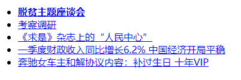
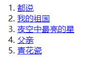
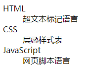
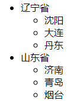

## 拨云见日_1

### 1、什么是HTML、CSS？

HTML、CSS是做网站的编程语言，浏览器把代码解析后的样子就是我们看到的网站。如果想看到网站的原始代码，可以通过浏览器上点鼠标右键选择查看网页源代码。

一个网站是由多个网页组成的，每一个网页是一个`.html`文件，这个就好比是一个电视剧，每一集是一个`.mp4`文件。

### 2、VS Code编辑器

编辑网页，推荐使用VS code编辑器，该编辑器是微软公司开发的。VS Code的下载地址：https://code.visualstudio.com/。

**插件安装：**

初始的VS code是没有插件的，而且是英文，需要我们手动安装插件。可以打开VS code后，在最左面找到一排按钮，点击第五个，就是由几个小方框组成的一个图标，或者使用快捷键`Ctrl+Shift+X`打开扩展管理，在这里面搜索即可。

**推荐几个插件：**

语言包：Chinese (Simplified) Language Pack for Visual Studio Code

通过Chrome浏览：open in browser、view in browser

**自动换行：**

 设置：文件-> 首选项 -> 设置 -> word wrap

**简单使用：**

打开`VS Code`，按下`Ctrl+N`新建一个文件，然后保存为`01_demo.html`，在里面写上一句话，比如`hello world ！！！`，保存，然后双击该文件通过浏览器打开，这样就看到了我们刚才写的那句话。

文件位置：[src/01_demo.html](./src/01_demo.html)

**常用快捷键：**

`Ctrl+s`：保存
`Ctrl+a`：全选
`Ctrl+x`、`Ctrl+c`、`Ctrl+v`：剪切、复制、粘贴
`Ctrl+z`、`Ctrl+y`：撤销、前进
`Shift+end`：从头选中一行
`Shift+home`：从尾部选中一行
`Shift+alt+↓`：快速复制一行
`alt+↑或↓`：快速移动一行

练习快捷键文件：[src/02_vsCode.html](./src/02_vsCode.html)

### 3、Chrome浏览器

Chrome下载地址： https://www.google.cn/intl/zh-CN/chrome/

使用Chrome的好处是它的市场占有率和市场份额高，兼容性好，不易出错。百度统计浏览器市场份额： https://tongji.baidu.com/data/browser，2019年chrome的占有率约为68.88%。

### 4、深入了解网站开发

网站开发一般分为UI设计师、Web前段开发工程师和Web后端开发工程师，其中UI设计师主要为设计网站的整体布局样式以及如何交互等，Web前段开发工程师主要是将UI设计师制作的稿件以代码的形式表现在浏览器上，并将后端的数据展现出来。

### 5、 web三大核心技术

HTML，CSS，JavaScript。

网页主要由三部分组成： 结构（ Structure） 、 表现（ Presentation） 和行为（ Behavior）

- HTML —— 结构， 决定网页的结构和内容（ “是什么”）
- CSS —— 表现（ 样式） ， 设定网页的表现样式（ “什么样子”）
- JavaScript（ JS） —— 行为， 控制网页的行为（ “做什么”）

JavaScript功能演示：[src/03_核心技术.html](./src/03_核心技术.html)。通过JavaScript，我们就可以实现一个鼠标滑入文字，自动变色的一个效果。

### 6、HTML基本结构和属性

超文本标记语言(HyperText Markup Language)，标准通用标记语言下的一个应用。是网页制作必备的编程语言。

**超文本标记语言解释：**

- 超文本 : 文本内容 + 非文本内容 ( 图片、视频、音频等 )
- 标记 : <单词>

- 语言 : 编程语言

**标记：**

标记也叫做标签，如`<header>`、`<footer>`等。写法一般为两种，一种是单标签，如`<header/>`，还有一种是双标签，如`<header></header>`。

VS Code中创建标签的快捷键：单词 + tab键 -> <单词>。

 标签是可以上下排列，也可以组合嵌套。

HTML常见标签：http://www.html5star.com/manual/html5label-meaning/


标签的属性：来修饰标签的，设置当前标签的一些功能。格式：`<标签 属性="值" 属性2="值2">`

相关代码文件：[src/04_HTML语法.html](./src/04_HTML语法.html)

### 7、HTML初始代码

每个`html`文件都有的代码叫做初始代码，要符合`html`文件的规范写法，这样才符合`html`的规范，不会出现各种莫名其妙的错误。在VS Code中，可以使用`!+tab`键，快速的创建`html`的初始代码。

文件位置：[src/05_HTML初始代码.html](./src/05_HTML初始代码.html)

```html
<!-- 文档声明 : 告诉浏览器这是一个html文件 -->
<!DOCTYPE html>
<!-- html文件的最外层标签：包裹着所有html标签代码 lang="en"表示是一个英文网站 lang="zh-CN"表示一个中文网站 -->
<html lang="en">
<head>
    <!-- 元信息：是编写网页中的一些辅助信息 charset="UTF-8"国际编码，让网页不出现乱码的情况 -->
    <meta charset="UTF-8">
    <!-- 设置网页的标题 -->
    <title>Document</title>
</head>
<!--  显示网页内容的区域 -->
<body>
</body>
</html>
```

### 8、HTML注释

HTML注释在浏览器中看不到，只能在代码中看到注释的内容。写法为：`<!-- 注释的内容 -->`

意义：

- 把暂时不用的代码注释起来，方便以后使用。
- 对开发人员进行提示。

VS Code中快捷添加注释与删除注释：`Ctrl+/`，`Shift+Alt+A`

文件位置：[src/06_HTML注释.html](./src/06_HTML注释.html)

### 9、HTML语义化

所谓HTML语义化指的是，根据网页中内容的结构，选择适合的HTM标签进行编写。比如如果是显示一个列表，那么就使用列表标签；如果显示一个标题，那么就使用标题标签；如果显示一个段落，那么就用段落标签。

**好处：**

- 在没有CSS的情况下，页面也能呈现出很好的内容结构。
- 有利于SEO，让搜索引擎爬虫更好的理解网页。
- 方便其他设备解析（如屏幕阅读器、盲人阅读器等），例如：http://h5o.github.io/
- 便于团队开发与维护。

### 10、标题与段落

标题是一个双标签，它的写法如下：

```html
<h1>标题</h1>
<h2>标题</h2>
<h2>标题</h2>
<h2>标题</h2>
<h3>标题</h3>
<h4>标题</h4>
<h5>标题</h5>
<h6>标题</h6>
```

一共六级标题，其中在一个网页中，h1的标题最为重要，规定一个html文件中只允许出现一次h1标签。h5和h6标签在网页中不经常使用，如果能不使用，尽量不使用。

段落也是一个双标签，它的写法为：`<p></p>`。

文件位置：[src/07_标题与段落.html](./src/07_标题与段落.html)

### 11、常用文本修饰标签

文本修饰标签基本为双标签，常见的文本修饰标签如下：

```
加粗：<strong></strong>
斜体：<em></em>
下标：<sub></sub>
上标：<sup></sup>
删除线：<del></del>
下划线：<ins></ins>
```

文件位置：[src/08_文本修饰标签.html](./src/08_文本修饰标签.html)

### 12、图片标签

图片标签是一个单标签，标签为：``。

常见的属性：

- src：引入图片的地址
- alt：当图片出现问题的时候，可以显示一段友好的提示文字
- title：提示信息
- width、height：图片的大小

**注意：**width和height会在网络不好或者图片未加载的时候撑起一个区域，如果未定义width和height，这个区域就不会被撑起。演示的方法就是在Chrome中按F12，转到Network，点击里面的online，调整成比较慢的网速，就可以看到实际效果。

文件位置：[src/09_图片标签.html](./src/09_图片标签.html)

### 13、路径引用

路径分为相对路径和绝对路径。

**注意：**

`在html中写路径，要使用正斜线，即/，不要使用反斜线\，虽然在Windows上不会出问题，但是这样是不规范的，在其他系统上会出现问题。`

`如果一个html以文件的形式打开，路径写为形如/aaa/bbb.jpg，这样表示是当前盘符下的绝对路径，如E:/aaa/bbb.jpg。`

文件位置：[src/10_路径.html](./src/10_路径.html)

### 14、链接标签

链接标签是一个双标签，写法为`<a></a>`。

- href属性：链接的地址
- target属性：可以改变链接打开的方式，默认情况下的值是`_self`，在当前页面打开。如果在新窗口打开，它的值为`_blank`。

如果想修改a标签的默认打开行为，可以在`<head>`中添加一个标签来修改默认行为：`<base target="_blank">`。

```html
<!-- 在当前页面打开链接 -->
<a href="http://www.baidu.com">访问百度</a>
<!-- 为图片加一个链接，在当前页面打开 -->
<a href="http://www.baidu.com">
    
</a>
<!-- 在新标签页打开链接 -->
<a href="http://www.baidu.com" target="_blank">访问百度</a>
```

```html
<!DOCTYPE html>
<html lang="en">
<head>
    <meta charset="UTF-8">
    <meta name="viewport" content="width=device-width, initial-scale=1.0">
    <meta http-equiv="X-UA-Compatible" content="ie=edge">
    <title>Document</title>
    <!-- 更改链接的默认行为为从新标签页打开 -->
    <base target="_blank">
</head>
<body>
    <!-- 如果在head标签上加入base，可以更改链接的默认行为 -->
    <a href="http://www.baidu.com">访问百度</a>
    <a href="http://www.baidu.com">访问百度</a>
    <a href="http://www.baidu.com">访问百度</a>
    <a href="http://www.baidu.com">访问百度</a>
    <a href="http://www.baidu.com">访问百度</a>
    <a href="http://www.baidu.com">访问百度</a>
</body>
</html>
```

文件位置：[src/11_链接.html](./src/11_链接.html)

链接的综合练习：[src/链接的综合练习/index.html](./src/链接的综合练习/index.html)

### 15、锚点跳转

锚点跳转有两种实现方法：

- #号加id属性
- #号加name属性，name属性是给a标签加的

#号加id属性实现：

```html
<!DOCTYPE html>
<html lang="en">
<head>
    <meta charset="UTF-8">
    <meta name="viewport" content="width=device-width, initial-scale=1.0">
    <meta http-equiv="X-UA-Compatible" content="ie=edge">
    <title>Document</title>
</head>
<body>
    <a href="#html">HTML</a>
    <a href="#css">CSS</a>
    <a href="#javascript">JavaScript</a>

    <h2 id="html">HTML超文本标记语言</h2>
    <p>模拟的段落</p>
    <p>模拟的段落</p>
    <p>模拟的段落</p>
    <p>模拟的段落</p>
    <p>模拟的段落</p>
    <p>模拟的段落</p>
    <p>模拟的段落</p>
    <p>模拟的段落</p>
    <p>模拟的段落</p>
    <p>模拟的段落</p>
    <p>模拟的段落</p>
    <p>模拟的段落</p>
    <p>模拟的段落</p>
    <p>模拟的段落</p>
    <p>模拟的段落</p>
    <h2 id="css">CSS层叠样式表</h2>
    <p>模拟的段落</p>
    <p>模拟的段落</p>
    <p>模拟的段落</p>
    <p>模拟的段落</p>
    <p>模拟的段落</p>
    <p>模拟的段落</p>
    <p>模拟的段落</p>
    <p>模拟的段落</p>
    <p>模拟的段落</p>
    <p>模拟的段落</p>
    <p>模拟的段落</p>
    <p>模拟的段落</p>
    <p>模拟的段落</p>
    <p>模拟的段落</p>
    <p>模拟的段落</p>
    <h2 id="javascript">JS脚本</h2>
    <p>模拟的段落</p>
    <p>模拟的段落</p>
    <p>模拟的段落</p>
    <p>模拟的段落</p>
    <p>模拟的段落</p>
    <p>模拟的段落</p>
    <p>模拟的段落</p>
    <p>模拟的段落</p>
    <p>模拟的段落</p>
    <p>模拟的段落</p>
    <p>模拟的段落</p>
    <p>模拟的段落</p>
    <p>模拟的段落</p>
    <p>模拟的段落</p>
    <p>模拟的段落</p>
</body>
</html>
```

#号加name属性实现：

```html
<!DOCTYPE html>
<html lang="en">
<head>
    <meta charset="UTF-8">
    <meta name="viewport" content="width=device-width, initial-scale=1.0">
    <meta http-equiv="X-UA-Compatible" content="ie=edge">
    <title>Document</title>
</head>
<body>
    <a href="#html">HTML</a>
    <a href="#css">CSS</a>
    <a href="#javascript">JavaScript</a>

    <a name="html"></a>    
    <h2>HTML超文本标记语言</h2>
    <p>模拟的段落</p>
    <p>模拟的段落</p>
    <p>模拟的段落</p>
    <p>模拟的段落</p>
    <p>模拟的段落</p>
    <p>模拟的段落</p>
    <p>模拟的段落</p>
    <p>模拟的段落</p>
    <p>模拟的段落</p>
    <p>模拟的段落</p>
    <p>模拟的段落</p>
    <p>模拟的段落</p>
    <p>模拟的段落</p>
    <p>模拟的段落</p>
    <p>模拟的段落</p>
    <a name="css"></a>
    <h2>CSS层叠样式表</h2>
    <p>模拟的段落</p>
    <p>模拟的段落</p>
    <p>模拟的段落</p>
    <p>模拟的段落</p>
    <p>模拟的段落</p>
    <p>模拟的段落</p>
    <p>模拟的段落</p>
    <p>模拟的段落</p>
    <p>模拟的段落</p>
    <p>模拟的段落</p>
    <p>模拟的段落</p>
    <p>模拟的段落</p>
    <p>模拟的段落</p>
    <p>模拟的段落</p>
    <p>模拟的段落</p>
    <a name="javascript"></a>
    <h2>JS脚本</h2>
    <p>模拟的段落</p>
    <p>模拟的段落</p>
    <p>模拟的段落</p>
    <p>模拟的段落</p>
    <p>模拟的段落</p>
    <p>模拟的段落</p>
    <p>模拟的段落</p>
    <p>模拟的段落</p>
    <p>模拟的段落</p>
    <p>模拟的段落</p>
    <p>模拟的段落</p>
    <p>模拟的段落</p>
    <p>模拟的段落</p>
    <p>模拟的段落</p>
    <p>模拟的段落</p>
</body>
</html>
```

文件位置：[src/12_跳转锚点.html](./src/12_跳转锚点.html)

### 16、特殊字符

为了解决一些特殊字符与html中的代码冲突，需要用一些特殊的写法来展现特殊字符，解决办法就是`&字符;`。

| 特殊字符 |   含义   | 特殊字符代码 |
| :------: | :------: | :----------: |
|   空格   |  空格符  |   `&nbsp;`   |
|    ©     |   版权   |   `&copy;`   |
|    ®     | 注册商标 |   `&reg;`    |
|    <     |  小于号  |    `&lt;`    |
|    >     |  大于号  |    `&gt;`    |
|    &     |   和号   |    `&amp`    |
|    ¥     |  人民币  |   `&yen;`    |
|    °     |  摄氏度  |   `&deg;`    |

文件位置：[src/13_特殊符号.html](./src/13_特殊符号.html)

### 17、列表标签

- `<ul>`和`<li>`：无序列表，分别表示的是列表的最外层容器和列表项。`ul`和`li`必须是组合出现的，`ul`和`li`之间不能有其他标签，但是`li`内部可以有其他标签。注意：`ul`有一个type属性，可以改变前面标记的样式，但是这个样式一般用`css`去控制。（参考http://www.w3school.com.cn/tags/att_ul_type.asp）
- `<ol>`和`<li>`：无序列表，分别表示的是列表的最外层容器和列表项。注意：有序列表用的非常少，经常用的是无序列表，无序列表可以去代替有序列表。`ol`有一个type属性，可以改变前面标记的样式，但是这个样式一般用`css`去控制。（参考http://www.w3school.com.cn/tags/att_ol_type.asp）
- `<dl>`、`<dt>`和`<dd>`：定义列表，`<dl>`为容器，`<dt>`为定义专业术语或名词，`<dd>`对名词进行解释和描述。

**注：**列表之间可以互相嵌套，形成多层级的列表。

```html
<!DOCTYPE html>
<html lang="en">
<head>
    <meta charset="UTF-8">
    <meta name="viewport" content="width=device-width, initial-scale=1.0">
    <title>Document</title>
</head>
<body>
    <!-- 无序列表 -->
      <ul>
        <li><a href="#"><strong>脱贫主题座谈会</strong></a></li>
        <li><a href="#">考察调研</a></li>
        <li><a href="#">《求是》杂志上的“人民中心”</a></li>
        <li><a href="#">一季度财政收入同比增长6.2% 中国经济开局平稳</a></li>
        <li><a href="#">奔驰女车主和解协议内容：补过生日 十年VIP</a></li>
    </ul>

    <!-- 有序列表 -->
    <ol>
        <li><a href="#">都说</a></li>
        <li><a href="#">我的祖国</a></li>
        <li><a href="#">夜空中最亮的星</a></li>
        <li><a href="#">父亲</a></li>
        <li><a href="#">青花瓷</a></li>
    </ol>

    <!-- 定义列表 -->
    <dl>
        <dt>HTML</dt>
        <dd>超文本标记语言</dd>
        <dt>CSS</dt>
        <dd>层叠样式表</dd>
        <dt>JavaScript</dt>
        <dd>网页脚本语言</dd>
    </dl>

    <!-- 嵌套列表 -->
     <ul>
        <li>
            辽宁省
            <ul>
                <li>沈阳</li>
                <li>大连</li>
                <li>丹东</li>
            </ul>
        </li>
        <li>
            山东省
            <ul>
                <li>济南</li>
                <li>青岛</li>
                <li>烟台</li>
            </ul>
        </li>
    </ul>

    <!-- 嵌套列表 -->
    <dl>
        <dt>中国</dt>
        <dd>
            <dl>
                <dt>辽宁省</dt>
                <dd>沈阳</dd>
                <dd>大连</dd>
                <dd>丹东</dd>
            </dl>
            <dl>
                <dt>山东省</dt>
                <dd>济南</dd>
                <dd>青岛</dd>
                <dd>烟台</dd>
            </dl>
        </dd>
        <dt>美国</dt>
        <dd>洛杉矶</dd>
        <dd>纽约</dd>
    </dl>
    
</body>
</html>
```

无序列表：



有序列表：



定义列表：



嵌套列表：



文件位置：[src/14_列表标签.html](./src/14_列表标签.html)

### 18、表格标签

表格标签有`table`、`tr`、`th`、`td`、`caption`等，还有语义化标签`tHead`、`tBody`、`tFood`。

- `<table>`：表格的最外层容器
- `<tr>`：定义表格行
- `<th>`：定义表头
- `<td>`：定义表格单元
- `<caption>`：定义表格标题
- `tHead`、`tBody`、`tFood`：三个语义化标签，在html中，无实际意义，主要是为了规范和方便阅读。在一个table中，`tBody`是可以出现多次的，但是`tHead`、`tFood`只能出现一次。

**表格属性：**

- `border`：表格边框
- `cellpadding`：单元格内的空间
- `cellspacing`：单元格之间的空间
- `rowspan`：合并行
- `colspan`：合并列
- `align`：左右对齐方式
- `valign`：上下对齐方式	

```html
<!DOCTYPE html>
<html lang="en">
<head>
    <meta charset="UTF-8">
    <meta name="viewport" content="width=device-width, initial-scale=1.0">
    <meta http-equiv="X-UA-Compatible" content="ie=edge">
    <title>Document</title>
</head>
<body>
    <!-- 表格的基本使用 -->
    <table>
        <caption>天气预报</caption>
        <tHead>
            <tr>
                <th>日期</th>
                <th>天气情况</th>
                <th>出行情况</th>
            </tr>
        </tHead>
        <tBody>
            <tr>
                <td>2019年1月1日</td>
                <td></td>
                <td>天气晴朗，适合出行</td>
            </tr>
            <tr>
                <td>2019年1月2日</td>
                <td></td>
                <td>有小雨，出门请带伞</td>
            </tr>
        </tBody>
        <tFood>

        </tFood>
    </table>

    <!-- 属性的演示 -->
    <table border="1" cellpadding="30" cellspacing="30">
        <caption>天气预报</caption>
        <tHead>
            <tr align="right">
                <th colspan="2">日期</th>
                <th>天气情况</th>
                <th>出行情况</th>
            </tr>
        </tHead>
        <tBody>
            <tr valign="top">
                <td rowspan="2">2019年1月1日</td>
                <td>白天</td>
                <td></td>
                <td>天气晴朗，适合出行</td>
            </tr>
            <tr>
                <td>夜晚</td>
                <td></td>
                <td>天气晴朗，适合出行</td>
            </tr>
            <tr valign="bottom">
                <td rowspan="2">2019年1月2日</td>
                <td>白天</td>
                <td></td>
                <td>有小雨，出门请带伞</td>
            </tr>
            <tr>
                <td>夜晚</td>
                <td></td>
                <td>有小雨，出门请带伞</td>
            </tr>
        </tBody>
        <tFood>

        </tFood>
    </table>
</body>
</html>

```

文件位置：[src/15_表格标签.html](./src/15_表格标签.html)

### 19、表单标签

表单标签为form，它也是一个双标签，是表单的最外层容器，写法为：`<form></form>`。form有一个action属性，表示为要提交表单的地址。

**input标签：**

- input是form标签下常见的一个标签，标签用于搜集用户信息，根据不同的type属性值，展示不同的控件，如输入框、密码框、复选框等。input标签主要有以下几种type属性值：
- text：普通的文本输入框，它有个属性为placeholder，可以在输入框中添加提示
- password：密码输入框，它有个属性为placeholder，可以在输入框中添加提示
- checkbox：复选框，如果添加一个checked，则为选中状态，如果添加一个disabled属性，则为禁用状态
- radio：单选框，如果有相同的name属性值，则可以成为一组
- file：上传文件，如果添加multiple属性，则可以选择多个文件
- submit：提交按钮
- reset：重置按钮

- textarea：多行文本框，textarea有cols和rows属性，分别代表列数和行数
- select、option下拉菜单，他们是嵌套关系；option中有selected属性，表示默认被选中，也有disabled属性，表示禁止被选中；select中的size属性表示可以显示多少个选项，multiple属性表示是否可以被多选
- babel：辅助表单，它没有实际含义，但是可以起到辅助作用，比如在单选框中，默认状态下只有点击文字前面的小圆圈，才能选择，如果使用label，可以通过设置label的for属性和input中的id属性，使input的id属性和label中的for属性相同，就可以通过点击文字的方式来选择了，具体可以见代码。

```html
<!DOCTYPE html>
<html lang="en">
<head>
    <meta charset="UTF-8">
    <meta name="viewport" content="width=device-width, initial-scale=1.0">
    <meta http-equiv="X-UA-Compatible" content="ie=edge">
    <title>Document</title>
</head>
<body>
    <form action="http://www.baidu.com">
        <!-- input标签列举 -->
        <h2>输入框：</h2>
        <input type="text" placeholder="请输入用户名">
        <h2>密码框：</h2>
        <input type="password" placeholder="请输入密码">
        <h2>复选框</h2>
        <input type="checkbox" checked>苹果
        <input type="checkbox" checked>香蕉
        <input type="checkbox" disabled>葡萄
        <h2>单选框</h2>
        <input type="radio" name="gender">男
        <input type="radio" name="gender">女
        <h2>上传文件</h2>
        <input type="file">
        <h2>提交按钮和重置按钮</h2>
        <!-- 提交 -->
        <input type="submit">
        <!-- 重置 -->
        <input type="reset">

        <h2>多行文本框</h2>
        <textarea cols="100" rows="10"></textarea>

        <h2>下拉菜单</h2>
        <select>
            <!-- 默认选择第一个，但是第一个不能再被选中 -->
            <option selected disabled>请选择</option>
            <option>北京</option>
            <option>上海</option>
            <option>杭州</option>
        </select>

        <!-- 显示三个选项 -->
        <select size="3">
            <option>北京</option>
            <option>上海</option>
            <option>杭州</option>
        </select>

        <!-- 可以多选 -->
        <select multiple>
            <option>北京</option>
            <option>上海</option>
            <option>杭州</option>
        </select>

        <input type="file" multiple>

        <!-- 让input的id和label中的for属性相同，这样就可以通过点击文字的方式来进行单选 -->
        <input type="radio" name="gender" id="man"><label for="man">男</label>
        <input type="radio" name="gender" id="woman"><label for="woman">女</label>

    </form>
</body>
</html>
```

文件位置：[src/16_表单标签.html](./src/16_表单标签.html)


