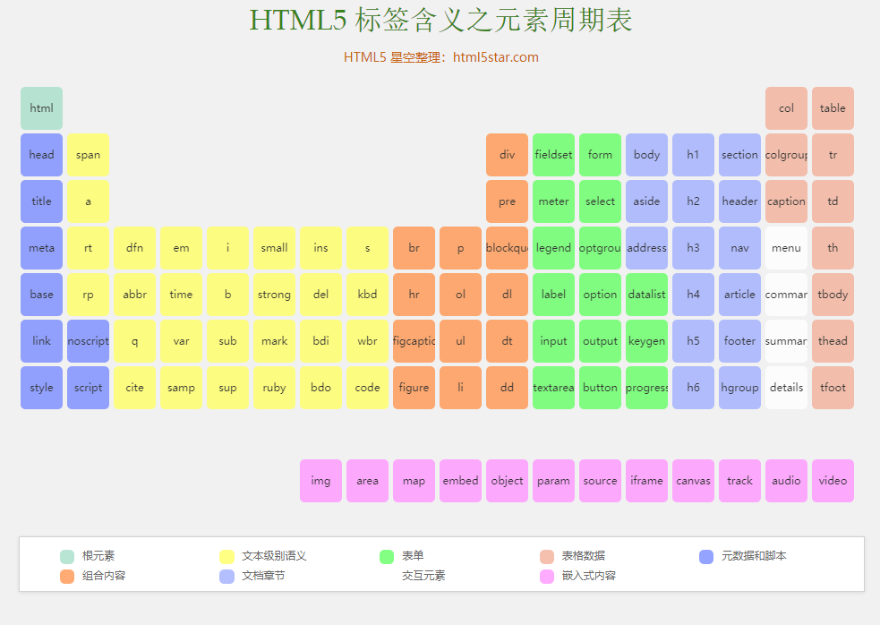

### 6、HTML基本结构和属性

超文本标记语言(HyperText Markup Language)，标准通用标记语言下的一个应用。是网页制作必备的编程语言。

**超文本标记语言解释：**

- 超文本 : 文本内容 + 非文本内容 ( 图片、视频、音频等 )
- 标记 : <单词>

- 语言 : 编程语言

**标记：**

标记也叫做标签，如`<header>`、`<footer>`等。写法一般为两种，一种是单标签，如`<header/>`，还有一种是双标签，如`<header></header>`。

VS Code中创建标签的快捷键：单词 + tab键 -> <单词>。

 标签是可以上下排列，也可以组合嵌套。

HTML常见标签：http://www.html5star.com/manual/html5label-meaning/



标签的属性：来修饰标签的，设置当前标签的一些功能。格式：`<标签 属性="值" 属性2="值2">`

相关代码文件：[src/04_HTML语法.html](./src/04_HTML语法.html)

### 7、HTML初始代码

每个`html`文件都有的代码叫做初始代码，要符合`html`文件的规范写法，这样才符合`html`的规范，不会出现各种莫名其妙的错误。在VS Code中，可以使用`!+tab`键，快速的创建`html`的初始代码。

文件位置：[src/05_HTML初始代码.html](./src/05_HTML初始代码.html)

```html
<!-- 文档声明 : 告诉浏览器这是一个html文件 -->
<!DOCTYPE html>
<!-- html文件的最外层标签：包裹着所有html标签代码 lang="en"表示是一个英文网站 lang="zh-CN"表示一个中文网站 -->
<html lang="en">
<head>
    <!-- 元信息：是编写网页中的一些辅助信息 charset="UTF-8"国际编码，让网页不出现乱码的情况 -->
    <meta charset="UTF-8">
    <!-- 设置网页的标题 -->
    <title>Document</title>
</head>
<!--  显示网页内容的区域 -->
<body>
</body>
</html>
```


