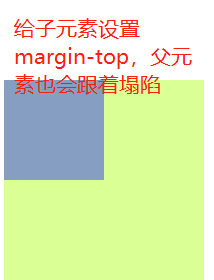

# 拨云见日_2

### 1、CSS背景图

背景常用的属性：

| 属性                  | 含义                     | 值以及说明                                                   |
| --------------------- | ------------------------ | ------------------------------------------------------------ |
| background-color      | 背景色                   | 三种表示方法，单词表示、十六进制表示#ffffff、rgb表示rgb(255,255,255) |
| background-image      | 背景图                   | url(背景地址)，默认会水平垂直都铺满背景图                    |
| background-repeat     | 平铺方式                 | `repeat-x`：x轴平铺；<br />`repeat-y`：y轴平铺；<br />`repeat`：x、y都进行平铺，默认值；<br />`no-repeat`：都不平铺 |
| background-position   | 背景位置                 | 表示方法：`background-position: x y;`<br />其中的x和y可以是数字，也可以是单词；<br />数字的单位可以是px，也可以是%；<br />单词中x可以是left、center、right，y可以是top、center、bottom |
| background-attachment | 背景图随滚动条移动的方式 | scroll：随滚动条滚动，该状态下背景位置是按照当前元素进行偏移的，默认值；<br />fixed：固定位置，该状态下背景位置是按照浏览器进行偏移的 |

代码文件位置：[src/01_背景样式.html](./src/01_背景样式.html)

### 背景图视觉差演示

```html
<!DOCTYPE html>
<html lang="en">

<head>
    <meta charset="UTF-8">
    <meta name="viewport" content="width=device-width, initial-scale=1.0">
    <meta http-equiv="X-UA-Compatible" content="ie=edge">
    <title>Document</title>
    <style>
        #div1 {
            width: 1400px;
            height: 800px;
            background-image: url(./img/1.jpg);
            background-attachment: fixed;
        }

        #div2 {
            width: 1400px;
            height: 800px;
            background-image: url(./img/2.jpg);
            background-attachment: fixed;
        }

        #div3 {
            width: 1400px;
            height: 800px;
            background-image: url(./img/3.jpg);
            background-attachment: fixed;
        }

        table {
            background-color: white;
        }
    </style>
</head>

<body>
    <div id="div1">
    </div>
    <div id="div2">
    </div>
    <div id="div3">
    </div>
</body>

</html>
```

代码文件位置：[src/02_视觉差.html](./src/02_视觉差.html)

### 2、CSS边框样式

| 属性         | 含义     | 值以及说明                                                   |
| ------------ | -------- | ------------------------------------------------------------ |
| border-style | 边框样式 | 常见的有以下几种：<br />solid：实线；<br />dashed：虚线；<br />dotted：点线 |
| border-width | 边框大小 | px，像素值                                                   |
| border-color | 边框颜色 | 三种表示方法均可                                             |

边框也可以针对某一条边进行单独设置，比如对左边框就是`border-left-style`，其中中间的单词可以是`left`、`right`、`top`、`bottom`。另外边框还可以使用复合样式，这个后面再说。

```html
<!DOCTYPE html>
<html lang="en">

<head>
    <meta charset="UTF-8">
    <meta name="viewport" content="width=device-width, initial-scale=1.0">
    <meta http-equiv="X-UA-Compatible" content="ie=edge">
    <title>Document</title>
    <style>
        div {
            width: 300px;
            height: 300px;
            /* 边框形状为实线 */
            border-style: solid;
            /* 边框的颜色 */
            border-color: red;
            /* 边框的线宽 */
            border-width: 1px;
        }

        div {
            width: 300px;
            height: 300px;
            /* 对右边框进行设置 */
            border-right-style: dotted;
            border-right-width: 10px;
            border-right-color: green;
            /* 对左边框进行设置 */
            border-top-style: solid;
            border-top-width: 10px;
            border-top-color: red;
        }
    </style>
</head>

<body>
    <div></div>
</body>

</html>
```

代码文件位置：[src/03_边框样式.html](./src/03_边框样式.html)

**绘制一个三角形：**

此外，color里还有一个属性值为transparent，该值表示为没有颜色，可以用这个来画一个三角形。

```html
<!DOCTYPE html>
<html lang="en">

<head>
    <meta charset="UTF-8">
    <meta name="viewport" content="width=device-width, initial-scale=1.0">
    <meta http-equiv="X-UA-Compatible" content="ie=edge">
    <title>Document</title>
    <style>
        body {
            background-color: green;
        }

        div {
            width: 0px;
            height: 0px;
            border-top-color: transparent;
            border-top-style: solid;
            border-top-width: 30px;
            ;
            border-right-color: red;
            border-right-style: solid;
            border-right-width: 30px;
            ;
            border-bottom-color: transparent;
            border-bottom-style: solid;
            border-bottom-width: 30px;
            ;
            border-left-color: transparent;
            border-left-style: solid;
            border-left-width: 30px;
            ;
        }
    </style>
</head>

<body>
    <div></div>
</body>

</html>
```

代码文件位置：[src/04_三角形.html](./src/04_三角形.html)

### 3、CSS文字样式

| 属性        | 含义     | 值以及说明                                                   |
| ----------- | -------- | ------------------------------------------------------------ |
| font-family | 字体类型 | 该属性可以设置字体的类型，有两点需要注意：<br />该属性可以设置多字体，设置多字体类型的目的是可以兼容不同电脑上的字体，如果第一个字体没有，可以向下查找；<br />如果字体的名字中间有空格，需要添加引号，例如：`font-family: 华文彩云, 'Times New Roman', SimSun, 微软雅黑;` |
| font-size   | 字体大小 | 有两种表示方式：<br />数字，默认值为16，推荐使用偶数，这样方便对齐；<br />单词表示（不推荐使用），xx-small最小，x-small较小，small小，medium正常（默认值），large大，x-large较大，xx-large最大 |
| font-weight | 字体粗细 | 单词表示：normal正常（默认值），bold（加粗）；<br />数值：100，200，300……900，其中100到500都是正常的，600都900都是加粗的。 |
| font-style  | 字体样式 | 正常：normal（默认值），斜体：italic、oblique<br />oblique也是表示斜体，用的比较少，一般了解即可。<br />区别：<br />1、italic带有倾斜属性的字体的才可以设置倾斜操作。<br />2、oblique没有倾斜属性的字体也可以设置倾斜操作，但是一般用italic，因为一般是使用字体提供的倾斜，而不是通过代码来强制让它倾斜。 |
| color       | 字体颜色 | 三种表示法                                                   |

**衬线体和非衬线体：**

特征不同

- 衬线字体(serif)在字的笔画开始、结束的地方有额外的装饰，而且笔bai画的粗细会有所不同。

- 无衬线字体(sans-serif)是无衬线字体，没有这些额外的装饰，而且笔画的粗细差不多。该类字体通常是机械的和统一线条的，它们往往拥有相同的曲率，笔直的线条，锐利的转角。

用途不同

- serif字体容易识别，它强调了每个字母笔画的开始和结束，因此易读性比较高。在整文阅读的情况下，适合使用serif字体进行排版，易于换行阅读的识别性，避免发生行间的阅读错误。

- 无衬线字体醒目，适合用于标题、DM、海报等，需要醒目但不需要长时间阅读的地方。但现在市场上很多app正文都开始采用无衬线字体，因为无衬线字体更简约、清新，比较有艺术感。

使用场合不同

- 无衬线字体与汉字字体中的黑体相对应。为了起到醒目的作用，笔画比较粗，不适合长时间阅读，不适合用作正文字体。衬线体基本上都是基于细黑体演化而来用作正文字体是易读性也很高。

可读性不同

- 在传统的正文印刷中，普遍认为衬线体能带来更佳的可读性。尤其是在大段落的文章中，衬线增加了阅读时对字母的视觉参照。

- 而无衬线体往往被用在标题、较短的文字段落或者一些通俗读物中。相比严肃正经的衬线体，无衬线体给人一种休闲轻松的感觉。

默认字体不同

- 中文字体中的宋体就是一种最标准的serif字体，衬线的特征非常明显。字形结构也和手写的楷书一致。
- 现代的 Macintosh、iOS、Android、Windows Vista 以上 等系统默认使用的无衬线字体。


<center style="font-size:14px;color:#C0C0C0;text-decoration:underline">衬线体</center>


<center style="font-size:14px;color:#C0C0C0;text-decoration:underline">非衬线体</center>

```html
<!DOCTYPE html>
<html lang="en">

<head>
    <meta charset="UTF-8">
    <meta name="viewport" content="width=device-width, initial-scale=1.0">
    <meta http-equiv="X-UA-Compatible" content="ie=edge">
    <title>Document</title>
    <style>
        div {
            /* 字体类型 */
            font-family: 华文彩云, 'Times New Roman', SimSun, 微软雅黑;
        }

        div {
            /* 字体大小 */
            font-size: 30px;
        }

        div {
            /* 字体粗细 */
            font-weight: 600;
        }

        div {
            /* 字体样式 */
            font-style: italic;
            /* 字体颜色 */
            color: red;
        }
    </style>
</head>

<body>
    <div>这是一段文字</div>
    <p>这是一段文字</p>
    <div>this is a text</div>
    <p>this is a text</p>
</body>

</html>
```

代码文件位置：[src/05_CSS文字样式.html](./src/05_CSS文字样式.html)

### 4、CSS段落样式

| 属性                  | 含义         | 值以及说明                                                   |
| --------------------- | ------------ | ------------------------------------------------------------ |
| text-decoration       | 文本装饰     | 下划线：underline，删除线：line-through，<br />上划线：overline，不添加任何装饰：none<br />注：添加多个文本修饰：line-through underline overline，中间用空格隔开 |
| text-transform        | 文本大小写   | 该属性主要针对英文，小写为lowercase，大写为uppercase<br />只针对首字母大写：capitalize |
| text-indent           | 首行缩进     | 可以使用px，也可以使用em，em单位是一个相对单位，1em的大小是一个字体的大小 |
| text-align            | 文本对齐方式 | left左对齐、right右对齐、center居中、justify两端点对齐       |
| line-height           | 行高         | 可以是px，也可以是scale（字体的倍数），scale没有单位，直接写数字即可，如`line-height: 2;` |
| letter-spacing        | 字间距       |                                                              |
| word-spacing          | 词间距       | 这个主要针对英文。                                           |
| word-break: break-all | 强制折行     | 这个折行不会出现空白区域。                                   |
| word-wrap: break-word | 强制折行     | 这个这行会产生一些空白区域。                                 |

行高的示意图：


```html
<!DOCTYPE html>
<html lang="en">

<head>
    <meta charset="UTF-8">
    <meta name="viewport" content="width=device-width, initial-scale=1.0">
    <meta http-equiv="X-UA-Compatible" content="ie=edge">
    <title>Document</title>
    <style>
        p {
            width: 300px;
            /* 文本装饰 */
            text-decoration: line-through underline overline;
        }

        P {
            /* 文本大小写 */
            text-transform: capitalize;
        }

        p {
            /* 首行缩进 */
            text-indent: 2em;
            /* 字体大小 */
            font-size: 18px;
        }

        p {
            /* 对对齐方式 */
            text-align: justify;
        }

        p {
            /* 行高scale表示 */
            line-height: 2;
        }

        p {
            /* 字间距 */
            word-spacing: 10px;
        }

        div {
            width: 300px;
            height: 300px;
            border: 1px solid red;
            /* 折行 */
            word-break: break-all;
        }
    </style>
</head>

<body>
    <p>据记者从孙杨团队处获悉，孙杨瑞士律师团队通过电子邮件通知孙杨方，他们已收到瑞士联邦最高法院判决结果，其判决结果为撤销国际体育仲裁法庭（CAS）此前涉及孙杨的裁决。截至发稿时，瑞士最高法院和CAS尚无正式表态。记者将跟踪报道此事进展。
    </p>
    <p>
        asd jsakdjsk asjdahsd ahdhjs ajsd39fc dsHRHFC ASFF shdjs ahjsd ajshd asd jsakdjsk asjdahsd ahdhjs ajsd39fc
        dsHRHFC ASFF shdjs ahjsd ajshd
    </p>
    <div>
        asd jsakdjskjsakdjskjsakdjskjsakdjskjsakdjskjsakdjskjsakdjskjsakdjsk asjdahsd ahdhjs ajsd39fc dsHRHFC ASFF shdjs
        ahjsd ajshd asd jsakdjsk asjdahsd ahdhjs ajsd39fc dsHRHFC ASFF shdjs ahjsd ajshd
    </div>
</body>

</html>
```

代码文件位置：[src/06_CSS段落样式.html](./src/06_CSS段落样式.html)

### CSS文字样式练习

效果图：


```html
<!DOCTYPE html>
<html lang="en">

<head>
    <meta charset="UTF-8">
    <meta name="viewport" content="width=device-width, initial-scale=1.0">
    <meta http-equiv="X-UA-Compatible" content="ie=edge">
    <title>Document</title>
    <style>
        div {
            width: 800px;
        }

        h1 {
            text-align: center;
            color: #ff6600;
        }

        h2 {
            color: #00a0ff;
            text-indent: 2em;
        }

        #p1 {
            font-style: italic;
            font-weight: bold;
            text-indent: 2em;
        }

        #p2 {
            color: #66ff00;
            line-height: 30px;
            text-indent: 2em;
        }

        #p3 {
            color: #00ffff;
            line-height: 30px;
            text-indent: 2em;
            text-decoration: underline;
            font-style: italic;
        }

        #p4 {
            font-weight: bold;
            letter-spacing: 10px;
            line-height: 30px;
            text-indent: 2em;
        }

        #p5 {
            color: #cc00cc;
            line-height: 30px;
            text-indent: 2em;
        }
    </style>
</head>

<body>
    <div>
        <h1>Angelababy简介</h1>
        <h2>基本信息</h2>
        <p id="p1">杨颖（Angelababy），1989年2月28日出生于上海，13岁时移居香港，中国影视女演员。</p>
        <p id="p2">
            2009年主演电影《全城热恋》。2012年，凭借爱情片《第一次》获得第十三届华语电影传媒大奖“最受瞩目女演员奖”。2013年1月，《南都娱乐周刊》举办新生代四小花旦的评选活动，杨颖以总分70分的综合得分与刘诗诗、杨幂、倪妮共同当选为新一代“四小花旦”；同年在徐克导演的影片《狄仁杰之神都龙王》中担任女主角，并且获得第21届北京大学生电影节最受欢迎女演员奖；4月，Angelababy主演电视剧《大汉情缘之云中歌》。2014年加盟综艺节目《奔跑吧兄弟》并主演电影版；同年主演顾长卫导演的电影《微爱之渐入佳境》，票房突破2.8亿。2015年5月参演好莱坞电影《独立日2》；7月，主演电影《摆渡人》。
        </p>
        <h2>早年经历</h2>
        <p id="p3"> 1989年2月28日，Angelababy出生在上海，中文名杨颖。杨颖自小随家人到上海定居，在上海的演艺学校学演戏及跳舞。13岁时，杨颖回香港加入了Talent Bang，还担任Viva Club
            Disney主持。</p>
        <h2>个人生活</h2>
        <p id="p4"> 2015年5月27日，黄晓明和Angelababy（杨颖）在青岛民政局领证完婚。</p>
        <p id="p5"> 2015年10月8日，黄晓明和Angelababy在上海展览中心正式举办婚礼。上午8点，Angelababy工作室曝光了一两人的婚纱照，照片中，两人以巴黎地标建筑为背景，浪漫亲吻。</p>
    </div>

</body>

</html>
```

代码文件位置：[src/07_个人简介.html](./src/07_个人简介.html)

### 5、CSS复合样式

一个CSS属性只控制一种样式，叫做单一样式。一个CSS属性控制多种样式，叫做复合样式。复合的写法，是通过空格的方式实现的。复合写法有的是不需要关心顺序，例如background、border；有的是需要关心顺序，例如font。先介绍这三个复合样式：

 **background：**

`background: red url() repeat 0 0;`，分别代表的是背景颜色，背景图，平铺以及背景图位置，这个顺序可以前后调整，但是要保证x和y要在一起。

**border：**

`border: 1px red solid;`，分别代表线宽，线的颜色，线的形状，这个也可以前后调整位置。此外单独设置某一个边，可以使用border-left，border-right等。

**font：**

font这个需要注意顺序，并且至少要有两个参数，分别为size和family，要保证字体的类型在最后，大小和行高在倒数第二个位置，正确举例如下：

`size family`，`weight style size family`，`style weight size family`，`weight style size/line-height family`，其中最后一个写法的实际情况如下：`font : bold italic 30px/100px 宋体;`

**注意：**

CSS的单一样式和复合样式，尽量避免混写，如果一定要混写的话，需要先写复合样式，再写单一样式，避免样式无法生效。因为复合样式中，没有写的属性，会赋默认值，将会覆盖它前面设置的值。

```html
<!DOCTYPE html>
<html lang="en">

<head>
    <meta charset="UTF-8">
    <meta name="viewport" content="width=device-width, initial-scale=1.0">
    <meta http-equiv="X-UA-Compatible" content="ie=edge">
    <title>Document</title>
    <style>
        div {
            width: 300px;
            height: 300px;
            /* 背景样式 */
            background: url(./img/dog.jpg) no-repeat center center;
            /* 如果需要单写，那么需要写在复合样式的后面 */
            background-color: red;
            /* 边框样式 */
            border : 2px black solid;
            /* 单独对右边框设置 */
            border-right: dashed 2px blue;
            /* 文字样式，注意顺序，需要把字体放在最后，size放在倒数第二个位置 */
            font: bold italic 30px/100px 宋体;
        }
    </style>
</head>

<body>
    <div>这是一段文字</div>
</body>

</html>
```

代码文件位置：[src/08_复合样式.html](./src/08_复合样式.html)

### 6、CSS选择器

选择器的练习可以看这个网站：[CSS Diner](https://flukeout.github.io/)

#### ID选择器

写法：html中，使用属性来定义id，比如`<div id="div1"></div>`，VS code中的快捷写法是div#div1加tab键。css中的写法为`#elem{}`。

**注意：**

- ID是唯一值，在一个页面中只能出现一次，出现多次是不符合规范的。
- 命名的规范，由字母、下划线、中划线、字母（并且第一个不能是数字）
- 驼峰写法：searchButton（小驼峰），SearchButton（大驼峰）
- 短线写法：search-small-button（推荐以这种方式命名）
- 下划线写法：search_small_button

css命名文件位置：[other/css命名.txt](./other/css命名.txt)

```html
<!DOCTYPE html>
<html lang="en">

<head>
    <meta charset="UTF-8">
    <meta name="viewport" content="width=device-width, initial-scale=1.0">
    <meta http-equiv="X-UA-Compatible" content="ie=edge">
    <title>Document</title>
    <style>
        /* id选择器 */
        #div1 {
            background: red;
        }

        /* id选择器 */
        #div2 {
            background: blue;
        }
    </style>
</head>

<body>
    <!-- 在标签上定义id -->
    <div id="div1">这是一个块</div>
    <div id="div2">这又是一个块</div>
    <div id="xiaoming1"></div>
    <div id="xiaoming2"></div>
    <div id="searchButton"></div>
</body>

</html>
```

####  CLASS选择器

写法：html中`<div class="box"></div>`，CSS选择器`.elem{}`。

**注意：**

- class选择器是可以复用的，class可以在多个标签中使用；
- 一个标签上可以添加多个class样式；
- 一个标签添加多个样式的时候，样式的优先级根据CSS选择器的前后来决定的，而不是class属性中的前后顺序；
- 在css中，通过标签+类的写法，可以选择某个标签下的某个类，写法为：`p.box {}`，表示p标签下的box类。

```html
<!DOCTYPE html>
<html lang="en">

    <head>
        <meta charset="UTF-8">
        <meta name="viewport" content="width=device-width, initial-scale=1.0">
        <meta http-equiv="X-UA-Compatible" content="ie=edge">
        <title>Document</title>
        <style>
            /* 类选择器 */
            .box {
                background: red;
            }

            /* 选择某个标签下的类 */
            p.box {
                background: red;
            }

            /* 一个标签添加多个样式的时候，样式的优先级根据CSS选择器的前后来决定的 */
            .content {
                font-size: 30px;
                background: blue;
            }
        </style>
    </head>
    <body>
        <!-- 在标签上添加class -->
        <div class="box">这是一个块</div>
        <!-- 一个标签中可以添加多个class -->
        <div class="box content">这又是一个块</div>
        <!-- class可以复用 -->
        <p class="box">这是一个段落</p>
    </body>
</html>
```

#### 标签选择器（tag选择器、元素选择器）

写法：html中`<div></div>`，css中`div {}`。

**使用场景：**

- 去掉某些标签的默认样式时
- 复杂的选择器中，如层次选择器，选择ul下的li或者ol下的li

#### 群组选择器（分组选择器）

可以通过逗号的方式，给多个不同的选择器添加统一的CSS样式，来达到代码的复用。

```html
<!DOCTYPE html>
<html lang="en">

    <head>
        <meta charset="UTF-8">
        <meta name="viewport" content="width=device-width, initial-scale=1.0">
        <meta http-equiv="X-UA-Compatible" content="ie=edge">
        <title>Document</title>
        <style>
            /* 群组选择器演示，这样可以同时为div，#text和.title设置背景色 */
            div, #text, .title {
                background: red;
            }
        </style>
    </head>
    <body>
        <!-- 群组选择器演示 -->
        <div>这是一个块</div>
        <p id="text">这是一个段落</p>
        <h2 class="title">这是一个标题</h2>
    </body>
</html>
```

#### 通配选择器

写法：`* {}`，作用是给所有标签都添加样式。

尽量避免使用通配选择器，因为会给所有的标签添加样式，慎用。

使用场景：去掉所有标签的默认样式时。

```html
<!DOCTYPE html>
<html lang="en">

    <head>
        <meta charset="UTF-8">
        <meta name="viewport" content="width=device-width, initial-scale=1.0">
        <meta http-equiv="X-UA-Compatible" content="ie=edge">
        <title>Document</title>
        <style>
            /* 通配选择器（慎用） */
            *{ border:1px red solid;}
        </style>
    </head>
    <body>
        <div>这是一个块</div>
        <p id="text">这是一个段落</p>
        <h2 class="title">这是一个标题</h2>
    </body>
</html>
```

#### 层次选择器

后代：`M N { }`，这种情况下，M下面所有的N都会被选择，无论这个N是M的子还是孙。

```html
<!DOCTYPE html>
<html lang="en">

    <head>
        <meta charset="UTF-8">
        <meta name="viewport" content="width=device-width, initial-scale=1.0">
        <meta http-equiv="X-UA-Compatible" content="ie=edge">
        <title>Document</title>
        <style>
            /* #list下所有的li都会生效，无论是子还是孙 */
            #list li{ border:1px red solid;}
        </style>
    </head>
    <body>
        <!-- 层级选择器演示 -->
        <ul id="list">
            <li>
                <ul>
                    <li></li>
                    <li></li>
                    <li></li>
                </ul>
            </li>
            <li></li>
            <li></li>
        </ul>
        <ol>
            <li></li>
            <li></li>
            <li></li>
        </ol>
    </body>
</html>
```

父子：`M > N { }`，这种情况下，只会选择M下是儿子关系的N，不会选择是孙子关系的N。

```html
<!DOCTYPE html>
<html lang="en">

    <head>
        <meta charset="UTF-8">
        <meta name="viewport" content="width=device-width, initial-scale=1.0">
        <meta http-equiv="X-UA-Compatible" content="ie=edge">
        <title>Document</title>
        <style>
            /* #list下儿子关系的li会被选择，孙子的不会被选择 */
            #list > li{ border:1px red solid;}
        </style>
    </head>
    <body>
        <!-- 层级选择器演示 -->
        <ul id="list">
            <li>
                <ul>
                    <li></li>
                    <li></li>
                    <li></li>
                </ul>
            </li>
            <li></li>
            <li></li>
        </ul>
        <ol>
            <li></li>
            <li></li>
            <li></li>
        </ol>
    </body>
</html>
```

兄弟：`M ~ N { }`，这种情况下会选择M同级下，M下方所有的N。

```html
<!DOCTYPE html>
<html lang="en">

    <head>
        <meta charset="UTF-8">
        <meta name="viewport" content="width=device-width, initial-scale=1.0">
        <meta http-equiv="X-UA-Compatible" content="ie=edge">
        <title>Document</title>
        <style>
            /* 这种情况下，只会选择和#relation同级的后面的所有h2 */
            #relation ~ h2 { background:red; }
        </style>
    </head>
    <body>
        <h2>这是一个标题</h2>
        <div id="relation">这是一个块</div>
        <h2>这是一个标题</h2>
        <h2>这是一个标题</h2>
        <p>这是一个段落</p>
        <h2>这是一个标题</h2>
    </body>
</html>
```

相邻：`M + N { }`，当前M同级，下面相邻的N标签

```html
<!DOCTYPE html>
<html lang="en">

    <head>
        <meta charset="UTF-8">
        <meta name="viewport" content="width=device-width, initial-scale=1.0">
        <meta http-equiv="X-UA-Compatible" content="ie=edge">
        <title>Document</title>
        <style>
            /* 这种情况下，只会选择和#relation同级的后面，并且紧挨着#relation的h2 */
            #relation + h2 { background:red; }
        </style>
    </head>
    <body>
        <h2>这是一个标题</h2>
        <div id="relation">这是一个块</div>
        <!-- 如果这里有其他标签，那么下面的h2将不再被选择 -->
        <h2>这是一个标题</h2>
        <h2>这是一个标题</h2>
        <p>这是一个段落</p>
        <h2>这是一个标题</h2>
    </body>
</html>
```

#### 属性选择器

| 选择器            | 说明                                                     |
| ----------------- | -------------------------------------------------------- |
| M[attr]           | M元素选择含有attr属性的集合                              |
| M[attr=value]     | M元素选择含有attr属性并且该属性的值和value完全匹配的集合 |
| M[attr*=value]    | M元素选择含有attr属性并且该属性的值包含value的集合       |
| M[attr^=value]    | M元素选择含有attr属性并且该属性的起始值为value的集合     |
| M[attr$=value]    | M元素选择含有attr属性并且该属性的结束值为value的集合     |
| `M[attr1][attr2]` | M元素选择含有attr1属性和attr2属性的集合                  |

```html
<!DOCTYPE html>
<html lang="en">

    <head>
        <meta charset="UTF-8">
        <meta name="viewport" content="width=device-width, initial-scale=1.0">
        <meta http-equiv="X-UA-Compatible" content="ie=edge">
        <title>Document</title>
        <style>
            /* 选择含有class的div */
            div[class]{ background:red;}
            /* 选择class值为box的div */
            div[class=box]{ background:red;}
            /* 选择class值中含有search的div */
            div[class*=search]{ background:red;}
            /* 选择class的起始值为search的div */
            div[class^=search]{ background:red;}
            /* 选择class的结束值为search的div */
            div[class$=search]{ background:red;}
            /* 选择含有class和id属性的div */
            div[class][id]{ background:red;}
        </style>
    </head>
    <body>
        <div>aaaaa</div>    
        <div class="box" id="elem">bbbbb</div>    
        <div class="search">ccccc</div>
        <div class="search-button">ddddd</div>
        <div class="button-search">eeeee</div>
    </body>
</html>
```

#### 伪类选择器1

CSS伪类用于向某些元素添加特殊的效果。一般用于初始样式添加不上的时候，用伪类来添加。

写法：`M:伪类{}`。

| 伪类     | 功能             | 说明                 |
| -------- | ---------------- | -------------------- |
| :link    | 访问前的样式     | 只能添加给a标签      |
| :visited | 访问后的样式     | 只能添加给a标签      |
| :hover   | 鼠标移入时的样式 | 可以添加给所有的标签 |
| :active  | 鼠标按下时的样式 | 可以添加给所有的标签 |

**说明：**

伪类的效果在Chrome控制台中是可以控制的，控制方法如图：


链接点击过后，就会变为已访问状态，可以通过清除浏览器的缓存来解决，Chrome清除历史记录的快捷键为`Ctrl+Shift+Delete`。

**注意：**

- link、visited只能给a标签加，hover和active可以给所有的标签加。
- 如果四个伪类都生效，一定要注意写的顺序：link、visited、hover、active，如果顺序错了，有的伪类会失效。
- 一般情况下，a标签选择器只设置a和a:hover。

```html
<!DOCTYPE html>
<html lang="en">

    <head>
        <meta charset="UTF-8">
        <meta name="viewport" content="width=device-width, initial-scale=1.0">
        <meta http-equiv="X-UA-Compatible" content="ie=edge">
        <title>Document</title>
        <style>
            /* 伪类选择器 */
            div{ width:200px; height:200px; background:red;}
            div:hover{ background:blue;}
            div:active{ background:green;}
            /* 伪类选择器，如果这几个都用，要注意前后顺序 */
            a:link{ color:red;}
            a:visited{ color:blue;}
            a:hover{ color:green;}
            a:active{ color:yellow;}

            /* 一般网站对a设置样式，只需要设置a和a:hover就可以了 */
            a{ color:gray;}
            a:hover{ color:red;}
        </style>
    </head>
    <body>
        <!-- 伪类选择器演示 -->
        <div></div>
        <a href="#">这是一个链接</a>
    </body>
</html>
```

#### 伪类选择器2

`:after`、`:before`：通过伪类的方式给元素添加一段文本内容，通常使用`content`属性。在控制台中，它实际的表示为`::after`或者是`::before`，前面是两个冒号，这种表示是伪元素。after和before可以用来清除浮动，设置列表的样式等。

:checked：当某个元素具备checked属性时被选择

:disabled：当某个元素具备disabled属性时被选择

:focus：当某个元素获取到光标时被选择

```html
<!DOCTYPE html>
<html lang="en">

    <head>
        <meta charset="UTF-8">
        <meta name="viewport" content="width=device-width, initial-scale=1.0">
        <meta http-equiv="X-UA-Compatible" content="ie=edge">
        <title>Document</title>
        <style>
            /* 通过伪类的方式给元素后面添加一段文本内容 */
            div:after {
                content: "world";
                color: red;
            }

            /* 当某个元素具备checked属性时被选择 */
            :checked {
                width: 100px;
                height: 100px;
            }

            /* 当某个元素具备disabled属性时被选择 */
            :disabled {
                width: 100px;
                height: 100px;
            }

            /* 当某个元素获取到光标时被选择 */
            :focus {
                background: red;
            }
        </style>
    </head>
    <body>
        <!-- 伪类选择器演示，before和after -->
        <div>hello </div>
        <!-- 伪类选择器演示，checked，disabled，focus -->
        <input type="checkbox">
        <input type="checkbox" checked>
        <input type="checkbox" disabled>
        <input type="text">
    </body>
</html>
```

代码文件位置：[src/09_CSS选择器.html](./src/09_CSS选择器.html)

#### 伪类选择器3——结构伪类选择器

`:nth-of-type()`、`:nth-child()`：选择索引为某个值的元素，角标是从1开始的，1表示第一项，2表示第二项；也可以用n来表示，n表示从0开始到无穷大；如果是2n，则会选择第二个、第四个……；如果是2n+1，则会选择第一个、第三个……；如果是3n，则会选择第三个、第六个……。

`:first-of-type()`、`first-of-child()`：选择第一个元素

`:last-of-type()`、`last-of-child()`：选择最后一个元素

`:only-of-type()`、only-of-child()`：如果元素在当前层级是唯一的，则会被选择

**type和child的区别：**

type在计算索引时会过滤掉同级下其他标签，而child不会过滤掉其他标签。

```html
<!DOCTYPE html>
<html lang="en">

<head>
    <meta charset="UTF-8">
    <meta name="viewport" content="width=device-width, initial-scale=1.0">
    <meta http-equiv="X-UA-Compatible" content="ie=edge">
    <title>Document</title>
    <style>
        /* 2n+1选择第一个li、第三个li……，type会先过滤掉同级的其他标签，因此div不会被选择 */
        #test1 li:nth-of-type(2n+1) {
            background: burlywood;
        }
        /* 2n+1选择第二个li、第四个li……，type会先过滤掉同级的其他标签，因此div不会被选择 */
        #test1 li:nth-of-type(2n) {
            background: olive;
        }

        /* type会先过滤掉除li的其他标签，然后选择第一个li标签 */
        #test2 li:first-of-type {
            background: red;
        }

        /* type会先过滤掉除li的其他标签，然后选择最后一个li标签 */
        #test2 li:last-of-type {
            background: blue;
        }

        /* type会先过滤掉除li的其他标签，然后当只有一个li时会被选择，这里演示有多个li，所以什么都不选择 */
        #test2 li:only-of-type {
            background: lime;
        }

        /* type会先过滤掉除li的其他标签，因此这里选择的是div下面的li */
        #test3 li:nth-of-type(2) {
            background: rgb(60, 173, 238);
        }

        /* child不会过滤标签，因此这里选择的第三个li */
        #test3 li:nth-child(4) {
            background: rgb(255, 176, 176);
        }

        /*  type会先过滤掉除div的所有标签，所以只有一个div，会被选择 */
        #test3 div:only-of-type {
            background: green;
        }

        /* child不会过滤标签，因此这里选择的是div下面的li */
        #test3 div:nth-child(2) {
            height: 50px;
        }

        /* child不会过滤标签，但是第三个标签不是div，所以什么都不选择 */
        #test3 div:nth-child(3) {
            height: 50px;
        }
    </style>
    </style>
</head>

<body>
    <ul id="test1">
        <li></li>
        <div>aaaaa</div>
        <li></li>
        <li></li>
        <li></li>
        <li></li>
    </ul>

    <ul id="test2">
        <li></li>
        <div>aaaaa</div>
        <li></li>
        <li></li>
        <li></li>
        <li></li>
    </ul>

    <ul id="test3">
        <li></li>
        <div>aaaaa</div>
        <li></li>
        <li></li>
        <li></li>
        <li></li>
    </ul>
</body>

</html>

```

代码文件位置：[src/10_结构伪类选择器.html](./src/10_结构伪类选择器.html)

### 7、CSS继承

文字相关的样式可以被继承，布局相关的样式默认是不被继承的，如果想继承，可以设置继承属性inherit值。

```html
<!DOCTYPE html>
<html lang="en">

<head>
    <meta charset="UTF-8">
    <meta name="viewport" content="width=device-width, initial-scale=1.0">
    <meta http-equiv="X-UA-Compatible" content="ie=edge">
    <title>Document</title>
    <style>
        div {
            width: 300px;
            height: 300px;
            border: 1px red solid;
            color: red;
            font-size: 30px;
        }

        p {
            border: inherit;
        }
    </style>
</head>

<body>
    <div>
        <p>这是一个段落</p>
    </div>
</body>

</html>
```

**小知识：**

在Chrome浏览器中，是可以查看继承关系的，如下图所示：


通过Inherited from div就可以查看到继承关系，其中深色的是默认被继承的，浅色的是默认没被继承的。

代码文件位置：[src/11_CSS继承.html](./src/11_CSS继承.html)

### 8、CSS优先级

**相同样式优先级：**

当设置相同样式时，后面的会覆盖前面的，但不建议出现重复设置样式的情况。

**内部样式与外部样式：**

内部样式与外部样式优先级相同，如果都设置了相同样式，那么后写的引入方式会覆盖前面的样式。

**单一样式优先级：**

style行间 > id > class > tag > * > 继承。

**权重：**

| 名称      | 权重 |
| --------- | ---- |
| style行间 | 1000 |
| id        | 100  |
| class     | 10   |
| tag       | 1    |

```html
<!DOCTYPE html>
<html lang="en">

<head>
    <meta charset="UTF-8">
    <meta name="viewport" content="width=device-width, initial-scale=1.0">
    <meta http-equiv="X-UA-Compatible" content="ie=edge">
    <title>Document</title>
    <style>
        /* 这两个div是属于相同的选择器，那么下面的优先级更高，所以div会显示蓝色 */
        div {
            color: red;
        }

        div {
            color: blue;
        }
    </style>
    <!-- 内部样式和外部样式的优先级是一样的，所以后写的优先级更高，所以div显示的是黄色（bass.css里面设置的div是黄色） -->
    <link rel="stylesheet" href="./base.css">

    <style>
        /* 行内，id，class，标签，通配符，继承，优先级从高到低 */
        #elem {
            color: red;
        }

        .box {
            color: blue;
        }

        div {
            color: green;
        }

        * {
            color: red;
        }

        body {
            color: blue;
        }
    </style>
</head>

<body>
    <div id="elem" style="color:blue;">这是一个块</div>
    <div id="elem" class="box">这是一个块</div>
    <div id="elem" style="color:blue;">这是一个块</div>
</body>

</html>
```

**!important：**

提升样式优先级，优先级最高，非规范方式，不建议使用。（不能针对继承的属性进行优先级的提升，因为子元素不会继承父元素的优先级。）

**标签+类与单类：**

标签+类>单类，即`div.box > .box`。

**群组优先级：**

群组选择器与单一选择器的优先级相同，靠后写的会覆盖前面的样式。

**层次优先级：**

1、权重比较：

```
ul li .box p input{}   1 + 1 + 10 + 1 + 1
.hello span #elem{}    10 + 1 + 100
因此下面的权重更高一些。
```

2、约分比较：

```
就是把相同等级的约掉，然后比较：
ul li .box p input{}    li p input{}
.hello span #elem{}      #elem{}
因此下面带id的优先级更高一些。
```

代码文件位置：[src/12_CSS优先级.html](./src/12_CSS优先级.html)

### 9、CSS盒子模型

盒子的组成：由内到外，content->padding->border->margin，分别为内容区域，默认状态下，由width和height组成；padding为内边距，border为边框，margin为外边距。

**content：**

内容区域，默认由width和height组成。

**padding：**

内边距（内填充）

- 只写一个值：30px，表示上下左右；
- 写两个值：30px 40px，表示上下、左右；
- 写四个值：30px 40px 50px 60px，表示上，右，下，左

才外，padding还可以用单一样式来控制，分别为padding-left，padding-right，padding-top和padding-bottom。

**margin：**

外边距（外填充）

- 只写一个值：30px，表示上下左右；
- 写两个值：30px 40px，表示上下、左右；
- 写四个值：30px 40px 50px 60px，表示上，右，下，左

才外，margin还可以用单一样式来控制，分别为margin-left，margin-right，margin-top和margin-bottom。

**盒子模型图：**


**注意：**

背景色填充到margin以内的区域，border也会被填充，不包括margin区域。

背景图片会填充到border，但是位置是从padding开始算的。

文字在content区域添加。

padding不能为负数，而margin可以为负数。

```html
<!DOCTYPE html>
<html lang="en">

<head>
    <meta charset="UTF-8">
    <meta name="viewport" content="width=device-width, initial-scale=1.0">
    <meta http-equiv="X-UA-Compatible" content="ie=edge">
    <title>Document</title>
    <style>
        #box {
            width: 200px;
            height: 200px;
            background: red;
            border: 10px green solid;
            padding: 30px 50px;
            margin: 10px;
        }

        #box2 {
            width: 200px;
            height: 200px;
            background: black;
            color: white;
        }
    </style>
</head>

<body>
    <div id="box">这是一个盒子</div>
    <div id="box2">又是一个盒子</div>
</body>

</html>
```

**box-sizing（很重要）：**

盒子的尺寸，通过该属性可以修改盒子模型的展现形式。该属性有两个值：

- content-box（默认值）：表示width和height是作用于content上的，padding和border与width和height无关。
- border-box：表示width和height将会作用于content、padding和border，即这三个属性同时组成width和height。

应用场景：

- 不用再去计算一些值，比如我希望盒子的总大小就是200*200，那么我可以把宽和高都设置成200，并且box-sizing设置为border-box，这样就能保证盒子的大小，content需要减去两个padding和两个border的值。
- 解决一些百分比的问题，比如对于一个input来说，如果设置了宽度为100%，再设置padding的时候，就会溢出，通过设置border-box，就可以解决这个问题。

```html
<!DOCTYPE html>
<html lang="en">

    <head>
        <meta charset="UTF-8">
        <meta name="viewport" content="width=device-width, initial-scale=1.0">
        <meta http-equiv="X-UA-Compatible" content="ie=edge">
        <title>Document</title>
        <style>
            #box {
                width: 200px;
                height: 200px;
                background: red;
                border: 10px blue solid;
                padding: 30px 50px;
                box-sizing: border-box;
            }

            input {
                width: 100%;
                padding: 30px;
                box-sizing: border-box;
            }
        </style>
    </head>

    <body>
        <div id="box">这是一个盒子</div>
        <input type="text">
    </body>

</html>
```

代码文件位置：[src/13_CSS盒子模型.html](./src/13_CSS盒子模型.html)

**盒子模型的几个问题：**

1、margin叠加问题。当两个盒子出现在上下margin同时存在的时候，会取上下中值较大的作为叠加的值。解决方法：通过BFC规范（这个会在第二部分讲解）；想办法只给一个元素添加间距。

2、margin传递问题。当几个盒子模型出现嵌套的的结构中时，margin-top会出现传递问题，即如果对子元素这是margin-top，那么这个值实际上会给父元素，而父元素和子元素的top依然是挨在一起的。解决办法：BFC规范（这个也会在第二部分讲解）；给父容器加边框；把子元素的margin换成父元素的padding。

第一个问题截图：


第二个问题截图：



```html
<!DOCTYPE html>
<html lang="en">
<head>
    <meta charset="UTF-8">
    <meta name="viewport" content="width=device-width, initial-scale=1.0">
    <meta http-equiv="X-UA-Compatible" content="ie=edge">
    <title>Document</title>
    <style>
        /* 当两个盒子出现在上下margin同时存在的时候，会取上下中值较大的作为叠加的值*/
        #box1{ width:200px; height: 200px; background:rgb(255, 194, 194); margin-bottom: 30px;}
        #box2{ width:200px; height: 200px; background:rgb(219, 219, 255); margin-top: 40px;}

        /* 当几个盒子模型出现嵌套的的结构中时，margin-top会出现传递问题 */
        #box3{ width:200px; height:200px; background:rgb(218, 255, 149);}
        #box4{ width:100px; height:100px; background:rgb(134, 158, 194); margin-top:100px;}

        /* 解决办法是可以通过把子元素的margin-top改成父元素的padding-top */
        #box5{ width:200px; height:100px; background:rgb(106, 172, 112); padding-top:100px;}
        #box6{ width:100px; height:100px; background:rgb(59, 68, 58);}
    </style>
</head>
<body>
    <div id="box1"></div>
    <div id="box2"></div>

    <div id="box3">
        <div id="box4"></div>
    </div>

    <div id="box5">
        <div id="box6"></div>
    </div>
</body>
</html>
```

代码文件位置：[src/14_盒子模型的问题.html](./src/14_盒子模型的问题.html)

**关于盒子问题的扩展：**

1、margin左右自适应是可以的 ，但是上下自适应是不行的。（如果想实现上下自适应的话，需要在第二大部分来进行学习）

2、不设置width时，padding和border对盒子宽度的影响，会自动去计算。

```html
<!DOCTYPE html>
<html lang="en">

<head>
    <meta charset="UTF-8">
    <meta name="viewport" content="width=device-width, initial-scale=1.0">
    <meta http-equiv="X-UA-Compatible" content="ie=edge">
    <title>Document</title>
    <style>
        /* margin左右自适应是可以的 ，但是上下自适应是不行的。 */
        #box {
            width: 400px;
            height: 100px;
            background: red;
            margin: auto auto;
        }

        #box1 {
            width: 300px;
            height: 300px;
            background: red;
        }
        /* 如果对div设置了宽度，那么当在设置padding和border时，就会有溢出的可能 */
        #box2 {
            width: 100%;
            height: 100px;
            background: blue;
            color: white;
            padding-left: 30px;
            border-left: 10px black solid;
        }

        #box3 {
            width: 300px;
            height: 300px;
            background: red;
        }
        /* 如果不设置宽度，那么设置了padding和border后，宽度会自动计算 */
        #box4 {
            height: 100px;
            background: blue;
            color: white;
            padding-left: 30px;
            border-left: 10px black solid;
        }
    </style>
</head>

<body>
    <div id="box"></div>
    <div id="box1">
        <div id="box2">这是一些内容</div>
    </div>
    <div id="box3">
        <div id="box4">这是一些内容</div>
    </div>
</body>

</html>
```

代码文件位置：[src/15_盒模型扩展.html](./src/15_盒模型扩展.html)

### CSS盒子嵌套练习

效果图：


实现：

```html
<!DOCTYPE html>
<html lang="en">

<head>
    <meta charset="UTF-8">
    <meta name="viewport" content="width=device-width, initial-scale=1.0">
    <meta http-equiv="X-UA-Compatible" content="ie=edge">
    <title>Document</title>
    <style>
        #box1 {
            width: 350px;
            height: 350px;
            border: 1px black dashed;
            padding: 27px;
        }

        #box2 {
            border: 5px #d7effe solid;
            padding: 20px;
        }

        #box3 {
            background: #ffa0df;
            padding: 41px;
        }

        #box4 {
            border: 1px white dashed;
            padding: 3px;
        }

        #box5 {
            border: 1px white dashed;
            padding: 49px;
        }

        #box6 {
            width: 100px;
            height: 100px;
            background: #96ff38;
            border: #fcff00 5px solid;
        }
    </style>
</head>

<body>
    <div id="box1">
        <div id="box2">
            <div id="box3">
                <div id="box4">
                    <div id="box5">
                        <div id="box6"></div>
                    </div>
                </div>
            </div>
        </div>
    </div>
</body>

</html>
```

代码文件位置：[src/16_嵌套盒子的练习.html](./src/16_嵌套盒子的练习.html)

### 10、标签的分类

#### 按照类型分类

**block类型： div、p、ul、li、h1……**

- 独占一行
- 支持所有的样式
- 不写宽的时候，跟父元素的宽相同
- 所占区域是一个矩形

**inline类型：span、a、em、strong、img……**

- 挨在一起的
- 有些样式不支持，例如：width、height、margin（左右生效，上下不生效）、padding（上下左右生效，但是不会因为padding的设置，而改变元素的位置）
-  不写宽的时候，宽度由内容决定
- 所占的区域不一定是矩形，因为inline属于行内样式，它可以折行
- 内联标签之间会有空隙，这个是由于换行产生的，比如两个span没有写在同一行上，而是写在了两行上，这样就在网页上就会看到空隙，解决办法：可以将span写在同一行，也可以对body设置一个0的fontsize，然后再对span设置一个正常的fontsize

**inline-block类型：input、select……**

它具有block和inline的特性，挨在一起，但是支持宽和高。

**注**：布局一般用块标签，修饰文本一般用内联标签。

如果想知道一个标签是什么类型的标签，可以通过Chrome的F12，元素下的styles来查看。

#### 按照内容分类

- Flow：流内容，指的是我们可以感知到的标签
- Metadata：元数据，一般在head当中，也包括标题title等
- Sectioning：分区，一般指的是div，nav，footer等
- Heading：标题，一般指的是h1到h6
- Phrasing：措辞，指的是strong，em等
- Embedded：嵌入的，如img，audio，video等
- Interactive：互动的，如输入框，下拉菜单等

详情：https://www.w3.org/TR/html5/dom.html。


#### 按照显示分类

- 替换元素：浏览器根据元素的标签和属性，来决定元素的具体显示内容。比如img、input等
- 非替换元素：将内容直接告诉浏览器，将其显示出来。比如div、h1、p等

**注**：img虽然属于inline，但是img是可以设置宽和高的，而且是以矩形形式显示的。

代码文件位置：[src/17_标签分类.html](./src/17_标签分类.html)

### 11、显示框类型

显示框类型就是display的属性，根据之前学习的内容，我们可以用到的有block、inline、inline-block、none，其他的比如flex等，以后再说。

注意：css中还有个属性是`visibility: hidden`，这个是占用空间的隐藏，而`display: none`是不占用空间的隐藏。

代码文件位置：[src/18_显示框类型.html](./src/18_显示框类型.html)

### 12、标签嵌套规范

常见的嵌套使用：

```
ul、li
dl、dt、dd
table、tr、td
```

块可以嵌套内联：

```html
<div>
    <span></span>
    <a href="#"></a>
</div> 
```

大部分情况，块可以嵌套块：

```html
正确的写法：
<div>
    <div></div>
</div>
错误的写法，p就不可以嵌套div，这样不符合w3c规范：
<p>
<div></div>
</p>
```

大部分情况，内敛不能嵌套块：

```html
错误的写法：
<span>
    <div></div>
</span>

特殊：
正确的写法：
<a href="#">
    <div></div>
</a>
a嵌套div符合规范，因为a在解析后，只剩下a嵌套的内容了。
```


