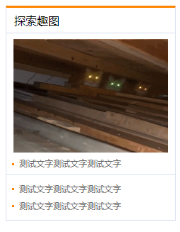
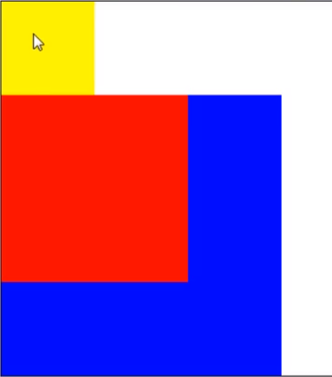
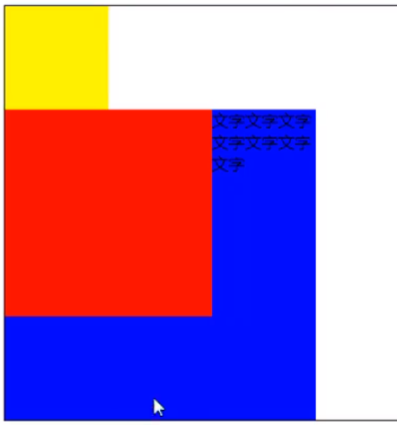
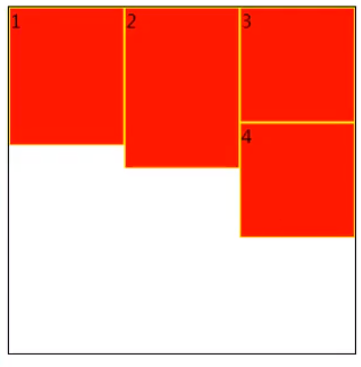
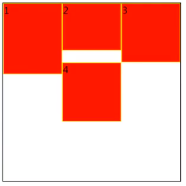
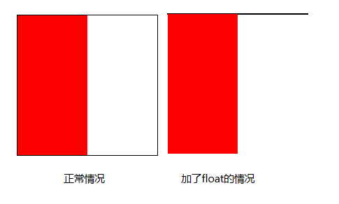

# 拨云见日3

### 图片格式

网页中，常见的图片格式有jpg，png和gif。jpg用来显示一般场景，png一般作为镂空图片使用，gif主要作为动图使用。

```html
<!DOCTYPE html>
<html lang="en">
<head>
    <meta charset="UTF-8">
    <meta name="viewport" content="width=device-width, initial-scale=1.0">
    <meta http-equiv="X-UA-Compatible" content="ie=edge">
    <title>Document</title>
    <style>
    body{ background:yellow;}
    </style>
</head>
<body>
    
    
    
    
</body>
</html>
```

代码文件位置：[src/01_图片格式.html](./src/01_图片格式.html)

此外，还提供了一个pdf设计的UI图和导出图，文件位置：[other/博文尚美首页.jpg](./other/博文尚美首页.jpg)以及[other/博文尚美首页.psd](./other/博文尚美首页.psd)。

### 1、切图练习

效果图：



代码：

```html
<!DOCTYPE html>
<html lang="en">
<head>
    <meta charset="UTF-8">
    <meta name="viewport" content="width=device-width, initial-scale=1.0">
    <meta http-equiv="X-UA-Compatible" content="ie=edge">
    <title>Document</title>
    <style>
    *{ margin : 0; padding: 0;}
    ul{ list-style: none;}
    img{ display: block;}
    a{ text-decoration: none; color:#666666;}
    h1,h2,h3,h4,h5,h6{ font-size:16px; font-weight: normal;}

    #main{ margin:20px auto; width:238px; border:1px solid #d9e0ee; border-top:3px #ff8400 solid;}
    #main h2{ height:35px; border-bottom:1px solid #d9e0ee; line-height: 35px; padding-left:11px;}
    #main h2 a{ color:black;}
    #main h2 a:hover{ color:#ff8400;}
    #main div img{ margin:8px auto 3px auto;}
    #main ul{ font-size:12px; line-height: 24px; margin-bottom: 8px;}
    #main ul li{ padding-left:18px; background: url(./img/dot.png) no-repeat 8px center;}
    #main ul li.first-line{ border-bottom:1px solid #d9e0ee; padding-bottom:3px; margin-bottom:8px;}
    #main ul a:hover{ color:#ff8400; text-decoration: underline;}
    </style>
</head>
<body>
    <div id="main">
        <h2>
            <a href="#">探索趣图</a>
        </h2>
        <div>
            <a href="#">
                
            </a>
        </div>
        <ul>
            <li class="first-line">
                <a href="#">测试文字测试文字测试文字</a>
            </li>
            <li>
                <a href="#">测试文字测试文字测试文字</a>
            </li>
            <li>
                <a href="#">测试文字测试文字测试文字</a>
            </li>
        </ul>
    </div>
</body>
</html>
```

代码文件位置：[src/02_新浪的小结构.html](./src/02_新浪的小结构.html)

**小技巧**：如果想看自己做的网页是否和切图一样，可以截图复制到PS中，然后将截图的透明度修改为50%，拿这个截图和原图进行拼合，如果能拼合，那么说明没有问题。

**PS切图技巧：**

PS推荐使用CC版本，因为CC版本有切图工具。

显示隐藏标尺：Ctrl+R。在标尺上可以拖拽参考线，可以通过移动工具拖拽回去，也可以在视图菜单中选择清除所有的参考线，图层中的小眼睛可以对当前图层进行显示隐藏，Alt+滚轮可以对图片进行放大缩小。

**png等图片的切图流程：**

通过矩形选框工具，选择指定的区域，选区工具中，按住shift增加区域，按住alt减少区域，可以进行微调，利用参考线记录量取的位置，以便以后测量其他的值。然后通过复制图像，新建文件和粘贴图像这个过程来创建切图，然后导出即可。

**psd图片的切图流程：**

在PS中，打开首选项，切换到增效工具，将生成器勾选上，然后点击菜单栏中的文件，选择生成，将图像资源勾选上。这样，更改图层名称，就会自动生成图片，比如更改名称为`icon.png`，就会生成png图片，更改为 `200% icon.png`，就会生成200%大小的图片。

**企业中UI设计和前端的合作：**

设计师通过sketch或者PS设计好文稿后，可以将文稿上传到蓝湖：https://lanhuapp.com。设计师在蓝湖中下载对应软件的插件就可以进行上传操作。此外，设计师还可以对图层进行切图，做好的切图，前端开发人员可以在蓝湖中下载该切图。

### 2、float浮动

文档流：文档流是文档中可显示对象在排列时所占用的位置。

float特性：加浮动的元素，会脱离文档流，会沿着父容器靠左或靠右排列，如果之前已经有浮动的元素，会挨着浮动的元素进行排列。

float可以取的值：left、right、none（none为默认值）

```html
<!DOCTYPE html>
<html lang="en">
<head>
    <meta charset="UTF-8">
    <meta name="viewport" content="width=device-width, initial-scale=1.0">
    <meta http-equiv="X-UA-Compatible" content="ie=edge">
    <title>Document</title>
    <style>
    body{ border:1px black solid;}
    #box1{ width:100px; height:100px; background:yellow; float:left;}
    #box2{ width:200px; height:200px; background:red;}
    </style>
</head>
<body>
    <!-- 当box1添加float后，box1就会脱离文档流，成为浮动的元素，因此它就不占实际的文档流的空间，box2就会会box1覆盖 -->
    <!-- 因为box1会脱离文档流，所以box1无法撑开body，body是由box2撑开的 -->
    <!-- 如果box2也添加了float，那么box1和box2都会浮动，都会脱离文档流，那么body就会塌陷，没有高度，只有边框 -->
    <!-- 如果box1和box2都添加left的浮动，那么box1会在最左面，box2会挨在box1的右面 -->
    <!-- 如果box1添加left，box2添加right，那么box1会在左面浮动，box2胡在右面浮动 -->
    <!-- 如果box1添加right，box2添加left，那么box1会在右面浮动，box2胡在左面浮动 -->
    <div id="box1"></div>
    <div id="box2"></div>
</body>
</html>
```

代码文件位置：[src/03_float浮动.html](./src/03_float浮动.html)

**注意：**

只会影响后面的元素，对于浮动之前的元素，不会造成任何影响，如图，对红色的块添加了float后，只会影响他下面的蓝色，黄色的不受影响：



内容默认提升半层，文字相当于半层，所以红色的块和文字属于同层，因此文字会被挤到右面，如图：



默认的块元素，宽度会填满父容器，但是float的元素，如果不给宽度的话，默认的宽度是由内部的内容决定的，类似inline的特性。

浮动元素如果在一个容器中，一行放不下的话，会换行排列。但是有一点注意的是，如果前一行的前几个元素高出来一块，那么就会把第二行的元素向后挤，如图所示：



但是如果前几个元素中有的元素很低，也不会顶上去，而是跟后面的元素一样高，如图：



主要给块元素添加，但也可以给内联元素添加。

代码文件位置：[src/04_float注意点.html](./src/04_float注意点.html)

#### 清除浮动：

**并列排列的情况：**

clear属性，表示清除浮动的，有三个值，left、right、both，推荐使用both。

注意：加了clear后，下面的div和上面的div并不在一个层，float的层更高一些。

```html
<!DOCTYPE html>
<html lang="en">
<head>
    <meta charset="UTF-8">
    <meta name="viewport" content="width=device-width, initial-scale=1.0">
    <meta http-equiv="X-UA-Compatible" content="ie=edge">
    <title>Document</title>
    <style>
        #box1{ width:100px; height:100px; background:red; float:left;}
        #box2{ width:200px; height:200px; background:blue; clear:both;}
    </style>
</head>
<body>
    <div id="box1"></div>
    <div id="box2"></div>
</body>
</html>
```

**嵌套排列：**

嵌套排列，会出现以下的情况：



固定宽高：但是这样做不好，不推荐把高度固定死，因为不适合做自适应的效果。

```html
<!DOCTYPE html>
<html lang="en">
<head>
    <meta charset="UTF-8">
    <meta name="viewport" content="width=device-width, initial-scale=1.0">
    <meta http-equiv="X-UA-Compatible" content="ie=edge">
    <title>Document</title>
    <style>
    #box1{ width:200px; height: 200px; border:1px black solid;}
    #box2{ width:100px; height:200px; background:red; float:left;}
    </style>
</head>
<body>
    <div id="box1">
        <div id="box2"></div>
    </div>
    aaaaaaa
</body>
</html>
```

父元素浮动：不推荐 , 因为父容器浮动也会影响到后面的元素。

```html
<!DOCTYPE html>
<html lang="en">
<head>
    <meta charset="UTF-8">
    <meta name="viewport" content="width=device-width, initial-scale=1.0">
    <meta http-equiv="X-UA-Compatible" content="ie=edge">
    <title>Document</title>
    <style>
    #box1{ width:200px; border:1px black solid; float:left;}
    #box2{ width:100px; height:200px; background:red; float:left;}
    </style>
</head>
<body>
    <div id="box1">
        <div id="box2"></div>
    </div>
    aaaaaaa
</body>
</html>
```

`overflow: hidden`（BFC规范）：这个办法可行，但是特殊情况下，如果有子元素想溢出，那么会受到影响。

```html
<!DOCTYPE html>
<html lang="en">
<head>
    <meta charset="UTF-8">
    <meta name="viewport" content="width=device-width, initial-scale=1.0">
    <meta http-equiv="X-UA-Compatible" content="ie=edge">
    <title>Document</title>
    <style>
    #box1{ width:200px; border:1px black solid; overflow: hidden;}
    #box2{ width:100px; height:200px; background:red; float:left;}
    </style>
</head>
<body>
    <div id="box1">
        <div id="box2"></div>
    </div>
    aaaaaaa
</body>
</html>
```

`display: inline-block`（BFC规范）：不推荐，父容器会影响到后面的元素，因为更改了盒子模型。

```html
<!DOCTYPE html>
<html lang="en">
<head>
    <meta charset="UTF-8">
    <meta name="viewport" content="width=device-width, initial-scale=1.0">
    <meta http-equiv="X-UA-Compatible" content="ie=edge">
    <title>Document</title>
    <style>
    #box1{ width:200px; border:1px black solid; display: inline-block;}
    #box2{ width:100px; height:200px; background:red; float:left;}
    </style>
</head>
<body>
    <div id="box1">
        <div id="box2"></div>
    </div>
    aaaaaaa
</body>
</html>
```

设置空标签：可以通过添加一个空标签然后设置clear属性，来消除float的影响，但是这个不是很推荐，因为会多添加一个标签。

```html
<!DOCTYPE html>
<html lang="en">
<head>
    <meta charset="UTF-8">
    <meta name="viewport" content="width=device-width, initial-scale=1.0">
    <meta http-equiv="X-UA-Compatible" content="ie=edge">
    <title>Document</title>
    <style>
    #box1{ width:200px; border:1px black solid;}
    #box2{ width:100px; height:200px; background:red; float:left;}
    .clear{ clear:both;}
    </style>
</head>
<body>
    <div id="box1">
        <div id="box2"></div>
        <div class="clear"></div>
    </div>
    aaaaaaa
</body>
</html>
```

after伪类清除浮动：推荐，是空标签的加强版，目前各大公司的做法。但是需要注意的是，clear属性只对block标签生效，对inline不生效，而after伪类是inline。

```html
<!DOCTYPE html>
<html lang="en">
<head>
    <meta charset="UTF-8">
    <meta name="viewport" content="width=device-width, initial-scale=1.0">
    <meta http-equiv="X-UA-Compatible" content="ie=edge">
    <title>Document</title>
    <style>
    #box1{ width:200px; border:1px black solid;}
    #box2{ width:100px; height:200px; background:red; float:left;}
    .clear:after{ content:''; clear:both; display: block;}
    </style>
</head>
<body>
    <div id="box1" class="clear">
        <div id="box2"></div>
    </div>
    aaaaaaa
</body>
</html>
```


