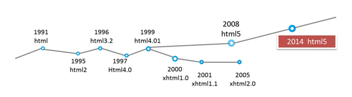
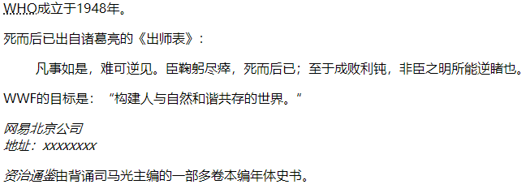

# 溯本求源_1

### 1、HTML和CSS的发展

#### HTML的发展

1991年8月6日，来自欧洲核子研究中心的科学家Tim Berners-Lee，启动了世界上第一个可以正式访问的网站（http: //info. cern. ch/），从此人类宣布了互联网时代的到来。



目前，html5应用广泛，而xhtml要求过于严格，受时代的影响，开发者的重心偏向于功能的开发，而不是制定严格的规范，因此xhtml逐渐没落。虽然html5规范要求不严格，但是我们在开发的时候，也要要求我们自己，尽量按照规范进行开发。

#### CSS的发展

1994年10月， Hakon Wium Lie提出了CSS层叠样式表，但是直到1996年的时候，CSS才演变成我们熟悉的样子。

CSS1.0--1996年12月，W3C推荐标准。

CSS2.0--1998年5月，W3C推荐标准。

CSS2.1--2004年6月，W3C推荐标准。

CSS3.0--还没有发布正式版本。

#### html和xhtml的区别

**DOCTYPE文档及编码**

html：

```html
<!DOCTYPE html>
<html lang="en">
<head>
    <meta charset="UTF-8">
    <meta name="viewport" content="width=device-width, initial-scale=1.0">
    <meta http-equiv="X-UA-Compatible" content="ie=edge">
    <title>Document</title>
</head>
```

xthml

```html
<!DOCTYPE html PUBLIC "-//W3C//DTD XHTML 1.0 Strict//EN" "http://www.w3.org/TR/xhtml1/DTD/xhtml1-strict.dtd">
<html xmlns="http://www.w3.org/1999/xhtml" xml:lang="zh-CN">
<head>
<meta http-equiv="Content-Type" content="text/html; charset=utf-8" />
<meta http-equiv="Content-Language" content="zh-CN" />
<title>文档标题</title>
</head>
```

**元素大小写**

html的元素可以允许大写，但是xhtml不允许大写。

**属性布尔值**

html的属性和属性值相同，或者属性值为真时，可以直接简写，比如`<input type="checkbox" checked>`，但是xhtml必须写完整，比如`<input type="checkbox" checked="checked" />`。

**属性引号**

html的属性值可以不加引号，但是最好是加上，比如`<div title=hello></div>`，但是xhtml是必须加引号的，`<div title="hello"></div>`。

**图片的alt属性**

html的img可以不加alt，``，但是xhtml必须写alt，``。

**单标签写法**

html的的单标签最后可以不用写斜线，比如`<input type="checkbox" checked>`，但是xhtml必须写斜线，比如`<input type="checkbox" checked="checked" />`。

**双标签闭合**

html的双标签可以不写闭合，但是不推荐这样做：

```html
<div>
        aaa
```

xhtml的双标签必须要闭合：

```html
<div>
    aaa
</div>
```

从上面来看，其实xhtml有一些规范，是比较好的，我们可以在html中继续使用，有一些略显麻烦的，我们可以不再使用，比如单标签的斜线问题。

代码文件位置：[src/01_html5.html](./src/01_html5.html)，[src/02_xhtml.html](./src/02_xhtml.html)

### 2、strong与b，em与i

**相同点**：他们的表现形态都是文本加粗和文本斜体。

**不同点**：

strong和em表示的是强调，而b仅表示加粗，i仅表示斜体，因此strong和em具有语义化；

利用b和i与span配合，可以简化css的选择器，更容易实现复杂的内联效果；

strong在盲人用的机器上会读两遍（在论坛上看到的，目前无法验证）。

```html
<!DOCTYPE html>
<html lang="en">
<head>
    <meta charset="UTF-8">
    <meta name="viewport" content="width=device-width, initial-scale=1.0">
    <meta http-equiv="X-UA-Compatible" content="ie=edge">
    <title>Document</title>
</head>
<body>
    <strong>文本1</strong>
    <b>文本2</b>
    <em>文本3</em>
    <i>文本4</i>
    <span>span</span>
</body>
</html>
```

代码文件位置：[src/03_b和i.html](./src/03_b和i.html)

### 3、引用标签

使用引用标签的好处：可以规范代码，有助于多人协作，可以更好的让浏览器解析，也可以让搜索引擎更快的搜索到。

- blockquote：引用大段的段落解释
- q：引用小段的短语解释
- abbr：缩写或首字母缩略词
- address：引用文档地址信息
- cite：引用著作的标题

```html
<!DOCTYPE html>
<html lang="en">
<head>
    <meta charset="UTF-8">
    <meta name="viewport" content="width=device-width, initial-scale=1.0">
    <meta http-equiv="X-UA-Compatible" content="ie=edge">
    <title>Document</title>
</head>
<body>
    <p>
        <abbr title="World Health Organization">WHO</abbr>成立于1948年。
    </p>
    <p>
        死而后已出自诸葛亮的《出师表》：
    </p>
    <blockquote>
        凡事如是，难可逆见。臣鞠躬尽瘁，死而后已；至于成败利钝，非臣之明所能逆睹也。
    </blockquote>
    <p>
        WWF的目标是：<q>构建人与自然和谐共存的世界。</q>
    </p>
    <address>
        网易北京公司<br>
        地址：xxxxxxxx
    </address>
    <p>
        <cite>资治通鉴</cite>由背诵司马光主编的一部多卷本编年体史书。
    </p>
</body>
</html>

```

效果图：



代码文件位置：[src/04_引用标签.html](./src/04_引用标签.html)

### 4、iframe嵌套页面

iframe 元素会创建包含另外一个文档的内联框架（即行内框架）。 

| 属性        | 含义                         |
| ----------- | ---------------------------- |
| frameborder | 规定是否显示框架周围的边框   |
| width       | 定义iframe的宽度             |
| height      | 定义iframe的高度             |
| scrolling   | 规定是否在iframe中显示滚动条 |
| src         | 规定在iframe中引入的URL      |
| srcdoc      | 规定在iframe中显示的页面内容 |

注意：当有srcdoc的时候，src就会失效。另外iframe的宽和高可以通过css来控制。

应用场景：数据传输、共享代码，局部刷新、第三方介入等。

```html
<!DOCTYPE html>
<html lang="en">
<head>
    <meta charset="UTF-8">
    <meta name="viewport" content="width=device-width, initial-scale=1.0">
    <meta http-equiv="X-UA-Compatible" content="ie=edge">
    <title>Document</title>
</head>
<body>
   <iframe src="https://g.163.com/r?site=netease&affiliate=homepage&cat=homepage&type=logo450x40&location=1" frameborder="0" width="450" height="40"></iframe>
</body>
</html>
```

代码文件位置：[src/05_iframe.html](./src/05_iframe.html)

**一天一个入狱小技巧——钓鱼网站：**

利用iframe，可以将第三方网站嵌入到自己的网站中进行伪装成真正的网站，但是可以在网站的登录等位置添加一个层，当点击之后，就会跳转到钓鱼网站的登录页面，通过这种方式就可以骗取用户名和密码等，因此在访问某个网页的时候，一定要看好域名。


