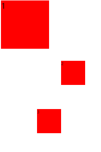

# 溯本求源_2

### 1、浏览器前缀

浏览器厂商以前就一直在实施CSS3，但它还未成为真正的标准。为此，当有一些CSS3样式语法还在波动的时候，他们提出了针对浏览器的前缀。通过前缀可以针对旧的浏览器做兼容，新浏览器基本不需要添加前缀。

| 浏览器        | 内核    | 前缀     |
| ------------- | ------- | -------- |
| IE            | Trident | -ms-     |
| Firefox       | Gecko   | -moz-    |
| Opera         | Presto  | -o-      |
| Chrome        | Webkit  | -webkit- |
| Safari        | Webkit  | -webkit- |
| Opera、Chrome | Blink   |          |

这些前缀不必手动刻意去加，可以通过工程化CSS的方式，通过工具来加，比如postcss、

```html
<!DOCTYPE html>
<html lang="en">
<head>
    <meta charset="UTF-8">
    <meta name="viewport" content="width=device-width, initial-scale=1.0">
    <meta http-equiv="X-UA-Compatible" content="ie=edge">
    <title>Document</title>
    <style>
    /* div{ width:200px; height:200px; background:red;
        animation: 1s move;
    }

    @keyframes move{
        0%{ opacity : 0;}
        100%{ opacity : 1;}
    } */

   /*  div{ width:200px; height:200px; background:red;
        -webkit-animation: 1s move;
    }

    @-webkit-keyframes move{
        0%{ opacity : 0;}
        100%{ opacity : 1;}
    } */

    div{ width:200px; height:200px; background:red;
        -ms-animation: 1s move;
    }

    @-ms-keyframes move{
        0%{ opacity : 0;}
        100%{ opacity : 1;}
    }
    </style>
</head>
<body>
    <div></div>
</body>
</html>
```

代码文件位置：[src/01_浏览器前缀.html](./src/01_浏览器前缀.html)

### 2、transition过渡

transition有四个属性：

- transition-property：规定设置过渡效果的CSS属性的名称。
- transition-duration：规定完成过渡效果需要多少秒或毫秒，单位可以是s或者是ms。
- transition-delay：定义过渡效果何时开始，单位可以是s或者是ms，而且可以是负数。
- transition-timing-function：规定速度效果的速度曲线。曲线主要有以下几个值：linear，ease（默认值），ease-in，ease-out，ease-in-out，cubic-bezier（贝塞尔曲线，这个可以参考该网站http://cubic-bezier.com）。


**注意：**

transition的复合写法，要注意是持续时间在前，延迟时间在后；如果实现鼠标移入移出都有效果，transition需要加在类本身上，不能加在hover上。

```html
<!DOCTYPE html>
<html lang="en">
<head>
    <meta charset="UTF-8">
    <meta name="viewport" content="width=device-width, initial-scale=1.0">
    <meta http-equiv="X-UA-Compatible" content="ie=edge">
    <title>Document</title>
    <style>
    /* div{ width:100px; height:100px; background:red; 
        transition-property: all; 
        transition-duration: 1s; 
        transition-delay: 2s;
        transition-timing-function:cubic-bezier(.49,-0.75,.88,1.74);
    } */
    div{ width:100px; height:100px; background:red; 
        transition: 1s linear;
    }
    div:hover{ width:200px; height:200px; background:blue;}
    </style>
</head>
<body>
    <div></div>
</body>
</html>
```

代码文件位置：[src/02_transition.html](./src/02_transition.html)

**transition案例：**

```html
<!DOCTYPE html>
<html lang="en">
<head>
    <meta charset="UTF-8">
    <meta name="viewport" content="width=device-width, initial-scale=1.0">
    <meta http-equiv="X-UA-Compatible" content="ie=edge">
    <title>Document</title>
    <style>
    ul,li{ margin: 0; padding:0; list-style: none;}
    ul{ width:360px;}
    ul li{  width:60px; height:70px; float:left; background: url('./img/aNavBg.png'); transition: .5s;}
    ul li:nth-child(1){ background-position: 0 -70px;}
    ul li:nth-child(2){ background-position: -60px -70px;}
    ul li:nth-child(3){ background-position: -120px -70px;}
    ul li:nth-child(4){ background-position: -180px -70px;}
    ul li:nth-child(5){ background-position: -240px -70px;}
    ul li:nth-child(6){ background-position: -300px -70px;}

    ul li:hover:nth-child(1){ background-position: 0 0;}
    ul li:hover:nth-child(2){ background-position: -60px 0;}
    ul li:hover:nth-child(3){ background-position: -120px 0;}
    ul li:hover:nth-child(4){ background-position: -180px 0;}
    ul li:hover:nth-child(5){ background-position: -240px 0;}
    ul li:hover:nth-child(6){ background-position: -300px 0;}
    </style>
</head>
<body>
    <ul>
        <li></li>
        <li></li>
        <li></li>
        <li></li>
        <li></li>
        <li></li>
    </ul>
</body>
</html>
```

代码文件位置：[src/03_transition案例.html](./src/03_transition案例.html)

### 3、transform变形

translate：位移，有三个值，translateX、translateY和translateZ。也可以使用复合写法translate(x, y, z)，这里需要注意的是，一般情况下z可以省略，即只写两个值，但是如果x和y的某一个不运动，需要用0来占位，不可以只写一个值。

```css
transform: translate(100px , 100px);
```

scale：缩放，值是一个比例值，正常大小就是1，2就是原来的2倍，0.5就是原来的一半。缩放会以当前元素中心点进行缩放。scale也有三个值，scaleX、scaleY和scaleZ。如果只写一个值，就是都放大或者都缩小，这个和translate不一样，需要注意。

```css
transform: translateX(100px);
```

rotate：旋转，旋转的值可以是角度，也可以是弧度，角度的单位是deg。rotate也有三个值，rotateX（3D）、rotateY（3D）和rotateZ（和rotate是等价关系，正值按顺时针旋转，负值按逆时针旋转）

```css
transform : rotateZ(-45deg); 
```

skew：斜切。skewX，skewY单位也是角度，正值逆时针倾斜，负值顺时针倾斜。

```css
transform: skew(-30deg,-30deg);
```

代码演示：

```html
<!DOCTYPE html>
<html lang="en">
<head>
    <meta charset="UTF-8">
    <meta name="viewport" content="width=device-width, initial-scale=1.0">
    <meta http-equiv="X-UA-Compatible" content="ie=edge">
    <title>Document</title>
    <style>
    .box1{ width:300px; height:300px; border:1px black solid; margin: 30px auto;}
    .box2{ width:100px; height:100px; background:red; transition:2s;}
    .box1:hover .box2{/*  transform: translate(100px , 100px); */
        /* transform: translateX(100px); */
       /*  transform : scale(2); */
       /* transform: scaleX(2); */

       transform : rotateZ(-45deg); 
       /* transform: skew(-30deg,-30deg);*/
    }
    </style>
</head>
<body>
    <div class="box1">
        <div class="box2"></div>
        aaaaaa
    </div>
</body>
</html>
```

代码文件位置：[src/04_transform.html](./src/04_transform.html)

**transform的注意事项：**

- 变形操作不会影响到其他元素。
- 变形操作只能添加给块元素，但是不能添加给内联元素。
- 复合写法，可以同时添加多个变形操作。但是执行的时候是有顺序的，rotate、scale、skew会改变坐标轴，因此会影响到translate。
- 变形默认是以元素的中心进行变换，可以通过transform-origin来改变基点的位置，有xyz三个值。

```html
<!DOCTYPE html>
<html lang="en">
<head>
    <meta charset="UTF-8">
    <meta name="viewport" content="width=device-width, initial-scale=1.0">
    <meta http-equiv="X-UA-Compatible" content="ie=edge">
    <title>Document</title>
    <style>
    .box1{ width:100px; height:100px; background:red; transition: 1s; transform-origin: 300px 300px;}
    .box1:hover{ transform: scale(.5)}
   /*  .box2{ width:100px; height:100px; background:red; transform: translate(100px,0) scale(.5);}
    .box3{ width:100px; height:100px; background:red; transform: scale(.5) translate(100px,0);} */
    /* .box2{ width:100px; height:100px; background:red; transform: translate(100px,0) rotate(45deg);}
    .box3{ width:100px; height:100px; background:red; transform: rotate(45deg) translate(100px,0);} */
    </style>
</head>
<body>
    <div class="box1">1</div>
    <div class="box2">2</div>
    <div class="box3">3</div>
</body>
</html>
```



代码文件位置：[src/05_transform的注意事项.html](./src/05_transform的注意事项.html)

**斜切的导航**

```html
<!DOCTYPE html>
<html lang="en">
<head>
    <meta charset="UTF-8">
    <meta name="viewport" content="width=device-width, initial-scale=1.0">
    <meta http-equiv="X-UA-Compatible" content="ie=edge">
    <title>Document</title>
    <style>
    *{ margin:0; padding:0;}
    ul{ list-style: none;}
    ul{ width:435px; margin:30px auto; overflow: hidden;}
    ul li{ float: left; width:100px; height:30px; background:red; color:white; line-height: 30px; text-align: center; margin:0 5px; transform:skewX(-30deg); cursor: pointer;}
    ul li.active{ background:blue;}
    ul li span{ transform: skewX(30deg); display: block;}
    ul li:first-child{ padding-left:10px; margin-left: -10px;}
    ul li:last-child{ padding-right:20px; margin-right: -20px;}
    </style>
</head>
<body>
    <div>
        <ul>
            <li class="active"><span>首页</span></li>
            <li><span>关于我们</span></li>
            <li><span>联系方式</span></li>
            <li><span>招聘信息</span></li>
        </ul>
    </div>
</body>
</html>
```

效果图：


代码文件位置：[src/06_斜切的导航.html](./src/06_斜切的导航.html)

**变形的列表**

要点：对于有动画的效果，要把最终的效果先做好，然后逆着回去做动画，这样会方便一些。比如下面的两个效果，上面是变形前的效果，下面是变形后的效果，我们需要先做变形后的效果，然后在反过来做变形前的效果：


```html
<!DOCTYPE html>
<html lang="en">
<head>
    <meta charset="UTF-8">
    <meta name="viewport" content="width=device-width, initial-scale=1.0">
    <meta http-equiv="X-UA-Compatible" content="ie=edge">
    <title>Document</title>
    <style>
    *{ margin:0; padding:0;}
    ul{ list-style: none;}
    img{ display: block;}

    .list{ width: 250px; margin:30px auto;}
    .list li{ height:97px; border-bottom: 1px #d0d6d9 dashed; overflow: hidden;}
    .list li:last-child{ border-bottom: none;}
    .list .list_photo{ float: left; width:112px; height:77px; margin:10px 9px 0 5px; position: relative;}
    .list .list_photo .list_photo_box{ width:92px; height:57px; border:1px white solid; position: absolute; left: 9px; top:9px; transform: translate(0,-60px) rotate(-90deg); transition:1s; transform-origin: 0 0;}
    .list .list_photo .list_photo_text{ width:100%; position: absolute; color:white; text-align: center; bottom: 15px; font-size: 14px;  transform: translate(0,100px); transition:1s;}
    .list .list_photo img{ width:100%;}
    .list .list_text{ float: left; width:114px; font-size:12px; line-height:21px; margin-top: 10px;}

    .list li:hover .list_photo_box{ transform: translate(0,0) rotate(0);}
    .list li:hover .list_photo_text{ transform: translate(0,0);}
    </style>
</head>
<body>
    <ul class="list">
        <li>
            <div class="list_photo">
                
                <div class="list_photo_box"></div>
                <div class="list_photo_text">陌陌上市</div>
            </div>
            <div class="list_text">
                <p>测试文字测试文字测试文字测试文字测试文字</p>
            </div>
        </li>
        <li>
            <div class="list_photo">
                
                <div class="list_photo_box"></div>
                <div class="list_photo_text">陌陌上市</div>
            </div>
            <div class="list_text">
                <p>测试文字测试文字测试文字测试文字测试文字</p>
            </div>
        </li>
        <li>
            <div class="list_photo">
                
                <div class="list_photo_box"></div>
                <div class="list_photo_text">陌陌上市</div>
            </div>
            <div class="list_text">
                <p>测试文字测试文字测试文字测试文字测试文字</p>
            </div>
        </li>
        <li>
            <div class="list_photo">
                
                <div class="list_photo_box"></div>
                <div class="list_photo_text">陌陌上市</div>
            </div>
            <div class="list_text">
                <p>测试文字测试文字测试文字测试文字测试文字</p>
            </div>
        </li>
    </ul>
</body>
</html>
```

代码文件位置：[src/07_变形的列表.html](./src/07_变形的列表.html)

**变形的列表练习**

html：

```html
<!DOCTYPE html>
<html lang="en">
<head>
    <meta charset="UTF-8">
    <meta name="viewport" content="width=device-width, initial-scale=1.0">
    <link rel="stylesheet" href="style.css">
    <style>
        
    </style>
    <title>Document</title>
</head>
<body>
    <div id="main">
        <ul class="list clear">
            <li>
                
				<div class="list_text">
					<h2>测试文字</h2>
					<p>测试段落测试段落测试段落测试段落测试段落</p>
				</div>
				<div class="list_maskUp"></div>
				<div class="list_maskDown"></div>
            </li>
            <li>
                
				<div class="list_text">
					<h2>测试文字</h2>
					<p>测试段落测试段落测试段落测试段落测试段落</p>
				</div>
				<div class="list_maskUp"></div>
				<div class="list_maskDown"></div>
            </li>
            <li>
                
				<div class="list_text">
					<h2>测试文字</h2>
					<p>测试段落测试段落测试段落测试段落测试段落</p>
				</div>
				<div class="list_maskUp"></div>
				<div class="list_maskDown"></div>
            </li>
            <li>
                
				<div class="list_text">
					<h2>测试文字</h2>
					<p>测试段落测试段落测试段落测试段落测试段落</p>
				</div>
				<div class="list_maskUp"></div>
				<div class="list_maskDown"></div>
            </li>
            <li>
                
				<div class="list_text">
					<h2>测试文字</h2>
					<p>测试段落测试段落测试段落测试段落测试段落</p>
				</div>
				<div class="list_maskUp"></div>
				<div class="list_maskDown"></div>
            </li>
            <li>
                
				<div class="list_text">
					<h2>测试文字</h2>
					<p>测试段落测试段落测试段落测试段落测试段落</p>
				</div>
				<div class="list_maskUp"></div>
				<div class="list_maskDown"></div>
            </li>

        </ul>
    </div>
</body>
</html>
```

css：

```css
* {
    margin: 0;
    padding: 0;
}

ul {
    list-style: none;
}

img {
    display: block;
}

.clear:after {
    content: "";
    display: block;
    clear: both;
}

#main {
    width: 826px;
    margin: 20px auto;
    border: 1px #cccccc solid;
}

.list {
    width: 830px;
}

.list li {
    width: 250px;
    height: 250px;
    float: left;
    margin: 13px;
    position: relative;
    overflow: hidden;
}

.list_text {
    width: 100%;
    height: 0px;
    background: rgba(0, 0, 0, .5);
    position: absolute;
    left: 0;
    top: 50px;
    z-index: 2;
    overflow: hidden;
    transform: rotate(45deg);
    transition: .5s;
}

.list_text h2 {
    height: 56px;
    border-bottom: 1px #8a7881 solid;
    font-size: 24px;
    color: white;
    line-height: 56px;
    text-align: center;
}

.list_text p {
    border-top: 2px #b1a5ab solid;
    line-height: 26px;
    font-size: 20px;
    color: white;
    text-align: center;
    padding-top: 13px;
}

.list_maskUp {
    width: 350px;
    height: 350px;
    position: absolute;
    left: 0;
    top: -300px;
    z-index: 1;
    background: rgba(199, 4, 109, .5);
    transform: rotate(45deg) translateX(-200px);
    transition: .5s;
}

.list_maskDown {
    width: 350px;
    height: 350px;
    position: absolute;
    left: 0;
    top: 300px;
    z-index: 1;
    background: rgba(199, 4, 109, .5);
    transform: rotate(45deg) translateX(50px);
    transition: .5s;
}

.list li:hover .list_text {
    height: 150px;
    transform: rotate(0deg);
}

.list li:hover .list_maskUp, .list li:hover .list_maskDown {
    top: 0;
}
```

代码文件位置：[src/变形练习/index.html](./src/变形练习/index.html)


