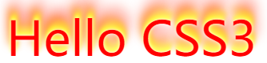
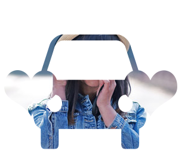
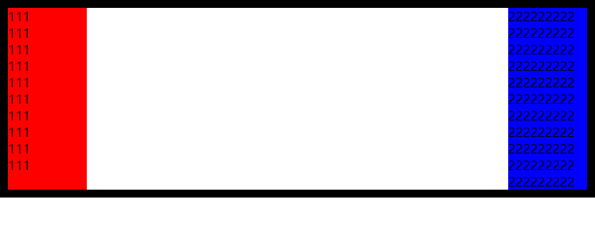

# 溯本求源_3

### 1、文字阴影

文字的阴影属性为text-shadow，格式如下：`text-shadow: x y blur color,  x y blur color, ...;`。

x和y代表偏移量，x为正数为往右，y为整数为往下，blur为模糊大小，color为颜色。同一个属性可以设置多个阴影效果。如果没有设置阴影的颜色，那么阴影的默认颜色和文字颜色相同。

```css
 div{ font-size:50px; color:red; text-shadow: 10px 10px 10px blue, -10px -10px 10px green;}
```

**火焰字：**

```css
div
{ 
    font-size:60px; 
    color:red; 
    text-shadow:0 0 4px white,0 -5px 4px #ff3,2px -10px 6px #fd3,-2px -15px 11px #f80,2px -25px 18px #f20;
}
```



代码文件位置：[src/01_文字阴影.html](./src/01_文字阴影.html)

### 2、盒子阴影

盒子阴影的属性为box-shadow，格式如下：`box-shadow: x y blur spread color inset, x y blur spread color inset, ...;`。

x，y，blur和color同文字阴影；spread表示扩展，可以让阴影在原有的基础上，向外扩展多少；inset为内阴影，默认情况下为外阴影，如果想使用外阴影，不需要写任何值，但是如果写了outset，阴影就会失效。

```html
<!DOCTYPE html>
<html lang="en">
<head>
    <meta charset="UTF-8">
    <meta name="viewport" content="width=device-width, initial-scale=1.0">
    <meta http-equiv="X-UA-Compatible" content="ie=edge">
    <title>Document</title>
    <style>
    .box{ width:200px; height:200px; background:red; margin: 100px;
        box-shadow: 10px 10px 10px 5px blue , 10px 10px 10px 5px green inset;
    }
    </style>
</head>
<body>
    <div class="box"></div>
</body>
</html>
```

代码文件位置：[src/02_盒子阴影.html](./src/02_盒子阴影.html)

**盒子阴影练习：**

小米官网划入会浮动并有阴影效果：

```html
<!DOCTYPE html>
<html lang="en">
<head>
    <meta charset="UTF-8">
    <meta name="viewport" content="width=device-width, initial-scale=1.0">
    <meta http-equiv="X-UA-Compatible" content="ie=edge">
    <title>Document</title>
    <style>
    ul{ list-style: none;}
    li{ float:left; margin:50px; cursor: pointer; position: relative; top: 0; transition: .5s; border-radius: 3px;}
    li:hover{ top:-3px; box-shadow: 0px 5px 10px 3px #ccc;}
    </style>
</head>
<body>
    <ul>
        <li>
            
        </li>
        <li>
            
        </li>
    </ul>
</body>
</html>
```

代码文件位置：[src/03_小米官网浮动效果.html](./src/03_小米官网浮动效果.html)

### 3、遮罩

遮罩的属性为mask，目前还mask还不是通用属性，需要加上浏览器前缀，格式如下：

`-webkit-mask: url repeat x y / width height, url repeat x y / width height, ...;`

url为引入的遮罩图片，一般为镂空图片，有像素的地方为显示区域，镂空的地方不会显示， repeat是是否平铺，x和y表示起始位置，可以是数字也可以是单词，width和height表示宽高。遮罩的效果如下：



注意：如果直接以文件的形式打开，可能无法正常显示图片。

```html
<!DOCTYPE html>
<html lang="en">

<head>
    <meta charset="UTF-8">
    <meta name="viewport" content="width=device-width, initial-scale=1.0">
    <meta http-equiv="X-UA-Compatible" content="ie=edge">
    <title>Document</title>
    <style>
        .mask {
            width: 300px;
            height: 300px;
            background: url('./img/girl.jpg');
            -webkit-mask: url('./img/car.png') no-repeat center center / 200px 200px, 
            url('./img/love.png') no-repeat left center / 100px 100px, 
            url('./img/love.png') no-repeat right center / 100px 100px;
            transition: .5s;
        }

        .mask:hover {
            -webkit-mask: url('./img/love.png') no-repeat center center / 100px 100px;
        }
    </style>
</head>

<body>
    <div class="mask">

    </div>
</body>

</html>

```

代码文件位置：[src/04_mask遮罩.html](./src/04_mask遮罩.html)

### 4、倒影

倒影的属性为box-reflect，格式为：`box-reflect: above|below|left|right distance mask|gradient;`。需要注意的是，该属性也需要加上浏览器前缀。

第一个参数表示为往哪边倒影，第二个表示具体原图有多远，第三个参数为遮罩或者渐变，遮罩直接使用url引入即可，渐变可以使用gradient函数。例如：

```css
.box{ margin:50px auto; width:300px; -webkit-box-reflect: below 20px;}
.box{ margin:50px auto; width:300px; -webkit-box-reflect: below 20px url('./img/love.png');}
.box{ margin:50px auto; width:300px; -webkit-box-reflect: below 20px linear-gradient( rgba(255,255,255,0) 50% , rgba(255,255,255,1) );}
```

**扩展：**

图像的翻转还可以通过scale来实现，只需要把值改为负数即可，在scale中的`scale(x, y)`通过单独控制x或者y，可以实现只对一个轴的翻转，比较灵活。

代码文件位置：[src/05_倒影.html](./src/05_倒影.html)

### 5、模糊

模糊一般通过filter属性来控制，使用blur函数，格式如下：`filter: blur(像素值);`。

### 6、运算

运算的函数为calc，可以进行四则运算，并且可以进行百分比和像素之间的运算，比如：`width:calc(100% - 100px);`。

```html
<!DOCTYPE html>
<html lang="en">
<head>
    <meta charset="UTF-8">
    <meta name="viewport" content="width=device-width, initial-scale=1.0">
    <meta http-equiv="X-UA-Compatible" content="ie=edge">
    <title>Document</title>
    <style>
    img{ filter:blur(20px);}
    .parent{ width:800px; height:300px; border:1px solid black;}
    .box{ height:100px; width:calc(100% - 100px); background:red;}
    </style>
</head>
<body>
    

    <div class="parent">
        <div class="box"></div>
    </div>
</body>
</html>
```

代码文件位置：[src/06_模糊.html](./src/06_模糊.html)

### 7、分栏布局

| 属性         | 说明                                                         |
| ------------ | ------------------------------------------------------------ |
| column-count | 分栏的个数                                                   |
| column-width | 分栏的宽度                                                   |
| column-gap   | 分栏的间距                                                   |
| column-rule  | 分栏的边线，设置方法类似设置边框                             |
| column-span  | 合并分栏，比如给外层的div分栏，里面有p和h2，把合并分栏添加到h2上，就不会被分栏。 |

 注：column-width和column-count不要一起去设置。

```html
<!DOCTYPE html>
<html lang="en">
<head>
    <meta charset="UTF-8">
    <meta name="viewport" content="width=device-width, initial-scale=1.0">
    <meta http-equiv="X-UA-Compatible" content="ie=edge">
    <title>Document</title>
    <style>
    .box{ width:600px; height:400px; border:1px black solid; margin: 30px auto;
        column-count: 4;
       /*  column-width: 100px; */
        column-gap : 40px;
        column-rule : 1px red dashed;
    }
    .box h2{ column-span: all;  text-align: center;}
    </style>
</head>
<body>
    <div class="box">
        <h2>恶劣天气导致美国新冠疫苗供应受阻</h2>
        <p>新华社北京2月21日新媒体专电 据塔斯社华盛顿2月20日报道，美国白宫新冠疫情应对团队高级顾问安迪·斯拉维特当地时间19日在例行记者会上称，猛烈的暴风雪导致50个州近600万剂新冠疫苗供应受阻。</p>
        <p>斯拉维特表示：“目前恶劣的天气导致我们约有600万剂疫苗的运送被推迟。全部50个州均受影响。600万剂差不多是3天积压的疫苗数量。许多州都通过原有储备弥补了送货延迟导致的短缺部分。”</p>
    </div>
</body>
</html>
```

代码文件位置：[src/07_分栏布局.html](./src/07_分栏布局.html)

### 8、伪类与伪元素

在CSS2.1中对伪类和伪元素的区别比较模糊。CSS3中对这两个概念做了相对较清晰地解释，并且在语法上也做了很明显的区分。CSS3中规定伪类由一个冒号开始，然后为伪类的名称；伪元素由两个冒泡开始，然后为伪元素的名称。

伪类本质上是为了弥补常规CSS选择器的不足，以便获取到更多信息。通常表示获取不存在与DOM树中的信息，或获取不能被常规CSS选择器获取的信息。比如hover、focus、empty等。

伪元素本质上是创建了一个有内容的虚拟容器。这个容器不包含任何DOM元素，但是可以包含内容。另外，开发者还可以为伪元素定制样式。比如selection、first-line、first-letter、before、after等。

```html
<!DOCTYPE html>
<html lang="en">
<head>
    <meta charset="UTF-8">
    <meta name="viewport" content="width=device-width, initial-scale=1.0">
    <meta http-equiv="X-UA-Compatible" content="ie=edge">
    <title>Document</title>
    <style>
    .box{ width:300px; height:300px; border:1px black solid;}
    .box:hover{ background:pink;}
    .box::selection{ background:red; color:yellow;}
    </style>
</head>
<body>
    <div class="box">
        据塔斯社华盛顿2月20日报道，美国白宫新冠疫情应对团队高级顾问安迪·斯拉维特当地时间19日在例行记者会上称，猛烈的暴风雪导致50个州近600万剂新冠疫苗供应受阻。
    </div>
</body>
</html>
```

代码文件位置：[src/08_伪元素.html](./src/08_伪元素.html)

### 9、CSS Hack

CSS Hack用来解决浏览器的兼容性问题，为不同版本的浏览器定制编写不同的CSS效果，使用每个浏览器单独识别的样式代码，控制浏览器的显示样式。Hack有CSS属性前缀法、选择器前缀法、IE条件注释法。

为了测试IE效果，可以下载IETester，通过该软件可以模拟各种IE环境，下载地址如下：https://www.my-debugbar.com/wiki/IETester/HomePage

为了避免出现错误，可以将网页放在服务器环境下，比如PHP集成环境、wamp、xampp、phpstudy等。

**CSS属性前缀法：**

属性前缀法是在CSS样式属性名前加上一些只有特定浏览器才能识别的hack前缀，以达到预期的页面展现效果。

| **前缀标识** | 兼容浏览器           |
| ------------ | -------------------- |
| `_`          | IE6                  |
| `+、*`       | IE6、IE7             |
| `\9`         | IE6、IE7、IE8、IE9   |
| `\0`         | IE8、IE9、IE10、IE11 |

```CSS
/* IE6 */
.box{ width:100px; height:100px; background: red; _background:blue;}
/* IE6 7 */
.box{ width:100px; height:100px; background: red; +background:blue;}
.box{ width:100px; height:100px; background: red; *background:blue;}
/* IE6~9 */
.box{ width:100px; height:100px; background: red; background:blue\9;}
/* IE8~11 */
.box{ width:100px; height:100px; background: red; background:blue\0;}
```

**选择器前缀法：**

| 前缀标识 | 兼容浏览器          |
| -------- | ------------------- |
| `*html`  | IE6                 |
| `*+html` | IE7                 |
| `:root`  | IE9以上及现代浏览器 |

```css
/* IE6 */
*html .box{ width:100px; height:100px; background:red;}
/* IE7 */
*+html .box{ width:100px; height:100px; background:red;}
/* IE9及高级浏览器 */
:root .box{ width:100px; height:100px; background:red;}
```

**IE条件注释法：**

这种方式是IE浏览器专有的Hack方式，微软官方推荐使用的hack方式。这种方式在给html标签添加注释的方式。这种方式只适合IE9以及IE9以下的浏览器，IE10及以上不适用。

| 前缀标识                          | 兼容浏览器                                    |
| --------------------------------- | --------------------------------------------- |
| `<!--[if IE]>…<![endif]-->`       | IE6 - IE9                                     |
| `<!--[if IE 7]>…<![endif]-->`     | IE7                                           |
| `<!--[if lte IE 7]>…<![endif]-->` | lte表示小于等于，即IE7及以下，gte表示大于等于 |
| `<!--[if ! IE 7]>…<![endif]-->`   | 非IE7                                         |

```html
<!--[if gte IE 7]>
<div class="box"></div>
<![endif]-->
```

代码文件位置：[src/09_hack.html](./src/09_hack.html)

### 10、IE低版本常见BUG

透明度

```css
/* opacity IE8及以下版本不识别 */
.box{ width:100px; height:100px; background:red; opacity:0.5;}
/* 解决方法：filter:alpha(opacity=50)，这里的取值是1-100 */
.box{ width:100px; height:100px; background:red; opacity:0.5; filter:alpha(opacity=50);}
```

双边距BUG

```css
/* IE6下的双边距BUG，使用margin-left和float，IE6下会出现左侧边距是设定的两倍 */
.box{ float:left; width:100px; height:100px; background:red; margin-left: 50px; }
/* 解决方法 */
.box{ float:left; width:100px; height:100px; background:red; margin-left: 50px; _display:inline;}
```

最小高度问题

```css
/* IE6下的最小高度BUG , IE6下的最小高为19px，如果设置的值小于19，那么会有溢出 */
.box{ width:300px; height:3px; background:red;}
/* 解决方法 */
.box{ width:300px; height:3px; background:red; overflow: hidden;}
```

img边框问题

```html
<style>
    /* img边框问题，IE浏览器下，给img添加a标签，会出现边框，IE6是红色，IE7-IE9是蓝色，解决方法如下： */
    img{ border:none;}
</style>
<a href="#">
    
</a>
```

代码文件位置：[src/10_IE常见BUG.html](./src/10_IE常见BUG.html)

### 11、渐进增强与优雅降级

渐进增强：针对低版本浏览器进行构建页面，保证最基本的功能，然后再针对高级浏览器进行效果、交互等改进和追加功能达到更好的用户体验。

优雅降级：一开始就构建完整的功能，然后再针对低版本浏览器进行兼容。

### 12、等高布局

要实现的效果：有两列内容，如果左侧的内容比较长，那么右侧的长度也和左侧保持一致，如果右侧的内容比较长，那么左侧的长度和右侧保持一致。

实现原理：现在有一个parent的div和一个child的div，默认情况下，parent的div的高度是由child的div撑开的。此时如果给child设置一个margin-bottom的负值，那么parent的高度就是用child的div的高度减去margin-bottom，如果在加上padding-bottom，那么parent的高度就是div减去margin-bottom再加上padding-bottom。所以只要设置一个足够大的margin-bottom和padding-bottom，并把child的div设置为0，然后再用实际的内容撑开，再设置parent的div隐藏溢出内容即可。

```html
<!DOCTYPE html>
<html lang="en">
<head>
    <meta charset="UTF-8">
    <meta name="viewport" content="width=device-width, initial-scale=1.0">
    <meta http-equiv="X-UA-Compatible" content="ie=edge">
    <title>Document</title>
    <style>
    /* #parent{ border:10px black solid; overflow: hidden;}
    #box1{ float:left; width:100px; height:200px; background:red;}
    #box2{ float:right; width:100px; height:300px; background:blue;} */

    *{ margin:0; padding:0;}
    #parent{ border:10px black solid; overflow: hidden;}
    #box1{ float:left; width:100px; background:red; margin-bottom: -2000px; padding-bottom: 2000px;}
    #box2{ float:right; width:100px; background:blue; margin-bottom: -2000px; padding-bottom: 2000px;}
    </style>
</head>
<body>
    <!-- <div id="parent">
        <div id="box1"></div>
        <div id="box2"></div>
    </div> -->
    
    <div id="parent">
        <div id="box1">
            <p>111</p>
            <p>111</p>
            <p>111</p>
            <p>111</p>
            <p>111</p>
            <p>111</p>
            <p>111</p>
            <p>111</p>
            <p>111</p>
            <p>111</p>
        </div>
        <div id="box2">
            <p>222222222</p>
            <p>222222222</p>
            <p>222222222</p>
            <p>222222222</p>
            <p>222222222</p>
            <p>222222222</p>
            <p>222222222</p>
            <p>222222222</p>
            <p>222222222</p>
            <p>222222222</p>
            <p>222222222</p>
        </div>
    </div>
</body>
</html>
```



代码文件位置：[src/11_等高布局.html](./src/11_等高布局.html)


