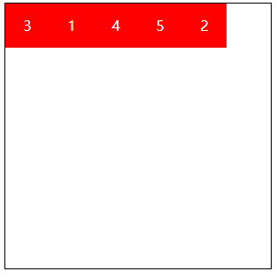
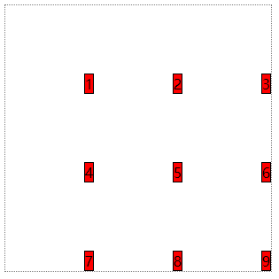

# 风生水起_1

### flex布局

随着移动互联网的发展，对于网页布局来说要求越来越高，而传统的布局方案对于实现特殊布局非常不方便，比如垂直居中。

2009年，W3C提出了一种新的方案——Flex布局，可以简便、完整、响应式地实现各种页面布局。目前，它已经得到了所有浏览器的支持，这意味着，现在就能很安全地使用这项功能。

**flex布局作用在的位置**

| 作用在flex容器上 | 作用在flex子项上 |
| :--------------: | :--------------: |
|  flex-direction  |      order       |
|    flex-wrap     |    flex-grow     |
|    flex-flow     |   flex-shrink    |
| justify-content  |    flex-basis    |
|   align-items    |       flex       |
|  align-content   |    align-self    |

**一个小实例：**

实现一个小矩形在一个容器中垂直水平居中，如下图所示：


```html
<!DOCTYPE html>
<html lang="en">
<head>
    <meta charset="UTF-8">
    <meta name="viewport" content="width=device-width, initial-scale=1.0">
    <meta http-equiv="X-UA-Compatible" content="ie=edge">
    <title>Document</title>
    <style>
    #parent{ width:300px; height:300px; border:1px black solid; margin:20px auto; display: flex;}
    #box{ width:150px; height:50px; background:red; margin:auto;}
    </style>
</head>
<body>
    <div id="parent">
        <div id="box"></div>
    </div>
</body>
</html>
```

### flex布局：作用在flex容器上的

#### flex-direction

flex-direction用来控制子项整体布局方向，是从左往右还是从右往左，是从上往下还是从下往上。<span style="color: #ff0000;">这个属性是加在<span style="font-weight: bold;">flex的容器</span>上的</span>。

| 取值           | 含义                                                         |
| -------------- | ------------------------------------------------------------ |
| row            | 默认值，显示为行。方向为当前文档水平流方向，默认情况下是从左往右。 |
| row-reverse    | 显示为行，但方向和row属性值是反的。                          |
| column         | 显示为列。                                                   |
| column-reverse | 显示为列，但方向和column属性值是反的。                       |


```html
<style>
    #box{ width:300px; height:300px; border:1px black solid; margin:20px auto; display: flex; flex-direction: column-reverse;}
    #box div{ width:50px; height:50px; color:white; line-height: 50px; text-align: center; background:red;}
</style>
<div id="box">
    <div>1</div>
    <div>2</div>
    <div>3</div>
</div>
```

#### flex-wrap

flex-wrap用来控制子项整体单行显示还是换行显示。<span style="color: #ff0000;">这个属性是加在<span style="font-weight: bold;">flex的容器</span>上的</span>。

| 取值         | 含义                                                         |
| ------------ | ------------------------------------------------------------ |
| nowrap       | 默认值，表示单行显示，不换行。子项的宽度会进行自适应，当内容无法被压缩，子项会溢出。 |
| wrap         | 宽度不足换行显示。默认状态下，两行中间会有一个很大的空隙。   |
| wrap-reverse | 宽度不足换行显示，但是是从下往上开始，也就是原本换行在下面的子项现在跑到上面。 |

#### flex-flow

flex-flow属性是flex-direction和flex-wrap的缩写，表示flex布局的flow流动特性。第一个值表示方向，第二个值表示换行，中间用空格隔开。<span style="color: #ff0000;">这个属性是加在<span style="font-weight: bold;">flex的容器</span>上的</span>。

```html
<style>
    #box2{ width:300px; height:300px; border:1px black solid; margin:20px auto; display: flex; flex-flow: column wrap;}
    #box2 div{ width:50px; height:50px; color:white; line-height: 50px; text-align: center; background:red;}
</style>
<body>
    <div id="box2">
        <div>1</div>
        <div>2</div>
        <div>3</div>
        <div>1</div>
        <div>2</div>
        <div>3</div>
        <div>1</div>
        <div>2</div>
    </div>
</body>
```

#### justify-content

justify-content属性决定了主轴方向上子项的对齐和分布方式。主轴就是flex-direction设置的方向的那条轴。<span style="color: #ff0000;">这个属性是加在<span style="font-weight: bold;">flex的容器</span>上的</span>。

| 取值          | 含义                                                         |
| ------------- | ------------------------------------------------------------ |
| flex-start    | 默认值，表现为起始位置对齐。                                 |
| flex-end      | 表现为结束位置对齐。                                         |
| center        | 表现为居中对齐。                                             |
| space-between | 表现为两端对齐。between是中间的意思，意思是多余的空白间距只在元素中间区域分配。 |
| space-around  | around是环绕的意思，意思是每个flex子项两侧都环绕互不干扰的等宽的空白间距，最终视觉上边缘两侧的空白只有中间空白宽度一半。 |
| space-evenly  | evenly是匀称、平等的意思。也就是视觉上，每个flex子项两侧空白间距完全相等。 |

需要注意的是，当元素比较多的时候，如果没有设置自动换行，那么元素之间可能是没有空隙的，如果设置了自动换行，那么会优先将上面填满，下面的会遵从设置的对齐方式。


```html
<!DOCTYPE html>
<html lang="en">

<head>
    <meta charset="UTF-8">
    <meta name="viewport" content="width=device-width, initial-scale=1.0">
    <title>Document</title>
    <style>
        #box3 {
            width: 300px;
            height: 300px;
            border: 1px black solid;
            margin: 20px auto;
            display: flex;
            justify-content: space-evenly;
        }

        #box3 div {
            width: 50px;
            height: 50px;
            color: white;
            line-height: 50px;
            text-align: center;
            background: red;
        }
    </style>
</head>

<body>
    <div id="box3">
        <div>1</div>
        <div>2</div>
        <div>3</div>
    </div>
</body>

</html>
```

#### align-items

align-items中的items指的就是flex子项们，因此align-items指的就是flex子项们相对于flex容器在侧轴方向上的对齐方式。如果flex-direction设置的值为row，那么次轴就是column。还需要注意的是，这个属性是针对一条主轴中子项的对齐方式。<span style="color: #ff0000;">这个属性是加在<span style="font-weight: bold;">flex的容器</span>上的</span>。

| 取值       | 含义                                                         |
| ---------- | ------------------------------------------------------------ |
| stretch    | 默认值，flex子项拉伸。（当主轴为row未设置高度，或者主轴为column未设置宽） |
| flex-start | 表现为容器顶部对齐。                                         |
| flex-end   | 表现为容器底部对齐。                                         |
| center     | 表现为垂直居中对齐。                                         |


如上图所示，默认状态下，如果you多行，那么就会在次轴上平均分成多个区域，然后内容都会在自己的那一行进行对齐，这也是为什么在默认状态下，折行后会有很大的空隙。

```html
<!DOCTYPE html>
<html lang="en">

<head>
    <meta charset="UTF-8">
    <meta name="viewport" content="width=device-width, initial-scale=1.0">
    <title>Document</title>
</head>
<style>
    #box4 {
        width: 300px;
        height: 300px;
        border: 1px black solid;
        margin: 20px auto;
        display: flex;
        justify-content: space-evenly;
        flex-wrap: wrap;
        align-items: center;
    }

    #box4 div {
        width: 50px;
        background: red;
    }
</style>

<body>
    <div id="box4">
        <div>测试文本</div>
        <div>测试文本测试文本</div>
        <div>测试文本测试文本测试文本</div>
        <div>测试文本</div>
        <div>测试文本</div>
        <div>测试文本测试文本</div>
        <div>测试文本测试文本测试文本</div>
        <div>测试文本</div>
        
    </div>
</body>

</html>
```

#### align-content

align-content可以看成和justify-content是相似且对立的属性，如果所有flex子项只有一行，则align-content属性是没有任何效果的。这个属性需要和上面的align-items区分好，这个属性是针对每条主轴之间的关系。<span style="color: #ff0000;">这个属性是加在<span style="font-weight: bold;">flex的容器</span>上的</span>。

| 取值          | 含义                                                         |
| ------------- | ------------------------------------------------------------ |
| stretch       | 默认值。每一行flex子元素都等比例拉伸。例如，如果共两行flex子元素，则每一行拉伸高度是50%。 |
| flex-start    | 表现为起始位置对齐。                                         |
| flex-end      | 表现为结束位置对齐。                                         |
| center        | 表现为居中对齐。                                             |
| space-between | 表现为两端对齐。                                             |
| space-around  | 每一行元素上下都享有独立不重叠的空白空间。                   |
| space-evenly  | 每一行元素都完全上下等分。                                   |

这里只演示部分效果，这里设置了align-items: flex-start;：


```html
<!DOCTYPE html>
<html lang="en">

<head>
    <meta charset="UTF-8">
    <meta name="viewport" content="width=device-width, initial-scale=1.0">
    <title>Document</title>
</head>
<style>
    #box4 {
        width: 300px;
        height: 300px;
        border: 1px black solid;
        margin: 20px auto;
        display: flex;
        justify-content: space-evenly;
        flex-wrap: wrap;
        align-items: flex-start;
        align-content: flex-end;
    }

    #box4 div {
        width: 50px;
        background: red;
    }
</style>

<body>
    <div id="box4">
        <div>测试文本</div>
        <div>测试文本测试文本</div>
        <div>测试文本测试文本测试文本</div>
        <div>测试文本</div>
        <div>测试文本</div>
        <div>测试文本测试文本</div>
        <div>测试文本测试文本测试文本</div>
        <div>测试文本</div>
        
    </div>
</body>

</html>
```

<span style="color: #ff0000;">以上的属性是加在<span style="font-weight: bold;">flex的容器</span>上的</span>。

### flex布局：作用在子容器上的

| 属性        | 含义                                                         |
| ----------- | ------------------------------------------------------------ |
| order       | 可以通过设置order改变某一个flex子项的排序位置。<br />所有flex子项的默认order属性值是0。 |
| flex-grow   | 属性中的grow是扩展的意思，扩展的就是flex子项所占据的宽度，<br />扩展所侵占的空间就是除去元素外的剩余的空白间隙。默认值为0。 |
| flex-shrink | 属性中的shrink是“收缩”的意思，<br />flex-shrink主要处理当flex容器空间不足时候，单个元素的收缩比例。默认值是1。 |
| flex-basis  | flex-basis定义了在分配剩余空间之前元素的默认大小。           |
| flex        | flex属性是flex-grow，flex-shrink和flex-basis的缩写。         |
| align-self  | align-self指控制单独某一个flex子项的垂直对齐方式。           |

#### order

可以通过设置order改变某一个flex子项的排序位置。所有flex子项的默认order属性值是0。如果小于0，那么就会往前排，如果大于0，就会往后排。

```html
<!DOCTYPE html>
<html lang="en">
<head>
    <meta charset="UTF-8">
    <meta name="viewport" content="width=device-width, initial-scale=1.0">
    <title>Document</title>
    <style>
        #box {
            width: 300px;
            height: 300px;
            border: 1px black solid;
            margin: 20px auto;
            display: flex;
        }

        #box div {
            width: 50px;
            height: 50px;
            color: white;
            line-height: 50px;
            text-align: center;
            background: red;
        }

        #box div:nth-child(2) {
            order: 1;
        }

        #box div:nth-child(3) {
            order: -1;
        }
    </style>
</head>
<body>
    <div id="box">
        <div>1</div>
        <div>2</div>
        <div>3</div>
        <div>4</div>
        <div>5</div>
    </div>
</body>

</html>
```



#### flex-grow

属性中的grow是扩展的意思，扩展的就是flex子项所占据的宽度，扩展所侵占的空间就是除去元素外的剩余的空白间隙。默认值为0。这个属性只有在容器中有空隙才能生效。如果只给一个元素设置该值，如果设置为1，那么就会把整个空隙填满，如果设置0.5，那么会填充空隙的一半。如果有多个容器设置，如果总和小于1，那么它们一共填的空隙就是百分之该值乘以100，如果大于1，那么他们就会按照比例填充满。

```html
<!DOCTYPE html>
<html lang="en">

<head>
    <meta charset="UTF-8">
    <meta name="viewport" content="width=device-width, initial-scale=1.0">
    <title>Document</title>
    <style>
        * {
            margin: 0;
            padding: 0;
        }

        #box {
            width: 300px;
            height: 300px;
            border: 1px black solid;
            margin: 20px auto;
            display: flex;
        }

        #box div {
            width: 50px;
            height: 50px;
            color: white;
            line-height: 50px;
            text-align: center;
            background: red;
        }

        #box div:nth-child(2) {
            background: yellow;
            color: black;
            flex-grow: 1;
        }

        #box div:nth-child(3) {
            background: blue;
            color: black;
            flex-grow: 2;
        }
    </style>
</head>

<body>
    <div id="box">
        <div>1</div>
        <div>2</div>
        <div>3</div>
        <div>4</div>
        <div>5</div>
    </div>
</body>

</html>
```


#### flex-shrink

属性中的shrink是“收缩”的意思，flex-shrink主要处理当flex容器空间不足时候，单个元素的收缩比例。默认值是1。如果设置为0，那么该元素就会保持原来的宽度或者高度不变，如果设置为大于1的数，那么它会收缩的更厉害，具体怎么换算的，我也不知道~

```html
<!DOCTYPE html>
<html lang="en">

<head>
    <meta charset="UTF-8">
    <meta name="viewport" content="width=device-width, initial-scale=1.0">
    <title>Document</title>
    <style>
        * {
            margin: 0;
            padding: 0;
        }

        #box {
            width: 300px;
            height: 300px;
            border: 1px black solid;
            margin: 20px auto;
            display: flex;
        }

        #box div {
            width: 50px;
            height: 50px;
            color: white;
            line-height: 50px;
            text-align: center;
            background: red;
        }

        #box div:nth-child(2) {
            background: yellow;
            color: black;
            flex-shrink: 2;
        }
    </style>
</head>

<body>
    <div id="box">
        <div>1</div>
        <div>2</div>
        <div>3</div>
        <div>4</div>
        <div>5</div>
        <div>1</div>
        <div>2</div>
        <div>3</div>
    </div>
</body>

</html>
```


#### flex-basis

flex-basis定义了在分配剩余空间之前元素的默认大小。当有剩余空间时，可以通过它来充当宽度或者高度的设置，如果flex-basis和宽度或者高度同时存在，那么flex-basis优先于宽度或者高度。但是它的值也不是无限大，当超过一定值充满了整个容器，那么会就开始自适应。

```html
<!DOCTYPE html>
<html lang="en">

<head>
    <meta charset="UTF-8">
    <meta name="viewport" content="width=device-width, initial-scale=1.0">
    <title>Document</title>
    <style>
        * {
            margin: 0;
            padding: 0;
        }

        #box {
            width: 300px;
            height: 300px;
            border: 1px black solid;
            margin: 20px auto;
            display: flex;
        }

        #box div {
            width: 50px;
            height: 50px;
            color: white;
            line-height: 50px;
            text-align: center;
            background: red;
        }

        #box div:nth-child(2) {
            background: yellow;
            color: black;
            flex-basis: 300px;
        }
    </style>
</head>

<body>
    <div id="box">
        <div>1</div>
        <div>2</div>
        <div>3</div>
        <div>4</div>
      
    </div>
</body>

</html>
```


#### flex

flex属性是flex-grow，flex-shrink和flex-basis的缩写。默认值：`flex：0 1 auto;`。

flex也可以用一个值来表示：

`flex: 1;`等价于`flex-grow: 1; flex-shrink: 1; flex-basis: 0%;`

`flex: 0;`等价于`flex-grow: 0; flex-shrink: 0; flex-basis: 0;`

#### align-self

align-self指控制单独某一个flex子项的垂直对齐方式。align-self类似于align-items，只不过align-self是针对单个元素，align-items是针对每条轴上的所有元素。

```html
<!DOCTYPE html>
<html lang="en">

<head>
    <meta charset="UTF-8">
    <meta name="viewport" content="width=device-width, initial-scale=1.0">
    <title>Document</title>
    <style>
        #box2 {
            width: 300px;
            height: 300px;
            border: 1px black solid;
            margin: 20px auto;
            display: flex;
            align-items: flex-end;
        }

        #box2 div {
            width: 50px;
            color: white;
            line-height: 50px;
            text-align: center;
            background: red;
        }

        #box2 div:nth-child(2) {
            background: yellow;
            color: black;
            align-self: stretch;
        }

        #box2 div:nth-child(1) {
            align-self: center;
        }
    </style>
</head>

<body>
    <div id="box2">
        <div>1</div>
        <div>测试文字</div>
        <div>3</div>
        <div>4</div>
    </div>
</body>

</html>
```

### flex练习

#### 骰子的制作：

需要注意的是，骰子的制作属于二维层面的布局，用grid更适合，而flex适合做一维布局。

```html
<!DOCTYPE html>
<html lang="en">
<head>
    <meta charset="UTF-8">
    <meta name="viewport" content="width=device-width, initial-scale=1.0">
    <meta http-equiv="X-UA-Compatible" content="ie=edge">
    <title>Document</title>
    <style>
    #box1{ width:100px; height:100px; border:1px black solid; border-radius: 5px; display: flex; justify-content: center; align-items: center;}
    #box1 div{ width:30%; height:30%; background:black; border-radius: 50%;}

    #box2{ width:100px; height:100px; border:1px black solid; border-radius: 5px; display: flex; justify-content: space-between;}
    #box2 div{ width:30%; height:30%; background:black; border-radius: 50%;}
    #box2 div:last-child{ align-self: flex-end;}

    #box3{ width:100px; height:100px; border:1px black solid; border-radius: 5px; display: flex; justify-content: space-between; align-items: center;}
    #box3 div{ width:30%; height:30%; background:black; border-radius: 50%;}
    #box3 div:first-child{ align-self: flex-start;}
    #box3 div:last-child{ align-self: flex-end;}

    #box4{ width:100px; height:100px; border:1px black solid; border-radius: 5px; display: flex; flex-wrap:wrap;}
    #box4 div{ width:100%; display: flex; justify-content: space-between;}
    #box4 div:last-child{ align-items: flex-end;}
    #box4 i{ display: block; width:30%; height:60%; background:black; border-radius: 50%;}

    #box5{ width:100px; height:100px; border:1px black solid; border-radius: 5px; display: flex; flex-wrap:wrap;}
    #box5 div{ width:100%; display: flex; justify-content: center; align-items: center;}
    #box5 div:first-child{ align-items: flex-start; justify-content: space-between;}
    #box5 div:last-child{ align-items: flex-end; justify-content: space-between;}
    #box5 i{ display: block; width:30%; height:90%; background:black; border-radius: 50%;}

    #box6{ width:100px; height:100px; border:1px black solid; border-radius: 5px; display: flex; flex-wrap:wrap;}
    #box6 div{ width:100%; display: flex; justify-content: space-between;}
    #box6 div:first-child{ align-items: flex-start; }
    #box6 div:last-child{ align-items: flex-end;}
    #box6 i{ display: block; width:30%; height:90%; background:black; border-radius: 50%;}
    </style>
</head>
<body>
    <div id="box1">
        <div></div>
    </div>
    <div id="box2">
        <div></div>
        <div></div>
    </div>
    <div id="box3">
        <div></div>
        <div></div>
        <div></div>
    </div>
    <div id="box4">
        <div>
            <i></i>
            <i></i>
        </div>
        <div>
            <i></i>
            <i></i>
        </div>
    </div>
    <div id="box5">
        <div>
            <i></i>
            <i></i>
        </div>
        <div>
            <i></i>
        </div>
        <div>
            <i></i>
            <i></i>
        </div>
    </div>
    <div id="box6">
        <div>
            <i></i>
            <i></i>
        </div>
        <div>
            <i></i>
            <i></i>
        </div>
        <div>
            <i></i>
            <i></i>
        </div>
    </div>
</body>
</html>
```

代码文件位置：[src/3_骰子.html](./src/3_骰子.html)

#### 自适应：

左右宽度固定，中间自适应。

```html
<!DOCTYPE html>
<html lang="en">
<head>
    <meta charset="UTF-8">
    <meta name="viewport" content="width=device-width, initial-scale=1.0">
    <meta http-equiv="X-UA-Compatible" content="ie=edge">
    <title>Document</title>
    <style>
    *{ margin:0; padding:0;}
    #main{ display: flex;}
    #left{ width:200px; height:200px; background:red;}
    #center{ flex:1; height:300px; background:yellow;}
    #right{ width:150px; height:200px; background:blue;}
    </style>
</head>
<body>
    <div id="main">
        <div id="left"></div>
        <div id="center"></div>
        <div id="right"></div>
    </div>
</body>
</html>
```

代码文件位置：[src/4_自适应.html](./src/4_自适应.html)

### Grid布局

Grid布局是一个二维的布局方法，纵横两个方向总是同时存在。

### grid布局：作用在gird容器上的

| 作用在grid容器上      |
| --------------------- |
| grid-template-columns |
| grid-template-rows    |
| grid-template-areas   |
| grid-template         |
| grid-column-gap       |
| grid-row-gap          |
| grid-gap              |
| justify-items         |
| align-items           |
| place-items           |
| justify-content       |
| align-content         |
| place-content         |

#### grid-template-columns和grid-template-rows

对网格进行横纵划分，形成二维布局。单位可以是像素，百分比，自适应以及fr单位（网格剩余空间比例单位），fr类似于flex布局中的flex-grow，也是会计算剩余空间，如果不足1，就会有空余，大于等于一会按照比例填充。

通过这两个属性，可以设置网格一共有几行几列，每行每列的宽度和高度各是多少。

```html
<!DOCTYPE html>
<html lang="en">
<head>
    <meta charset="UTF-8">
    <meta name="viewport" content="width=device-width, initial-scale=1.0">
    <title>Document</title>
    <style>
        .box{ width:500px; height:500px; border:1px gray dotted; display: grid;
        grid-template-rows: 100px auto 25%;
        grid-template-columns: 100px 100px 200px 100px;
       
    }
    </style>
</head>
<body>
    <div class="box">
        <div>1</div>
        <div>2</div>
        <div>3</div>
        <div>4</div>
        <div>5</div>
        <div>6</div>
        <div>7</div>
        <div>8</div>
        <div>9</div>
        <div>10</div>
        <div>11</div>
        <div>12</div>
    </div>
</body>
</html>
```

像上面这个，一共设置了三行四列，这三行高度分别为100px，自适应以及25%，这四列的宽度分别为100px，100px，200px和100px，如图：


假设现在有几个元素，三行三列，让他们每行和每列都相等，那么可以写成如下的代码：

```css
grid-template-rows: 1fr 1fr 1fr;
grid-template-columns: 1fr 1fr 1fr;
```

有时候，我们网格的划分是很规律的，如果需要添加多个横纵网格时，可以利用repeat()语法进行简化操作。上面的代码就可以简化成如下代码，其中的3就是表示有三行或者三列，第二个参数就是设置它们的宽或者高：

```css
grid-template-rows: repeat(3 , 1fr);
grid-template-columns: repeat(3 , 1fr);
```

#### grid-template-areas和grid-template

area是区域的意思，grid-template-areas就是给我们的网格划分区域的。此时grid子项只要使用grid-area属性指定其隶属于那个区。

```html
<!DOCTYPE html>
<html lang="en">
<head>
    <meta charset="UTF-8">
    <meta name="viewport" content="width=device-width, initial-scale=1.0">
    <title>Document</title>
    <style>
        .box{   
            width:300px; height:300px; border:1px gray dotted; display: grid;
            grid-template-rows: repeat(3 , 1fr);
            grid-template-columns: repeat(3 , 1fr);
            grid-template-areas: 
            "a1 a1 a1"
            "a2 a2 a3"
            "a2 a2 a3";
        }
        .box div{ background-color: lightgoldenrodyellow; border:1px black solid;}
        .box div:nth-child(1){ grid-area: a1;}
        .box div:nth-child(2){ grid-area: a2;}
        .box div:nth-child(3){ grid-area: a3;}
    </style>
</head>
<body>
    <div class="box">
        <div>1</div>
        <div>2</div>
        <div>3</div>
    </div>
</body>
</html>
```


但是需要注意的是，区域需要设置为规则的矩形，特殊形状是会出问题的。

grid-template是grid-template-rows，grid-template-columns和grid-template-areas属性的缩写。上面分区域的代码就可以简化为以下代码：

```css
grid-template:
"a1 a1 a1" 1fr
"a2 a2 a3" 1fr
"a2 a2 a3" 1fr
/1fr 1fr 1fr;
```

前三行设置的是每行的区域和宽度，最后一行用一个斜线，然后是设置列。

#### grid-column-gap，grid-row-gap和grid-gap

grid-column-gap和grid-row-gap属性用来定义网格中网格间隙的尺寸。

```html
<!DOCTYPE html>
<html lang="en">
<head>
    <meta charset="UTF-8">
    <meta name="viewport" content="width=device-width, initial-scale=1.0">
    <title>Document</title>
    <style>
        .box{   
            width:300px; height:300px; border:1px gray dotted; display: grid;
            margin: 100px auto;
            grid-template-rows: repeat(3 , 1fr);
            grid-template-columns: repeat(3 , 1fr);
            grid-template-areas: 
            "a1 a1 a1"
            "a2 a2 a3"
            "a2 a2 a3";
            grid-column-gap: 10px;
            grid-row-gap: 20px;
        }
        .box div{ background-color: navajowhite; border:1px black solid;}
        .box div:nth-child(1){ grid-area: a1;}
        .box div:nth-child(2){ grid-area: a2;}
        .box div:nth-child(3){ grid-area: a3;}
    </style>
</head>
<body>
    <div class="box">
        <div>1</div>
        <div>2</div>
        <div>3</div>
    </div>
</body>
</html>
```


CSS grid-gap属性是grid-column-gap和grid-row-gap属性的缩写。

grid-gap属性是grid-column-gap和grid-row-gap属性的缩写，上面的样式用该属性的写法如下：

```css
grid-gap:20px 10px;
```

#### justify-items，align-items和place-items

justify-items指定了网格元素的水平呈现方式，是水平拉伸显示，还是左中右对齐。align-items指定了网格元素的垂直呈现方式，是垂直拉伸显示，还是上中下对齐。

| 取值    | 含义                                 |
| ------- | ------------------------------------ |
| stretch | 默认值，拉伸。表现为水平或垂直填充。 |
| start   | 表现为容器左侧或顶部对齐。           |
| end     | 表现为容器右侧或底部对齐。           |
| center  | 表现为水平或垂直居中对齐。           |

```html
<!DOCTYPE html>
<html lang="en">
<head>
    <meta charset="UTF-8">
    <meta name="viewport" content="width=device-width, initial-scale=1.0">
    <title>Document</title>
    <style>
        .box3{
            width:300px; height:300px; border:1px gray dotted; display: grid;
            grid-template-rows: repeat(3 , 100px);
            grid-template-columns: repeat(3 , 100px);
            justify-items: end;
            align-items:end;
        }
        .box3 div{ background:red; border:1px black solid;}
    </style>
</head>
<body>
    <div class="box3">
        <div>1</div>
        <div>2</div>
        <div>3</div>
        <div>4</div>
        <div>5</div>
        <div>6</div>
        <div>7</div>
        <div>8</div>
        <div>9</div>
    </div>
</body>
</html>
```



place-items可以让align-items和justify-items属性写在单个声明中。需要注意的是，这个的符合写法，第一个参数是影响纵向的，第二个参数是影响横向的：

```css
place-items: start end;
```


#### justify-content，align-content和place-content

justify-content指定了网格元素的水平分布方式。align-content指定了网格元素的垂直分布方式。place-content可以让align-content和justify-content属性写在一个CSS声明中，和上面一样，也是纵向在前，横向在后。和items不同的是，content是网格和网格之间的关系，而items是网格内的关系。content的取值，和flex的类似。

| 取值          | 含义                                 |
| ------------- | ------------------------------------ |
| stretch       | 默认值，拉伸。表现为水平或垂直填充。 |
| start         | 表现为容器左侧或顶部对齐。           |
| end           | 表现为容器右侧或底部对齐。           |
| center        | 表现为水平或垂直居中对齐。           |
| space-between | 表现为两端对齐。                     |
| space-around  | 享有独立不重叠的空白空间。           |
| space-evenly  | 平均分配空白空间。                   |

```html
<!DOCTYPE html>
<html lang="en">
<head>
    <meta charset="UTF-8">
    <meta name="viewport" content="width=device-width, initial-scale=1.0">
    <title>Document</title>
    <style>
        .box3{
            width:500px; height:500px; border:1px gray dotted; display: grid;
            grid-template-rows: repeat(3 , 100px);
            grid-template-columns: repeat(3 , 100px);
            justify-content: space-around;
            align-content: space-around;
        }
        .box3 div{ background:red; border:1px black solid;}
    </style>
</head>
<body>
    <div class="box3">
        <div>1</div>
        <div>2</div>
        <div>3</div>
        <div>4</div>
        <div>5</div>
        <div>6</div>
        <div>7</div>
        <div>8</div>
        <div>9</div>
    </div>
</body>
</html>
```


### 作用在grid子项上的CSS属性

| 取值              | 含义                                               |
| ----------------- | -------------------------------------------------- |
| grid-column-start | 水平方向上占据的起始位置。                         |
| grid-column-end   | 水平方向上占据的结束位置。（span属性）             |
| grid-row-start    | 垂直方向上占据的起始位置。                         |
| grid-row-end      | 垂直方向上占据的结束位置。（span属性）             |
| grid-column       | grid-column-start + grid-column-end的缩写。        |
| grid-row          | grid-row-start + grid-row-end的缩写。              |
| grid-area         | 表示当前网格所占用的区域，名字和位置两种表示方法。 |
| justify-self      | 单个网格元素的水平对齐方式。                       |
| align-self        | 单个网格元素的垂直对齐方式。                       |
| place-self        | align-self和justify-self的缩写。                   |

#### grid-column和grid-row相关

默认状态下，gird的网格都有自己的标识，如下图所示：


通过grid-column-start和grid-column-end可以设置该元素的列开始位置和列结束位置，grid-column-end如果加上span，那么就表示该元素占据多少个网格。

通过grid-row-start和grid-row-end可以设置该元素的列开始位置和列结束位置，grid-row-end如果加上span，那么就表示该元素占据多少个网格。

```html
<!DOCTYPE html>
<html lang="en">
<head>
    <meta charset="UTF-8">
    <meta name="viewport" content="width=device-width, initial-scale=1.0">
    <title>Document</title>
    <style>
        .box{
            width:300px; height:300px; border:1px gray dotted; display: grid;
            grid-template-rows: repeat(3 , 1fr);
            grid-template-columns: repeat(3 , 1fr);
        }
    .box div{
        background:red; border:1px black solid;
        grid-column-start: 2;
        grid-column-end: 3;
        grid-row-start: 2;
        grid-row-end: 4; 
    }
    </style>
</head>
<body>
    <div class="box">
        <div></div>
    </div
</body>
</html>
```


以上写法还可以用以下的代码替代：

```css
grid-column-start: 2;
grid-column-end: 3;
grid-row-start: 2;
grid-row-end: span 2;
```

```css
grid-column: 2 / 3;
grid-row: 2 / span 2;
```

#### grid-area

grid-area表示当前网格所占用的区域，名字和位置两种表示方法。名字在前面有演示，就是先通过grid-template-areas设置区域名字，然后在grid-area中引用即可：

```html
<!DOCTYPE html>
<html lang="en">
<head>
    <meta charset="UTF-8">
    <meta name="viewport" content="width=device-width, initial-scale=1.0">
    <title>Document</title>
    <style>
        .box{   
            width:300px; height:300px; border:1px gray dotted; display: grid;
            grid-template-rows: repeat(3 , 1fr);
            grid-template-columns: repeat(3 , 1fr);
            grid-template-areas: 
            "a1 a1 a1"
            "a2 a2 a3"
            "a2 a2 a3";
        }
        .box div{ background-color: lightgoldenrodyellow; border:1px black solid;}
        .box div:nth-child(1){ grid-area: a1;}
        .box div:nth-child(2){ grid-area: a2;}
        .box div:nth-child(3){ grid-area: a3;}
    </style>
</head>
<body>
    <div class="box">
        <div>1</div>
        <div>2</div>
        <div>3</div>
    </div>
</body>
</html>
```

也可以使用数字来表示，如果使用数字，分别代表的是上、左、下、右：

```html
<!DOCTYPE html>
<html lang="en">
<head>
    <meta charset="UTF-8">
    <meta name="viewport" content="width=device-width, initial-scale=1.0">
    <title>Document</title>
    <style>
        .box{
            width:300px; height:300px; border:1px gray dotted; display: grid;
            grid-template-rows: repeat(3 , 1fr);
            grid-template-columns: repeat(3 , 1fr);
        }
    .box div{
        background:red; border:1px black solid;
        grid-area: 3 / 2 / 4 / 4;
    }
    </style>
</head>
<body>
    <div class="box">
        <div></div>
    </div
</body>
</html>
```


#### justify-self，align-self和place-self

这三个值与justify-items，align-items和place-items类似，只不过这三个值是针对某一个元素而言的，这里不再赘述。

```html
<!DOCTYPE html>
<html lang="en">
<head>
    <meta charset="UTF-8">
    <meta name="viewport" content="width=device-width, initial-scale=1.0">
    <meta http-equiv="X-UA-Compatible" content="ie=edge">
    <title>Document</title>
    <style>
    .box2{
        width:300px; height:300px; border:1px gray dotted; display: grid;
        grid-template-rows: repeat(3 , 1fr);
        grid-template-columns: repeat(3 , 1fr);
    }
    .box2 div{ background:red; border:1px black solid;}
    .box2 div:nth-child(2){ place-self:end start ; }
    </style>
</head>
<body>
    <div class="box2">
        <div>1</div>
        <div>2</div>
        <div>3</div>
        <div>4</div>
        <div>5</div>
        <div>6</div>
        <div>7</div>
        <div>8</div>
        <div>9</div>
    </div>
</body>
</html>
```


### grid练习——骰子

```html
<!DOCTYPE html>
<html lang="en">
<head>
    <meta charset="UTF-8">
    <meta name="viewport" content="width=device-width, initial-scale=1.0">
    <meta http-equiv="X-UA-Compatible" content="ie=edge">
    <title>Document</title>
    <style>
    .box{ width:100px; height:100px; border:1px black solid; border-radius: 5px;
        display:grid;
        grid-template-columns: repeat(3 , 1fr);
        grid-template-rows: repeat(3 , 1fr);
        place-items: center center;
    }
    .box div{ width:20px; height:20px; background:black; border-radius: 50%;}
    .box div:nth-child(1){ grid-area: 2 / 2 / 3 / 3; }

    .box2{ width:100px; height:100px; border:1px black solid; border-radius: 5px;
        display:grid;
        grid-template-columns: repeat(3 , 1fr);
        grid-template-rows: repeat(3 , 1fr);
        place-items: center center;
    }
    .box2 div{ width:20px; height:20px; background:black; border-radius: 50%;}
    .box2 div:nth-child(2){ grid-area: 3 / 3 / 4 / 4; }

    .box3{ width:100px; height:100px; border:1px black solid; border-radius: 5px;
        display:grid;
        grid-template-columns: repeat(3 , 1fr);
        grid-template-rows: repeat(3 , 1fr);
        place-items: center center;
        grid-template-areas: 
        "a1 a2 a3"
        "a4 a5 a6"
        "a7 a8 a9";
    }
    .box3 div{ width:20px; height:20px; background:black; border-radius: 50%;}
    .box3 div:nth-child(2){ grid-area: a5; }
    .box3 div:nth-child(3){ grid-area: a9; }

    .box4{ width:100px; height:100px; border:1px black solid; border-radius: 5px;
        display:grid;
        grid-template-columns: repeat(3 , 1fr);
        grid-template-rows: repeat(3 , 1fr);
        place-items: center center;
        grid-template-areas: 
        "a1 a2 a3"
        "a4 a5 a6"
        "a7 a8 a9";
    }
    .box4 div{ width:20px; height:20px; background:black; border-radius: 50%;}
    .box4 div:nth-child(2){ grid-area: a3; }
    .box4 div:nth-child(3){ grid-area: a7; }
    .box4 div:nth-child(4){ grid-area: a9; }

    .box5{ width:100px; height:100px; border:1px black solid; border-radius: 5px;
        display:grid;
        grid-template-columns: repeat(3 , 1fr);
        grid-template-rows: repeat(3 , 1fr);
        place-items: center center;
        grid-template-areas: 
        "a1 a2 a3"
        "a4 a5 a6"
        "a7 a8 a9";
    }
    .box5 div{ width:20px; height:20px; background:black; border-radius: 50%;}
    .box5 div:nth-child(2){ grid-area: a3; }
    .box5 div:nth-child(3){ grid-area: a7; }
    .box5 div:nth-child(4){ grid-area: a9; }
    .box5 div:nth-child(5){ grid-area: a5; }

    .box6{ width:100px; height:100px; border:1px black solid; border-radius: 5px;
        display:grid;
        grid-template-columns: repeat(3 , 1fr);
        grid-template-rows: repeat(3 , 1fr);
        place-items: center center;
        grid-template-areas: 
        "a1 a2 a3"
        "a4 a5 a6"
        "a7 a8 a9";
    }
    .box6 div{ width:20px; height:20px; background:black; border-radius: 50%;}
    .box6 div:nth-child(2){ grid-area: a3; }
    .box6 div:nth-child(3){ grid-area: a7; }
    .box6 div:nth-child(4){ grid-area: a9; }
    .box6 div:nth-child(5){ grid-area: a4; }
    .box6 div:nth-child(6){ grid-area: a6; }
    </style>
</head>
<body>
    <div class="box">
        <div></div>
    </div>
    <div class="box2">
        <div></div>
        <div></div>
    </div>
    <div class="box3">
        <div></div>
        <div></div>
        <div></div>
    </div>
    <div class="box4">
        <div></div>
        <div></div>
        <div></div>
        <div></div>
    </div>
    <div class="box5">
        <div></div>
        <div></div>
        <div></div>
        <div></div>
        <div></div>
    </div>
    <div class="box6">
        <div></div>
        <div></div>
        <div></div>
        <div></div>
        <div></div>
        <div></div>
    </div>
</body>
</html>
```


代码文件位置：[src/7_骰子grid.html](./src/7_骰子grid.html)

### gird——百度风云榜

示例图：


```html
<!DOCTYPE html>
<html lang="en">
<head>
    <meta charset="UTF-8">
    <meta name="viewport" content="width=device-width, initial-scale=1.0">
    <meta http-equiv="X-UA-Compatible" content="ie=edge">
    <title>Document</title>
    <style>
    .box{ width:280px; height:352px; margin:20px auto; display: grid;
        grid-template-columns: repeat(3 , 1fr);
        grid-template-rows: repeat(4 , 1fr);
        grid-template-areas: 
        "a1 a2 a2"
        "a3 a2 a2"
        "a4 a4 a5"
        "a6 a7 a7";
        grid-gap: 6px 6px;
    }
    .box div{ background:red;}
    .box div:nth-child(1){ grid-area: a1;}
    .box div:nth-child(2){ grid-area: a2;}
    .box div:nth-child(3){ grid-area: a3;}
    .box div:nth-child(4){ grid-area: a4;}
    .box div:nth-child(5){ grid-area: a5;}
    .box div:nth-child(6){ grid-area: a6;}
    .box div:nth-child(7){ grid-area: a7;}
    </style>
</head>
<body>
    <div class="box">
        <div></div>
        <div></div>
        <div></div>
        <div></div>
        <div></div>
        <div></div>
        <div></div>
    </div>
</body>
</html>
```


代码文件位置：[src/8_百度风云榜.html](./src/8_百度风云榜.html)

### Viewport视口

在移动端viewport视口就是浏览器显示页面内容的屏幕区域。在viewport中有两种视口，分别表示为， visual viewport（可视视口）和layout viewport（布局视口）。visual viewport固定大小跟屏幕大小相同，在上面，而layout viewport 可改变大小，在下面。Layout viewport默认宽度为980像素，如果网页没有做任何设置，那么网页就会把宽度设置为980，然后压缩到屏幕大小，这个值可通过document.documentElement.clientWidth获取。现代网页需要将layout viewport设置成跟visual viewport等同大小，方便进行网页制作。

**Viewport设置方法**：通过`<meta>`标签进行设置，name属性指定viewport值，content属性进行视口配置。

| 取值          | 含义                                                      |
| ------------- | --------------------------------------------------------- |
| width         | 设置layout viewport的宽度特定值，device-width表示设备宽。 |
| height        | 设置layout viewport的高度特定值，一般不进行设置。         |
| initial-scale | 设置页面的初始缩放。                                      |
| minimum-scale | 设置页面的最小缩放。                                      |
| maximum-scale | 设置页面的最大缩放。                                      |
| user-scalable | 设置页面能否进行缩放。                                    |

一般网页视口的设置举例：

```html
<meta name="viewport" content="width=device-width,initial-scale=1.0,user-scalable=no">
```

百度手机端设置：

```html
<meta name="viewport" content="width=device-width,minimum-scale=1.0,maximum-scale=1.0,user-scalable=no">
```

淘宝手机端设置：

```html
<meta name="viewport" content="width=device-width,initial-scale=1,minimum-scale=1,maximum-scale=1,user-scalable=no,viewport-fit=cover">
```

`viewport-fit=cover`的作用是针对iPhone X以上的设备，默认状态下，手机最下面是功能区，通过这个设置，可以让网页填满功能区，让网页浏览体验更好。

### 移动端适配方案

现在移动端的适配方案主要有两种，一种是百分比布局，也叫流式布局。这种布局的元素大小不变，通过元素之间的空隙来适配，代表网站有优酷、百度、天猫、腾讯等。

还有一种布局是等比缩放布局，也叫rem布局，这种布局是元素之间的间隔保持一定比例不变，元素通过等比缩放的方式来进行适配，代表网站有网易、爱奇艺、淘宝、美团等。


### 流式布局原则


好处：大屏幕下显示更多的内容。 坏处：宽屏下比例会有一些不协调。

**练习——拉勾网：**

代码文件位置：[src/lagou/index.html](./src/lagou/index.html)

### rem布局

这种布局是元素之间的间隔保持一定比例不变，元素通过等比缩放的方式来进行适配。这里需要了解几个单位：

em：是一个相对单位，1em等于当前元素或父元素的font-size值，如果当前元素设置了font-size，那么会优先使用当前元素设置的值。

rem：是一个相对单位，1rem等于根元素的font-size值。这里的根元素说的就是html元素。其他元素或者当前元素设置的font-size值，对它没有影响。

vw / vh：把屏幕分为100份，1vw等于屏幕宽的1%。 

那么怎么可以做到等比例放大呢？等比例缩放的元素就可以不用px单位了，而改用rem单位，比如一个元素的宽高，边框的宽度等，都可以使用rem来设置。然后在不同的设备上，通过JS或者是VW方式，动态设置font-size的大小。

```html
<!DOCTYPE html>
<html lang="en">
<head>
    <meta charset="UTF-8">
    <meta name="viewport" content="width=device-width, initial-scale=1.0">
    <meta http-equiv="X-UA-Compatible" content="ie=edge">
    <title>Document</title>
    <style>
    html{ font-size:50px;}
    #box1{ font-size: 30px;}
    #box2{ width:100px; height:100px; background:red; border-left:1em solid black; 
    border-right:1rem solid black;}
    /* rem -> root + em */
    </style>
</head>
<body>
    <div id="box1">
        <div id="box2"></div>
    </div>
</body>
</html>
```

代码文件位置：[src/10_rem单位.html](./src/10_rem单位.html)

#### 通过JS动态设置font-size大小

我们知道，iPhone 6/7/8的尺寸为`375*667`，iPhone 6/7/8 plus的尺寸为`414*736`，我们以淘宝网为例，淘宝网在375的尺寸下，html的font-size为100px，414尺寸下，html的font-size为110.4px，`375/3.75=100`，`414/3.75=110.4`。因此我们可以通过JS动态获取设备的宽度，然后设置html的font-size，代码如下：

```html
<!DOCTYPE html>
<html lang="en">
<head>
    <meta charset="UTF-8">
    <meta name="viewport" content="width=device-width, initial-scale=1.0">
    <meta http-equiv="X-UA-Compatible" content="ie=edge">
    <title>Document</title>
    <style>
    #box{ width:1.8462rem; height:1rem; background:red;}
    </style>
</head>
<body>
    <div id="box"></div>
    <script>
        var fontsize = document.documentElement.clientWidth / 3.75;
        document.documentElement.style.fontSize = fontsize + 'px';
    </script>
</body>
</html>
```

代码文件位置：[src/11_动态设置fontSize.html](./src/11_动态设置fontSize.html)

这里推荐一个VS Code插件，叫`px to rem`，通过这个插件，就可以快速的对一个px值或者一堆px值转换成rem，该软件的转换快捷键为`Alt+Z`。需要注意的是，要在插件的设置中，给出正确的font-size值，这里推荐使用100。

#### 通过vw/vh动态设置font-size大小

vw和vh就是将屏幕的宽度和屏幕的高度分成一百份，1vw就是屏幕宽的一百分之一。那么如果想将字体的大小在iPhone 6下设置为100px，我们可以来换算一下，iPhone 6的屏幕宽度为375px，则1vw的值为3.75px，100/3.75就是26.66667，因此在iPhone 6下26.66667vw就代表了100px。而26.66667乘以4.14，值就是110.4。所以这里我们可以把html的font-size设置为26.66667vw。

还有一点需要注意的是，给html设置完了font-size，还需要在body上重新设置一下font-size为16px，恢复成默认大小，防止字体大小出现问题。

代码文件位置：[src/12_动态设置fontSize.html](./src/12_动态设置fontSize.html)

### 用rem设计案例——拉勾网

其实用rem设计很简单。根据设计师给的设计稿，调好模拟器的宽度和高度，然后根据设计稿的实际尺寸来设计，这里都使用px单位。然后根据设计稿的宽度，计算好在html里面的font-size的vw值，再给body设置一个font-size的默认值，然后再用VS Code插件，批量将px转换为rem就可以了。

代码文件位置：[src/lagou/index-rem.html](./src/lagou/index-rem.html)

