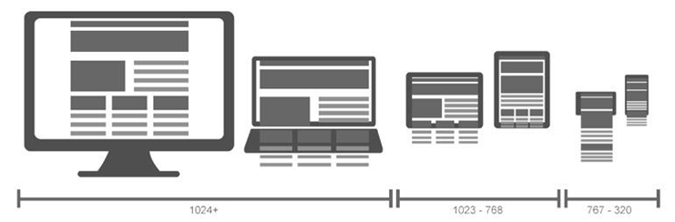
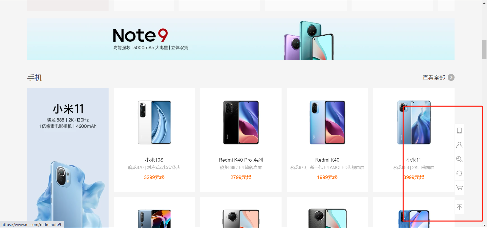
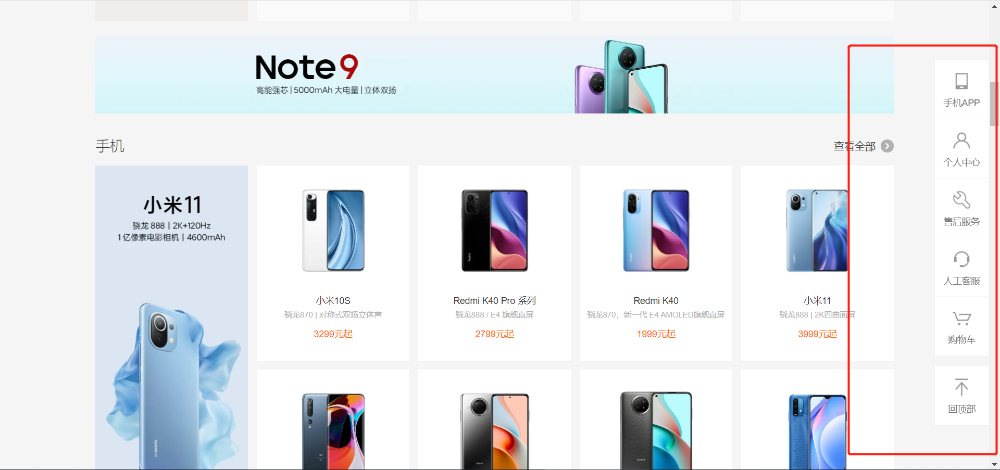

# 风生水起——2

### 响应式布局——媒体查询语句

利用媒体查询，即media queries，可以针对不同的媒体类型定义不同的样式，从而实现响应式布局 。



响应式布局的设置方法主要有两种，一种是通过style来设置，还有一种是通过`<link>`标签来设置。

设置响应式布局可以设置媒体的类型，目前常用的媒体类型主要有以下几种，一般情况下，我们使用all即可：

| 取值   | 含义                                 |
| ------ | ------------------------------------ |
| all    | 用于所有设备。                       |
| print  | 用于打印机和打印预览。               |
| screen | 用于电脑屏幕，平板电脑，智能手机等。 |
| speech | 应用于屏幕阅读器等发声设备。         |

设置响应式布局，通常有以下几种条件：

- 媒体类型
- and、not
- min-width、max-width
- orientation:portrait（竖屏）、orientation:landscape（横屏）

比如要设置一个大于500px的响应式样式：

```html
<style>
    div {
        height: 100px;
        width: 100px;
        background-color: aqua;
    }
    @media all and (min-width:700px) {
        div {
            background-color: yellow;
        }
    }
</style>
```

设置一个大于500px小于700px的响应式样式：

```html
<style>
    div {
        height: 100px;
        width: 100px;
        background-color: aqua;
    }

    @media all and (min-width:500px) and (max-width:700px) {
        #box {
            background: blue;
        }
    }
</style>
```

设置小于500px的样式：

```html
<style>
    div {
        height: 100px;
        width: 100px;
        background-color: aqua;
    }

    @media not all and (min-width:500px) {
        #box {
            background: blue;
        }
    }
</style>
```

设置竖屏和横屏：

```html
<style>
    div {
        height: 100px;
        width: 100px;
        background-color: aqua;
    }

    @media all and (orientation:portrait) {
        #box {
            background: blue;
        }
    }

    @media all and (orientation:landscape) {
        #box {
            background: yellow;
        }
    }
</style>
```

需要注意的是，如果设置多个尺寸，写在后面的css要比写在前面的css优先级高，比如里面用的都是min-width，那么min-width为500的要写在前面，而min-width为700的要写在后面。此外，基本样式要写在最前面，media响应式样式要写在后面。

除了在css中写媒体查询语句，还可以在link标签中写，写法和`@media`类似，哪个link符合条件，就会执行哪个link引用的css文件：

```html
<link rel="stylesheet" href="base.css" media=" all and (orientation:portrait) ">
<link rel="stylesheet" href="base2.css" media=" all and (orientation:landscape) ">
```

响应式布局常见的修改样式，一般会修改display，float还有width等。

文件代码位置：[src/1_media.html](./src/1_media.html)

### 响应式布局——两种设计模式

响应式布局的设计，通常有两种方法，一种是对同一种类或者标签设计各种尺寸的适配，另外一种是不同尺寸都用一种类名，然后根据情况在html标签上选择性的添加上设计好的类名。

第一种：

```html
<!DOCTYPE html>
<html lang="en">
<head>
    <meta charset="UTF-8">
    <meta name="viewport" content="width=device-width, initial-scale=1.0">
    <meta http-equiv="X-UA-Compatible" content="ie=edge">
    <title>Document</title>
    <style>
    *{ margin:0; padding:0;}
    .container{ padding-left:15px; padding-right:15px; margin-left:auto; margin-right:auto;}

    @media all and ( min-width : 768px ){
        .container{ max-width : 720px; }
    }

    @media all and ( min-width : 992px ){
        .container{ max-width : 960px; }
    }

    @media all and ( min-width : 1200px ){
        .container{ max-width : 1140px; }
    }
    </style>
</head>
<body>
    <div class="container" style="border:1px black solid;">hello media</div>
</body>
</html>
```

这种模式下，就是对container的各种尺寸都做了适配。

第二种：

```html
<!DOCTYPE html>
<html lang="en">
<head>
    <meta charset="UTF-8">
    <meta name="viewport" content="width=device-width, initial-scale=1.0">
    <meta http-equiv="X-UA-Compatible" content="ie=edge">
    <title>Document</title>
    <style>
    *{ margin:0; padding:0;}
    .container{ padding-left:15px; padding-right:15px; margin-left:auto; margin-right:auto;}
    .mt-50{ 
        margin-top: 50px; 
    }

    @media all and ( min-width : 768px ){
        .mt-md-50{ margin-top:50px;}
    }
    @media all and ( min-width : 992px ){
        .mt-lg-50{ margin-top:50px;}
    }
    @media all and ( min-width : 1200px ){
        .mt-xl-50{ margin-top:50px;}
    }
    </style>
</head>
<body>
    <div class="container mt-md-50" style="border:1px black solid;">hello media</div>
</body>
</html>
```

这种模式就是先定义一个默认的类叫mt-50，然后分别设置不同的类名，不日大于768的叫mt-md-50，大于992的叫mt-lg-50等，然后根据实际需求，在html标签上添加上适当的类。

此外这里container使用max-width的好处就是可以保证浏览器在一定的尺寸下，width始终是充满浏览器的，而且不会出现滚动条。

文件代码位置：[src/2_media.html](./src/2_media.html)

### 响应式布局练习——小米网站

在宽度较小的情况下：



在分辨率较大的情况下：



实现原理：

我们这里要做这个侧边栏的样式，样式是单独设计的，但是结构是共享的，我们可以将最完整的结构写好，然后在特定的尺寸下，隐藏掉不需要的结构。这里涉及到了两种尺寸，我们可以把不同的尺寸，写在不同的css文件中，这样可以避免冲突。在通过link引入css文件时，为了避免css之间的冲突，可以较小的尺寸使用max-width，较大的尺寸使用min-width，具体看代码：

index.html：

```html
<!DOCTYPE html>
<html lang="en">
<head>
    <meta charset="UTF-8">
    <meta name="viewport" content="width=device-width, initial-scale=1.0">
    <meta http-equiv="X-UA-Compatible" content="ie=edge">
    <title>Document</title>
    <style>
    *{ margin:0; padding:0;}
    ul{ list-style: none;}
    .container{ width:1200px; height:1000px; border:1px black solid; margin:0 auto;}
    </style>
    <link rel="stylesheet" href="./iconfont/iconfont.css">
    <link rel="stylesheet" href="./subbar.css" media="all and (max-width:1499.98px)">
    <link rel="stylesheet" href="./subbar-large.css" media="all and (min-width:1500px)">
</head>
<body>
    <div class="container"></div>
    <ul class="subbar">
        <li>
            <i class="iconfont icon-home"></i>
            <p>个人中心</p>
        </li>
        <li>
            <i class="iconfont icon-home"></i>
            <p>个人中心</p>
        </li>
        <li>
            <i class="iconfont icon-home"></i>
            <p>个人中心</p>
        </li>
        <li>
            <i class="iconfont icon-home"></i>
            <p>个人中心</p>
        </li>
        <li>
            <i class="iconfont icon-home"></i>
            <p>个人中心</p>
        </li>
    </ul>
</body>
</html>
```

subbar.css：

```css
.subbar{ position: fixed; bottom: 100px; left:50%; margin-left:602px;}
.subbar li{ width:30px; height:30px; border:1px #ccc solid; text-align: center; line-height: 30px;}
.subbar li i{}
.subbar li p{ display: none;}
```

这里将侧边栏紧贴版心右侧的实现原理是使用fixed定位，先给一个left为50%，这样左侧的边就在屏幕中间了，然后再设置一个margin-left的值为版心的一半多一点，就会在版心的右侧，多一点是为了不紧紧贴住版心，这样可以好看一些。

subbar-large.css：

```css
.subbar{ position: fixed; bottom: 100px; right:0; text-align: center;}
.subbar li{ width:80px; height:80px; border:1px #ccc solid; text-align: center; line-height: 30px;}
.subbar li i{ font-size:30px;}
.subbar li p{}
```

文件代码位置：[src/xiaomi/index.html](./src/xiaomi/index.html)

### Bootstrap简介

Bootstrap 是最受欢迎的 HTML、CSS 和 JS 框架，用于开发响应式布局、移动设备优先的 WEB 项目。它具有以下的特点：响应式布局，有基于lfex的栅格系统，有丰富的组件和工具方法，有常见的交互功能。Bootstrap的官网为：https://getbootstrap.com。Bootstrap的css部分使用Sass开发的，JS部分是基于jQuery的。

我们在下载Bootstrap时，可以下载完整的源码，完整的源码中含有源码和编译好的文件，编译好的文件在dist文件夹中。在dist中的css下，有很多个文件，其中bootstrap.css是编译好的完整文件，bootstrap.min.css是压缩后的文件，bootstrap-grid.css是栅格系统文件，bootstrap-reboot.css是重置样式文件，其中bootstrap.css里面已经包含了栅格系统和重置样式，如果想使用Bootstrap的完整功能，只需要引入bootstrap.css即可。

简单的使用：

```html
<!DOCTYPE html>
<html lang="en">
<head>
    <meta charset="UTF-8">
    <meta name="viewport" content="width=device-width, initial-scale=1.0">
    <meta http-equiv="X-UA-Compatible" content="ie=edge">
    <title>Document</title>
    <link rel="stylesheet" href="./bootstrap.css">
</head>
<body>
    <div class="container">
        aaaaa
    </div>
    <div class="container-fluid">
        bbbbb
    </div>
</body>
</html>
```

文件代码位置：[src/3_boot.html](./src/3_boot.html)


