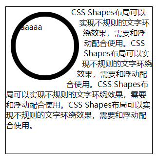
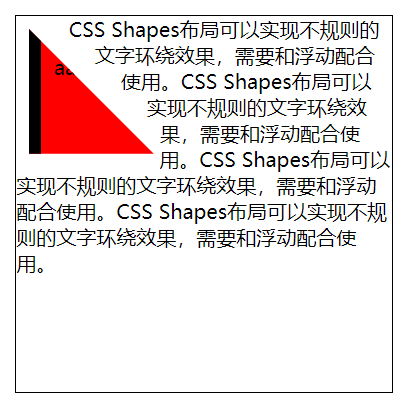

# 巧夺天工

### Sass和Less

Sass和Less都属于CSS预处理器，CSS 预处理器定义了一种新的语言，其基本思想是，用一种专门的编程语言，为 CSS 增加了一些编程的特性，如：变量、语句、函数、继承等概念。将 CSS 作为目标生成文件，然后开发者就只要使用这种语言进行CSS的编码工作。


Less的官网地址为：http://lesscss.org/

sass的官网地址为：https://sass-lang.com/

这里推荐两个VS code插件，分别为：Easy LESS和Easy Sass，这两个插件可以在保存less和sass时，直接生成编译好的css文件。还有一点需要注意的是，less的缩略名为.less，sass文件的缩略名，老版本文件为.sass，新版本文件为.scss。

#### sass和scss的区别：

- 异同：简言之可以理解scss是sass的一个升级版本，完全兼容sass之前的功能，又有了些新增能力。语法形式上有些许不同，最主要的就是sass是靠缩进表示嵌套关系，scss是花括号。
- scss功能很强大的样子，能做运算、写函数啥的
- @mixin、@extend、%placeholder的适用场景总结
  - mixin 可以传变量
  - extend 不可以传变量，相同样式直接继承，不会造成代码冗余；基类未被继承时，也会被编译成css代码
  - placeholder 基类未被继承时不会被编译成css代码

慕课网的总结：


#### LESS和SASS注释

sass和less的单行注释不会编译出来，但是多行注释会被编译出来：

less：

```less
// 单行注释，不会被编译出来

/*
    多行注释，就是CSS的注释方式，会被编译出来
*/
```

编译后的css：

```css
/*
    多行注释，就是CSS的注释方式，会被编译出来
*/
```

sass：

```scss
// 单行注释，不会被编译出来

/*
    多行注释，就是CSS的注释方式，会被编译出来
*/
```

css：

```css
@charset "UTF-8";
/*
    多行注释，就是CSS的注释方式，会被编译出来
*/
```

#### LESS和SASS变量、插值、作用域

less的变量定义使用`@加变量名`，使用的时候也是`@加变量名`；插值表示变量名可以代替关键字，定义方法和定义变量相同，使用方法为`@{变量名}`；less的作用域是就近原则，但是需要注意的是，变量定义在花括号内，即使是先用变量，后改变变量的值，那么less也会使用花括号内的值的：

less：

```less
// 定义变量
@number : 123px;
// 插值
@key : margin;
@i : 2;

// 使用插值
.box@{i}{
    // 使用变量
    width : @number;
    height : @number;
    // 使用插值
    @{key} : auto;
}

.box3{
    // 作用域问题，就近原则，但是这里会编译为456px
    height : @number;
    @number : 456px;
    width : @number;
}
```

css：

```css
.box2 {
  width: 123px;
  height: 123px;
  margin: auto;
}

.box3 {
  height: 456px;
  width: 456px;
}
```

SASS的变量定义为`$加变量名`，使用也是一样的。插值定义同变量名，使用方法为`#{$变量名}`。作用域为就近原则，并且讲究顺序。

scss：

```scss
// 定义变量
$number : 123px;
// 定义插值
$key : margin;
$i : 2;

// 使用插值
.box#{$i}{
    width : $number;
    height : $number;
    // 使用插值
    #{$key} : auto;
}

// Sass的作用于是有顺序的
.box3{
    // height会编译为123px
    height: $number;
    $number : 456px;
    width : $number;
}
```

css：

```css
.box2 {
  width: 123px;
  height: 123px;
  margin: auto;
}

.box3 {
  height: 123px;
  width: 456px;
}
```

#### LESS和SASS选择器嵌套，伪类嵌套，属性嵌套(Sass)

在写后代选择器时，less和sass可以使用嵌套的方式来表示；在写伪类选择器时，如果按照正常的嵌套方式写，中间会有空格，为了避免有空格，在嵌套时可以加上一个`&`；对于SASS来说有一个独特的功能，可以进行属性嵌套，具体见代码：

less：

```less
// ul li{}
// ul li div{}
// ul li p{}

ul{
    list-style:none;
    li{
        float:left;
        div{ margin:10px;}
        p{ margin:20px;}
    }
    // 加&可以避免产生空格
    &:hover{
        color : red;
        // less是没有这种属性嵌套的写法
        // font : {
        //     size : 10px;
        //     weight : bold;
        //     family : 宋体;
        // }
    }
}
```

css：

```css
ul {
  list-style: none;
}
ul li {
  float: left;
}
ul li div {
  margin: 10px;
}
ul li p {
  margin: 20px;
}
ul:hover {
  color: red;
}
```

scss：

```scss
ul{
    list-style:none;
    li{
        float:left;
        div{ margin:10px;}
        p{ margin:20px;}
    }
    &:hover{
        color : red;
        // 属性嵌套
        font : {
            size : 10px;
            weight : bold;
            family : 宋体;
        }
    }
}
```

css：

```css
ul {
  list-style: none;
}

ul li {
  float: left;
}

ul li div {
  margin: 10px;
}

ul li p {
  margin: 20px;
}

ul:hover {
  color: red;
  /*属性嵌套的结果*/
  font-size: 10px;
  font-weight: bold;
  font-family: 宋体;
}
```

#### LESS和SASS运算，单位，转义，颜色

less和sass都可以做加减乘除的运算，对于less来说，如果想表示属性中带斜线的，可以使用`~"20px / 1.5"`这种方式来表示，做除法计算可以添加小括号，比如`(20px / 1.5)`，scss中斜线默认是不会做计算的，如果想做计算，可以使用小括号括起来，比如`(20px / 1.5)`。

单位方面，less如果是两个不同的单位做运算，那么会以第一个数值的单位为计算后的单位，而scss中，不同的单位不能做计算，会报错。

#的颜色值，也可以做四则运算。

less：

```less
@num : 100px;

.box4{
    width : @num * 3;
    // 计算结果为px
    height : @num + 10em;
    // 计算结果为em
    margin : 10em + @num;
    // 直接输出，如果想计算，可以添加小括号，比如(20px / 1.5)
    font : 20px / 1.5;
    // 直接输出
    padding : ~"20px / 1.5";
    color : #010203 * 2;
}
```

css：

```css
.box4 {
  width: 300px;
  height: 110px;
  margin: 110em;
  font: 20px / 1.5;
  padding: 20px / 1.5;
  color: #020406;
}
```

scss：

```scss
.box4{
    width : $num * 3;
    //Sass中如果单位不同的话，是不能运算
    //height : $num + 20em;
    // 默认 / 是分割的操作
    font : 20px / 1.5;
    // 加括号会参与计算
    padding : (20px / 1.5);
    color : #010203 * 2;
}

```

css：

```css
.box4 {
  width: 300px;
  font: 20px / 1.5;
  padding: 13.33333px;
  color: #020406;
}
```

#### LESS和SASS函数

less和sass都提供了很多默认函数，但是需要注意的是，它们有的函数不是通用的，有的函数互相没有。另外sass还可以自定义函数，自定义函数的方法为：

```scss
@function sum($n,$m){
    @return $n + $m;
}
```

使用方法和使用默认函数方法相同。

less：

```less
.box5{
    width : round(3.4px);
    height : percentage(0.2);
    // less没有random
    //margin : random();
    padding : sqrt(25%);
}
```

css：

```css
.box5 {
  width: 3px;
  height: 20%;
  margin: random();
  padding: 5%;
}
```

scss：

```scss
// 自定义函数
@function sum($n,$m){
    @return $n + $m;
}

.box5{
    width : round(3.4px);
    height : percentage(0.2);
    margin : random();
    padding : sqrt(25%);
    font-size : sum(4px , 5px);
}
```

css：

```css
.box5 {
  width: 3px;
  height: 20%;
  margin: 0.37028;
  padding: sqrt(25%);
  font-size: 9px;
}
```

#### LESS和SASS混入，命名空间(Less)，继承

混入就是将写好的一块代码，在其他的地方进行复用：

less：

```css
// 这样写会被编译到css中
.show{
    display : block;
}
// 这样写不会被编译进去，而且还可以传参
.hide(@color){
    display : none;
    color : @color;
}
.box6{
    width : 100px;
    // 两种混入
    .show;
    .hide(blue);
}
```

css：

```css
show {
  display: block;
}
.box6 {
  width: 100px;
  display: block;
  display: none;
  color: blue;
}
```

sass：

```scss
// 这两种写法都不会被编译
@mixin show {
    display : block;
}
@mixin hide($color) {
    display : none;
    color : $color;
}

.box6{
    width : 100px;
    @include show;
    @include hide(red);
}
```

css：

```css
.box6 {
  width: 100px;
  display: block;
  display: none;
  color: red;
}
```

命名空间是less特有的功能，用法如下：

less：

```less
.show{
    display : block;
}
#nm(){
    .show{ display: inline-block; }
}

.box7{
    #nm.show;
}
```

css：

```css
.box7 {
  display: inline-block;
}
```

继承就是可以将多个类相同的属性，写成分组的形式：

less：

```less
// less的一个弊端是.line要被编译进去
.line{
    display : inline;
}
.box7{
    &:extend(.line);
}
.box8{
    &:extend(.line);
}
```

css：

```
.line,
.box7,
.box8 {
  display: inline;
}
```

scss：

```
// line不会被编译
%line{
    display : inline;
}
.box7{
    @extend %line;
}
.box8{
    @extend %line;
}

// line会被编译
.line{
    display : inline;
}
.box7{
    @extend .line;
}
.box8{
    @extend .line;
}
```

css：

```css
.box7, .box8 {
  display: inline;
}

.line, .box7, .box8 {
  display: inline;
}

```

#### LESS和SASS合并，媒体查询

LESS和SASS可以将一个属性的值合并起来，具体见代码；此外在媒体查询方面，也有简便写法：

LESS：

```less
.box9{
    // 可以将两个值合并起来，中间用逗号隔开
    background+ : url(a.png);
    background+ : url(b.png);
    // 可以将两个值合并起来，中间用空格隔开
    transform+_ : scale(2);
    transform+_ : rotate(30deg);
}

// 媒体查询的写法
.box10{
    width : 100px;
    @media all and ( min-width : 768px ){
        width : 600px;
    }
    @media all and ( min-width : 1440px ){
        width : 900px;
    }
}
```

CSS：

```css
box9 {
  background: url(a.png), url(b.png);
  transform: scale(2) rotate(30deg);
}
.box10 {
  width: 100px;
}
@media all and (min-width: 768px) {
  .box10 {
    width: 600px;
  }
}
@media all and (min-width: 1440px) {
  .box10 {
    width: 900px;
  }
}
```

SCSS：

```scss
// SCSS是通过键值对实现的
$background : (
    a : url(a.png),
    b : url(b.png)
);
$tranform : (
    a : scale(2),
    b : rotate(30deg)
);

.box9{
    // 使用SCSS的函数，编译后有逗号
    background : map-values($background);
    // 编译后无逗号
    transform : zip(map-values($tranform)...);
}

// 媒体查询
.box10{
    width : 100px;
    @media all and ( min-width : 768px ){
        width : 600px;
    }
    @media all and ( min-width : 1440px ){
        width : 900px;
    }
}
```

CSS：

```css
.box9 {
  background: url(a.png), url(b.png);
  transform: scale(2) rotate(30deg);
}

.box10 {
  width: 100px;
}

@media all and (min-width: 768px) {
  .box10 {
    width: 600px;
  }
}

@media all and (min-width: 1440px) {
  .box10 {
    width: 900px;
  }
}
```

LESS和SASS条件，循环

条件：

LESS：

```less
@count : 3;
// 如果大于4，就走上面，如果小于4就走下面
.get(@cn) when ( @cn > 4 ){
    width : 100px + @cn;
}
.get(@cn) when ( @cn < 4 ){
    width : 10px + @cn;
}
.box11{
    .get(@count);
}
```

SCSS：

```scss
// SCSS的写法更加人性化
$count : 3;
.box11{
    @if($count > 4){
        width : 100px + $count;
    }
    @else{
        width : 10px + $count;
    }
}
```

 循环：

LESS的循环需要用递归来实现：

LESS：

```less
@count2 : 0;
.get2(@cn) when (@cn < 3){
    // 递归实现
    .get2((@cn+1));
    .box-@{cn}{
        width: 100px + @cn;
    }
}

.get2(@count2);
```

CSS：

```
.box-2 {
  width: 102px;
}
.box-1 {
  width: 101px;
}
.box-0 {
  width: 100px;
}
```

而SCSS可以通过for循环来实现：

SCSS：

```scss
@for $i from 0 through 2{
    .box-#{$i}{
        width : 100px + $i;
    }
}
```

CSS：

```
.box-0 {
  width: 100px;
}

.box-1 {
  width: 101px;
}

.box-2 {
  width: 102px;
}
```

#### LESS和SASS导入

两个语言写法相同：

```scss
@import './reset.scss';
```

### PostCSS

PostCSS 本身是一个功能比较单一的工具。它提供了一种方式用 JavaScript 代码来处理 CSS。利用PostCSS可以实现一些工程化的操作，如：自动添加浏览器前缀，代码合并，代码压缩等。

官方网址：https://postcss.org/

安装方法：`npm  install  postcss-cli –g`

如果要为PostCSS添加插件，需要创建一个`postcss.config.js`文件，然后将配置写在该文件中。这里介绍六中插件。

#### autoprefixer

该插件可以自动为css属性添加适当的浏览器前缀，但是具体添加什么前缀，需要在配置文件中配置。该插件的安装方法为`npm i autoprefixer`，接下来的几个插件安装方法是一样的。

postcss.config.js：

```js
const autoprefixer = require('autoprefixer');

module.exports = {
    plugins : [
        autoprefixer({
            // 如果填>0%，则表示要适配100%的浏览器
            "overrideBrowserslist": [
                "> 0%"
              ]
        })
    ]
};
```

原始CSS：

```
div{
    width:300px;
    height:300px;
    transform: rotate(30deg);
}
```

编译后的CSS：

```
div{
    width:300px;
    height:300px;
    -webkit-transform: rotate(30deg);
       -moz-transform: rotate(30deg);
        -ms-transform: rotate(30deg);
         -o-transform: rotate(30deg);
            transform: rotate(30deg);
}
```

#### postcss-import

通过这个插件，可以让css文件导入其他文件：

原始CSS：

```
@import './reset';
```

编译后的css文件就会将reset.css导入到该CSS中，类似于预编译。

#### cssnano

通过该插件，可以对css进行压缩。

#### postcss-cssnext

通过该插件，可以增强css的兼容性。

原始CSS：

```
:root{
    --color : red;
}

div{
    background : var(--color);
    color : var(--color);
    border : 1px var(--color) solid;
}
```

编译后的CSS：

```css
div{
    background : red;
    color : red;
    border : 1px red solid;
}
```

#### stylelint

该插件可以规范CSS代码，类似ESLint，如果有代码不符合配置，那么控制台将会输出错误信息。

配置示例：

```js
const stylelint = require('stylelint');

module.exports = {
    plugins : [
        stylelint({
            "rules" : {
                "color-no-invalid-hex" : true
            }
        })
    ]
};
```

postcss-sprites

该插件可以自动将背景图转为精灵图。

配置示例：

```js
const sprites = require('postcss-sprites');

module.exports = {
    plugins : [
        sprites({
            spritePath : './dist'
        })
    ]
};
```

原始CSS：

```
div{
    background : url('./icon/1.jpg');
}

p{
    color : #000;
    background : url('./icon/2.jpg');
}
```

编译后的CSS：

```
div{
    background-image : url(../dist/sprite.png);
    background-position : 0px 0px;
    background-size : 51px 22px;
}

p{
    color : #000;
    background-image : url(../dist/sprite.png);
    background-position : -25px 0px;
    background-size : 51px 22px;
}
```

最后，给出完整的配置示例：

```js
const autoprefixer = require('autoprefixer');
const pcImport = require('postcss-import');
const cssnano = require('cssnano');
const cssnext = require('postcss-cssnext');
const stylelint = require('stylelint');
const sprites = require('postcss-sprites');

module.exports = {
    plugins : [
        autoprefixer({
            browsers : [' > 0% ']
        }),
        pcImport,
        cssnano,
        cssnext,
        stylelint({
            "rules" : {
                "color-no-invalid-hex" : true
            }
        }),
        sprites({
            spritePath : './dist'
        })
    ]
};
```

### CSS架构

在一个大型项目中，由于页面过多，导致CSS代码难以维护和开发。所以CSS架构可以帮助我们解决文件管理与文件划分等问题。首先要对CSS进行模块化处理，一个模块负责一类操作行为。可利用Sass或Less来实现。

| 文件夹     | 含义                                                         |
| ---------- | ------------------------------------------------------------ |
| base       | 一些初始的通用CSS，如重置默认样式，动画，工具，打印等。      |
| components | 用于构建页面的所有组件，如按钮，表单，表格，弹窗等。         |
| layout     | 用于布局页面的不同部分，如页眉，页脚，弹性布局，网格布局等。 |
| pages      | 放置页面之间不同的样式，如首页特殊样式，列表页特殊样式等。   |
| themes     | 应用不同的主题样式时，如管理员，买家，卖家等。               |
| abstracts  | 放置一些如：变量，函数，响应式等辅助开发的部分。             |
| vendors    | 放置一些第三方独立的CSS文件，如bootstrap，iconfont等。       |

文件树示例：

```
│  main.scss
│  
├─abstracts
│      _functions.scss
│      _media.scss
│      _variables.scss
│      
├─base
│      _animate.scss
│      _reset.scss
│      _typography.scss
│      _utilities.scss
│      
├─components
│      _alert.scss
│      _button.scss
│      _form.scss
│      _table.scss
│      
├─layout
│      _flex.scss
│      _footer.scss
│      _grid.scss
│      _header.scss
│      
├─pages
│      _detail.scss
│      _goods.scss
│      _index.scss
│      _list.scss
│      
├─themes
│      _admin.scss
│      _buyer.scss
│      _seller.scss
│      _tourist.scss
│      
└─vendors
        boostrap.css
        iconfont.css
```

main.scss的内容：

```scss
@import "abstracts/variables";
@import "abstracts/functions";
@import "abstracts/media";

@import "base/reset";
@import "base/typography";
@import "base/animate";
@import "base/utilities";

@import "components/alert";
@import "components/button";
@import "components/form";
@import "components/table";

@import "layout/flex";
@import "layout/grid";
@import "layout/header";
@import "layout/footer";

@import "pages/index";
@import "pages/list";
@import "pages/detail";
@import "pages/goods";

@import "themes/admin";
@import "themes/buyer";
@import "themes/seller";
@import "themes/tourist";

```

这里需要注意的是，文件前加下划线表示该文件为私有文件，不能单独使用，需要引入使用。在main.scss中引入时，不需要加下划线和缩略名，在编译时，可以自动识别。

### CSS新特性之自定义属性

CSS 自定义属性(也称为“CSS 变量”)，在目前所有的现代浏览器中都得到了支持。CSS自定义属性是通过在变量前面添加两个减号来实现的。使用时添加到var()中。

如果定义变量的时候加了单位，那么直接使用var()即可，如果没加单位，需要使用calc()来实现，具体见下面的代码。

此外还可以设置默认值，如果能找到该变量，那么就使用设置的变量值，如果找不到该变量，就可以使用默认值，具体见代码。

变量也有作用域，也是就近原则，也和HTML的层级有关系，比如设置在同级或者父级div上，就会优先与`:root`上。

```css
<!DOCTYPE html>
<html lang="en">
<head>
    <meta charset="UTF-8">
    <meta name="viewport" content="width=device-width, initial-scale=1.0">
    <meta http-equiv="X-UA-Compatible" content="ie=edge">
    <title>Document</title>
    <style>
    
    div{
        --color : yellow;
    }

    :root{
        --color : red;
        --number : 100px;
        --number2 : 100;
        --size : 50px;
    }

    #box{
        /* --color : blue; */
        background: var(--color);
        /* 如果变量有符号，这样写就可以 */
        width : va没r(--number);
         /* 如果变量有符号，这样写 */
        height : calc(var(--number2) * 1px);
         /* 设置默认值 */
        font-size : var(--size , 100px);
    }
    
    </style>
</head>
<body>
    <div id="box">aaaaaaaaaaaaa</div>
</body>
</html>
```

### CSS新特性之shapes

CSS Shapes布局可以实现不规则的文字环绕效果，需要和浮动配合使用。

shape-outside：设置文字环绕方式，默认是none，可选值有margin-box、padding-box、border-box、content-box等。

```html
<!DOCTYPE html>
<html lang="en">
<head>
    <meta charset="UTF-8">
    <meta name="viewport" content="width=device-width, initial-scale=1.0">
    <meta http-equiv="X-UA-Compatible" content="ie=edge">
    <title>Document</title>
    <style>
    #parent{ width:300px; height: 300px; border:1px black solid; margin:20px;}
    #shape{
        width: 100px; height:100px;
        padding:10px;
        border:10px black solid;
        margin:10px;
        float:left;
        border-radius: 50%;
        shape-outside: margin-box;
    } 
    
    </style>
</head>
<body>
    <div id="parent">
        <div id="shape">aaaaa</div>
        CSS Shapes布局可以实现不规则的文字环绕效果，需要和浮动配合使用。CSS Shapes布局可以实现不规则的文字环绕效果，需要和浮动配合使用。CSS Shapes布局可以实现不规则的文字环绕效果，需要和浮动配合使用。CSS Shapes布局可以实现不规则的文字环绕效果，需要和浮动配合使用。

    </div>
</body>
</html>
```



此外还可以使用clip-path来给图形化区域，使用shape-outside来自定义环绕范围：

```html
<!DOCTYPE html>
<html lang="en">
<head>
    <meta charset="UTF-8">
    <meta name="viewport" content="width=device-width, initial-scale=1.0">
    <meta http-equiv="X-UA-Compatible" content="ie=edge">
    <title>Document</title>
    <style>
    #parent{ width:300px; height: 300px; border:1px black solid; margin:20px;}
    #shape{
        width: 100px; height:100px;
        padding:10px;
        border:10px black solid;
        margin:10px;
        float:left;
        background: red;
        clip-path: polygon(0 0,0 100px,100px 100px);
        shape-outside: polygon(0 0,0 100px,100px 100px);
        shape-margin:15px;
    }
    </style>
</head>
<body>
    <div id="parent">
        <div id="shape">aaaaa</div>
        CSS Shapes布局可以实现不规则的文字环绕效果，需要和浮动配合使用。CSS Shapes布局可以实现不规则的文字环绕效果，需要和浮动配合使用。CSS Shapes布局可以实现不规则的文字环绕效果，需要和浮动配合使用。CSS Shapes布局可以实现不规则的文字环绕效果，需要和浮动配合使用。

    </div>
</body>
</html>
```



### CSS新特性之scrollbar

CSS scrollbar用于实现自定义滚动条样式。

- `::-webkit-scrollbar`可以设置滚动条的宽高等。
- `::-webkit-scrollbar-thumb`设置滚动条可拖拽的部分的样式。
- `::-webkit-scrollbar-track`设置滑道的样式。

```html
<!DOCTYPE html>
<html lang="en">
<head>
    <meta charset="UTF-8">
    <meta name="viewport" content="width=device-width, initial-scale=1.0">
    <meta http-equiv="X-UA-Compatible" content="ie=edge">
    <title>Document</title>
    <style>
    body{ height:2000px;}
    html::-webkit-scrollbar{
        width:10px;
        /* height:1px; */
    }
    html::-webkit-scrollbar-thumb{
        background: #f90;
        border-radius: 15px;
    }
    html::-webkit-scrollbar-track{
        background:#dedede;
        box-shadow: inset 0 0 5px gary;
    }
    </style>
</head>
<body>
    
</body>
</html>
```

### CSS新特性之Scroll Snap

CSS Scroll Snap（CSS 滚动捕捉）允许你在用户完成滚动后多锁定特定的元素或位置。

`scroll-snap-type: x或y mandatory;`：该属性设置在容器上，设置吸附的容器。

`scroll-snap-align`：设置吸附的位置。

```html
<!DOCTYPE html>
<html lang="en">
<head>
    <meta charset="UTF-8">
    <meta name="viewport" content="width=device-width, initial-scale=1.0">
    <meta http-equiv="X-UA-Compatible" content="ie=edge">
    <title>Document</title>
    <style>
    *{ margin:0; padding:0;}
    ul{ list-style: none;}
    #main{ 
        width:600px; height:100px; border:1px black solid; margin:100px; overflow: auto;
        scroll-snap-type: x mandatory;
    }
    #main ul{ width:4000px;}
    #main li{ width:300px; height:100px; background: red; float: left; margin:0 100px;
        scroll-snap-align: end;
    }
    </style>
</head>
<body>
    <div id="main">
        <ul>
            <li>1111</li>
            <li>2222</li>
            <li>3333</li>
            <li>4444</li>
            <li>5555</li>
        </ul>
    </div>
</body>
</html>
```


