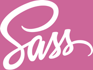
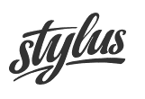
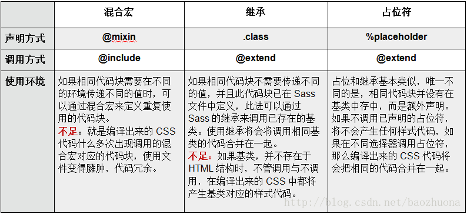

# 巧夺天工

### Sass和Less

Sass和Less都属于CSS预处理器，CSS 预处理器定义了一种新的语言，其基本思想是，用一种专门的编程语言，为 CSS 增加了一些编程的特性，如：变量、语句、函数、继承等概念。将 CSS 作为目标生成文件，然后开发者就只要使用这种语言进行CSS的编码工作。






Less的官网地址为：http://lesscss.org/

sass的官网地址为：https://sass-lang.com/

这里推荐两个VS code插件，分别为：Easy LESS和Easy Sass，这两个插件可以在保存less和sass时，直接生成编译好的css文件。还有一点需要注意的是，less的缩略名为.less，sass文件的缩略名，老版本文件为.sass，新版本文件为.scss。

#### sass和scss的区别：

- 异同：简言之可以理解scss是sass的一个升级版本，完全兼容sass之前的功能，又有了些新增能力。语法形式上有些许不同，最主要的就是sass是靠缩进表示嵌套关系，scss是花括号。
- scss功能很强大的样子，能做运算、写函数啥的
- @mixin、@extend、%placeholder的适用场景总结
  - mixin 可以传变量
  - extend 不可以传变量，相同样式直接继承，不会造成代码冗余；基类未被继承时，也会被编译成css代码
  - placeholder 基类未被继承时不会被编译成css代码

慕课网的总结：



#### LESS和SASS注释

sass和less的单行注释不会编译出来，但是多行注释会被编译出来：

less：

```less
// 单行注释，不会被编译出来

/*
    多行注释，就是CSS的注释方式，会被编译出来
*/
```

编译后的css：

```css
/*
    多行注释，就是CSS的注释方式，会被编译出来
*/
```

sass：

```scss
// 单行注释，不会被编译出来

/*
    多行注释，就是CSS的注释方式，会被编译出来
*/
```

css：

```css
@charset "UTF-8";
/*
    多行注释，就是CSS的注释方式，会被编译出来
*/
```

#### LESS和SASS变量、插值、作用域

less的变量定义使用`@加变量名`，使用的时候也是`@加变量名`；插值表示变量名可以代替关键字，定义方法和定义变量相同，使用方法为`@{变量名}`；less的作用域是就近原则，但是需要注意的是，变量定义在花括号内，即使是先用变量，后改变变量的值，那么less也会使用花括号内的值的：

less：

```less
// 定义变量
@number : 123px;
// 插值
@key : margin;
@i : 2;

// 使用插值
.box@{i}{
    // 使用变量
    width : @number;
    height : @number;
    // 使用插值
    @{key} : auto;
}

.box3{
    // 作用域问题，就近原则，但是这里会编译为456px
    height : @number;
    @number : 456px;
    width : @number;
}
```

css：

```css
.box2 {
  width: 123px;
  height: 123px;
  margin: auto;
}

.box3 {
  height: 456px;
  width: 456px;
}
```

SASS的变量定义为`$加变量名`，使用也是一样的。插值定义同变量名，使用方法为`#{$变量名}`。作用域为就近原则，并且讲究顺序。

scss：

```scss
// 定义变量
$number : 123px;
// 定义插值
$key : margin;
$i : 2;

// 使用插值
.box#{$i}{
    width : $number;
    height : $number;
    // 使用插值
    #{$key} : auto;
}

// Sass的作用于是有顺序的
.box3{
    // height会编译为123px
    height: $number;
    $number : 456px;
    width : $number;
}
```

css：

```css
.box2 {
  width: 123px;
  height: 123px;
  margin: auto;
}

.box3 {
  height: 123px;
  width: 456px;
}
```

#### LESS和SASS选择器嵌套，伪类嵌套，属性嵌套(Sass)

在写后代选择器时，less和sass可以使用嵌套的方式来表示；在写伪类选择器时，如果按照正常的嵌套方式写，中间会有空格，为了避免有空格，在嵌套时可以加上一个`&`；对于SASS来说有一个独特的功能，可以进行属性嵌套，具体见代码：

less：

```less
// ul li{}
// ul li div{}
// ul li p{}

ul{
    list-style:none;
    li{
        float:left;
        div{ margin:10px;}
        p{ margin:20px;}
    }
    // 加&可以避免产生空格
    &:hover{
        color : red;
        // less是没有这种属性嵌套的写法
        // font : {
        //     size : 10px;
        //     weight : bold;
        //     family : 宋体;
        // }
    }
}
```

css：

```css
ul {
  list-style: none;
}
ul li {
  float: left;
}
ul li div {
  margin: 10px;
}
ul li p {
  margin: 20px;
}
ul:hover {
  color: red;
}
```

scss：

```scss
ul{
    list-style:none;
    li{
        float:left;
        div{ margin:10px;}
        p{ margin:20px;}
    }
    &:hover{
        color : red;
        // 属性嵌套
        font : {
            size : 10px;
            weight : bold;
            family : 宋体;
        }
    }
}
```

css：

```css
ul {
  list-style: none;
}

ul li {
  float: left;
}

ul li div {
  margin: 10px;
}

ul li p {
  margin: 20px;
}

ul:hover {
  color: red;
  /*属性嵌套的结果*/
  font-size: 10px;
  font-weight: bold;
  font-family: 宋体;
}
```

#### LESS和SASS运算，单位，转义，颜色

less和sass都可以做加减乘除的运算，对于less来说，如果想表示属性中带斜线的，可以使用`~"20px / 1.5"`这种方式来表示，做除法计算可以添加小括号，比如`(20px / 1.5)`，scss中斜线默认是不会做计算的，如果想做计算，可以使用小括号括起来，比如`(20px / 1.5)`。

单位方面，less如果是两个不同的单位做运算，那么会以第一个数值的单位为计算后的单位，而scss中，不同的单位不能做计算，会报错。

#的颜色值，也可以做四则运算。

less：

```less
@num : 100px;

.box4{
    width : @num * 3;
    // 计算结果为px
    height : @num + 10em;
    // 计算结果为em
    margin : 10em + @num;
    // 直接输出，如果想计算，可以添加小括号，比如(20px / 1.5)
    font : 20px / 1.5;
    // 直接输出
    padding : ~"20px / 1.5";
    color : #010203 * 2;
}
```

css：

```css
.box4 {
  width: 300px;
  height: 110px;
  margin: 110em;
  font: 20px / 1.5;
  padding: 20px / 1.5;
  color: #020406;
}
```

scss：

```scss
.box4{
    width : $num * 3;
    //Sass中如果单位不同的话，是不能运算
    //height : $num + 20em;
    // 默认 / 是分割的操作
    font : 20px / 1.5;
    // 加括号会参与计算
    padding : (20px / 1.5);
    color : #010203 * 2;
}

```

css：

```css
.box4 {
  width: 300px;
  font: 20px / 1.5;
  padding: 13.33333px;
  color: #020406;
}
```

#### LESS和SASS函数

less和sass都提供了很多默认函数，但是需要注意的是，它们有的函数不是通用的，有的函数互相没有。另外sass还可以自定义函数，自定义函数的方法为：

```scss
@function sum($n,$m){
    @return $n + $m;
}
```

使用方法和使用默认函数方法相同。

less：

```less
.box5{
    width : round(3.4px);
    height : percentage(0.2);
    // less没有random
    //margin : random();
    padding : sqrt(25%);
}
```

css：

```css
.box5 {
  width: 3px;
  height: 20%;
  margin: random();
  padding: 5%;
}
```

scss：

```scss
// 自定义函数
@function sum($n,$m){
    @return $n + $m;
}

.box5{
    width : round(3.4px);
    height : percentage(0.2);
    margin : random();
    padding : sqrt(25%);
    font-size : sum(4px , 5px);
}
```

css：

```css
.box5 {
  width: 3px;
  height: 20%;
  margin: 0.37028;
  padding: sqrt(25%);
  font-size: 9px;
}
```

#### LESS和SASS混入，命名空间(Less)，继承

混入就是将写好的一块代码，在其他的地方进行复用：

less：

```css
// 这样写会被编译到css中
.show{
    display : block;
}
// 这样写不会被编译进去，而且还可以传参
.hide(@color){
    display : none;
    color : @color;
}
.box6{
    width : 100px;
    // 两种混入
    .show;
    .hide(blue);
}
```

css：

```css
show {
  display: block;
}
.box6 {
  width: 100px;
  display: block;
  display: none;
  color: blue;
}
```

sass：

```scss
// 这两种写法都不会被编译
@mixin show {
    display : block;
}
@mixin hide($color) {
    display : none;
    color : $color;
}

.box6{
    width : 100px;
    @include show;
    @include hide(red);
}
```

css：

```css
.box6 {
  width: 100px;
  display: block;
  display: none;
  color: red;
}
```

命名空间是less特有的功能，用法如下：

less：

```less
.show{
    display : block;
}
#nm(){
    .show{ display: inline-block; }
}

.box7{
    #nm.show;
}
```

css：

```css
.box7 {
  display: inline-block;
}
```

继承就是可以将多个类相同的属性，写成分组的形式：

less：

```less
// less的一个弊端是.line要被编译进去
.line{
    display : inline;
}
.box7{
    &:extend(.line);
}
.box8{
    &:extend(.line);
}
```

css：

```
.line,
.box7,
.box8 {
  display: inline;
}
```

scss：

```
// line不会被编译
%line{
    display : inline;
}
.box7{
    @extend %line;
}
.box8{
    @extend %line;
}

// line会被编译
.line{
    display : inline;
}
.box7{
    @extend .line;
}
.box8{
    @extend .line;
}
```

css：

```css
.box7, .box8 {
  display: inline;
}

.line, .box7, .box8 {
  display: inline;
}

```


